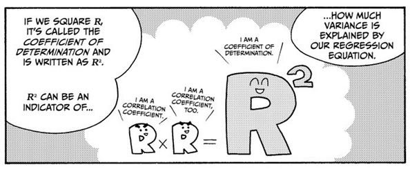

<style type="text/css">

body{ /* Normal  */
      font-size: 16px;
  }
td {  /* Table  */
  font-size: 8px;
}
h1.title {
  font-size: 55px;
  color: DarkBlue;
}
h1 { /* Header 1 */
  font-size: 38px;
  color: DarkBlue;
}
h2 { /* Header 2 */
    font-size: 38px;
  color: DarkBlue;
}
h3 { /* Header 3 */
  font-size: 35px;
  font-family: "Times New Roman", Times, serif;
  color: DarkBlue;
}
code.r{ /* Code block */
    font-size: 12px;
}
pre { /* Code block - determines code spacing between lines */
    font-size: 14px;
}
</style>


```{r setup, include=FALSE}
knitr::opts_chunk$set(echo = TRUE)

#install for export in pdf file
#tinytex::install_tinytex()
```

## Présentation des données

Nous étions à la recherche d'un **jeu de données** de minimum 300 observations et 15 variables quantitatives dont une à expliquer,
Nous avions des jeux de données provenant de sondages, mais leurs données étaient qualitative, donc non exploitable dans notre contexte d'étude.

Après recherche, le jeu de données choisis est météorologique, nous souhaitons prévoir la température du lendemain en fonction des autres variables quantitative. Ce jeu de données a été obtenu dans les open data de la ville de Tours, le fichier est trouvable à l'adresse suivante : <https://data.tours-metropole.fr/explore/dataset/observation-meteorologique-historiques-tours-synop/export/?sort=date>.
<br> </br>
# Import de la base de données
```{r}
data <- 
  read.csv("~/PrevisionMeteoTours/observation-meteorologique-historiques-tours-synop.csv", sep=";")

```

D'après l'hébergeur les paramètres atmosphériques sont mesurés (température, humidité, direction et force du vent, pression atmosphérique...) ou observés (description des nuages, visibilité...) depuis la surface terrestre.

Après lecture de la colonne Date, les données sont collectés de 2010 jusqu'à maintenant, il en résulte plus de \textcolor{blue}{30k observations}.


\newpage
Nous avons cependant une limite à notre analyse.
Puisque l'ensemble de ces observations est tirés d'une seule station d'observation.
{width=50%}
<br> </br>
Nous supprimons alors les collonnes correspondant à des indications géographiques
```{r}
#numero de la station météo
data$ID.OMM.station <- NULL

#coords géographique
data$Coordonnees <- NULL
data$Latitude <- NULL
data$Longitude <- NULL

#Nom de la ville et département
data$Nom <- NULL
data$communes..code. <- NULL
data$communes..name. <- NULL
data$EPCI..name. <- NULL
data$EPCI..code. <- NULL
data$department..name. <- NULL
data$department..code. <- NULL
data$region..name. <- NULL
data$region..code.<- NULL
```
<br> </br>
Les colonnes vides ou constantes sont inutilisables
```{r}
data$Niveau.baromÃ.trique  <- NULL
data$TempÃ.rature.minimale.sur.24.heures <- NULL
data$TempÃ.rature.minimale.sur.24.heures..Â.C. <- NULL
data$MÃ.thode.de.mesure.TempÃ.rature.du.thermomÃ.tre.mouillÃ. <- NULL
data$TempÃ.rature.du.thermomÃ.tre.mouillÃ. <- NULL
data$Hauteur.totale.de.la.couche.de.neige..glace..autre.au.sol <- NULL
data$NÃ.bulositÃ..couche.nuageuse.4 <- NULL
data$Hauteur.de.base.4 <- NULL
data$TempÃ.rature.minimale.sur.24.heures <- NULL
data$TempÃ.rature.maximale.sur.24.heures <- NULL
data$Altitude  <- NULL
data$NÃ.bulositÃ..couche.nuageuse.1  <- NULL
data$Etat.du.sol  <- NULL
data$Periode.de.mesure.de.la.rafale  <- NULL
data$NÃ.bulositÃ...des.nuages.de.l..Ã.tage.infÃ.rieur  <- NULL
data$TempÃ.rature.minimale.du.sol.sur.12.heures..en.Â.C. <- NULL

```

<br> </br>
Retirons les variables qualitatives.

Type de tendance barométrique et temps présent est mis quali- mi quanti, nous ne les traiterons pas
```{r}
data$Type.de.tendance.baromÃ.trique <- NULL
data$Temps.prÃ.sent <- NULL
data$Temps.prÃ.sent.1 <- NULL
data$Temps.passÃ..1 <- NULL
data$Temps.passÃ..1.1 <- NULL
data$Temps.passÃ..2 <- NULL
data$Type.de.tendance.baromÃ.trique.1 <- NULL
data$mois_de_l_annee <- NULL


```


<br> </br>
Nous n'avons pas supprimé la variable date car elle nous est utile à trier chronologiquement les données.
```{r,echo=TRUE}

data <- data[order(as.Date(data$Date)),]

```
<br> </br>


Observons les valeurs manquantes des variables restantes
```{r,results='hide'}
#1
sum(is.na(data$Pression.au.niveau.mer))
#2
sum(is.na(data$Variation.de.pression.en.3.heures))
#3
sum(is.na(data$Type.de.tendance.baromÃ.trique))
#4
sum(is.na(data$Direction.du.vent.moyen.10.mn))
#5
sum(is.na(data$Vitesse.du.vent.moyen.10.mn))
#6
sum(is.na(data$TempÃ.rature))
#7
sum(is.na(data$Point.de.rosÃ.e))
#8
sum(is.na(data$HumiditÃ.))
#9
sum(is.na(data$VisibilitÃ..horizontale))
#10
sum(is.na(data$NebulositÃ..totale))
#11
sum(is.na(data$NÃ.bulositÃ...des.nuages.de.l..Ã.tage.infÃ.rieur))
#12
sum(is.na(data$Hauteur.de.la.base.des.nuages.de.l.Ã.tage.infÃ.rieur))
#13
sum(is.na(data$Type.des.nuages.de.l.Ã.tage.infÃ.rieur))
#14
sum(is.na(data$Type.des.nuages.de.l.Ã.tage.moyen))
#15
sum(is.na(data$Type.des.nuages.de.l.Ã.tage.supÃ.rieur))
#16
sum(is.na(data$Pression.station))
#17
sum(is.na(data$GÃ.opotentiel))
#18
sum(is.na(data$Variation.de.pression.en.24.heures))
#19
sum(is.na(data$TempÃ.rature.minimale.sur.12.heures))
#20
sum(is.na(data$TempÃ.rature.maximale.sur.12.heures))
#21
sum(is.na(data$TempÃ.rature.minimale.du.sol.sur.12.heures))
#22
sum(is.na(data$Rafale.sur.les.10.derniÃ.res.minutes))
#23
sum(is.na(data$Rafales.sur.une.pÃ.riode))
#24
sum(is.na(data$Periode.de.mesure.de.la.rafale))
#25
sum(is.na(data$Etat.du.sol))
#26
sum(is.na(data$Hauteur.de.la.neige.fraÃ.che))
#27
sum(is.na(data$Periode.de.mesure.de.la.neige.fraiche))
#28
sum(is.na(data$PrÃ.cipitations.dans.la.derniÃ.re.heure))
#29
sum(is.na(data$PrÃ.cipitations.dans.les.3.derniÃ.res.heures))
#30
sum(is.na(data$PrÃ.cipitations.dans.les.6.derniÃ.res.heures))
#31
sum(is.na(data$PrÃ.cipitations.dans.les.12.derniÃ.res.heures))
#32
sum(is.na(data$PrÃ.cipitations.dans.les.24.derniÃ.res.heures))
#33
sum(is.na(data$PhÃ.nomÃ.ne.spÃ.cial.1))
#34
sum(is.na(data$PhÃ.nomÃ.ne.spÃ.cial.2))
#35
sum(is.na(data$PhÃ.nomÃ.ne.spÃ.cial.3))
#36
sum(is.na(data$PhÃ.nomÃ.ne.spÃ.cial.4))
#37
sum(is.na(data$NÃ.bulositÃ..couche.nuageuse.1))
#38
sum(is.na(data$Type.nuage.1))
#39
sum(is.na(data$Hauteur.de.base.1))
#40
sum(is.na(data$NÃ.bulositÃ..couche.nuageuse.2))
#41
sum(is.na(data$Type.nuage.2))
#42
sum(is.na(data$NÃ.bulositÃ..couche.nuageuse.3))
#43
sum(is.na(data$Type.nuage.3))
#44
sum(is.na(data$Hauteur.de.base.3))
#45
sum(is.na(data$Type.nuage.4))
#46
#sum(is.na(data$Temps.prÃ.sent.1))
#47
sum(is.na(data$TempÃ.rature..Â.C.))
#48
sum(is.na(data$TempÃ.rature.minimale.sur.12.heures..Â.C.))
#49
sum(is.na(data$TempÃ.rature.maximale.sur.12.heures..Â.C.))
#50
sum(is.na(data$TempÃ.rature.maximale.sur.24.heures..Â.C.))
#51
sum(is.na(data$TempÃ.rature.minimale.du.sol.sur.12.heures..en.Â.C.))
#52
sum(is.na(data$Altitude))
#53
sum(is.na(data$mois_de_l_annee))

```
On en déduit cela


plus 20 000 manquants:
<ul>
* $Type.des.nuages.de.l.Ã.tage.infÃ.rieur 
* $Type.des.nuages.de.l.Ã.tage.moyen
* $Type.des.nuages.de.l.Ã.tage.supÃ.rieur
* $GÃ.opotentiel
* $TempÃ.rature.minimale.sur.12.heures
* $TempÃ.rature.maximale.sur.12.heures
* $Hauteur.de.la.neige.fraÃ.che
* $Periode.de.mesure.de.la.neige.fraiche
* $PhÃ.nomÃ.ne.spÃ.cial.1
* $PhÃ.nomÃ.ne.spÃ.cial.2
* $PhÃ.nomÃ.ne.spÃ.cial.3
* $PhÃ.nomÃ.ne.spÃ.cial.4
* $Type.nuage.1
* $Hauteur.de.base.1
* $NÃ.bulositÃ..couche.nuageuse.2
* $Type.nuage.2
* $NÃ.bulositÃ..couche.nuageuse.3
* $Type.nuage.3
* $Hauteur.de.base.3
* $Type.nuage.4
* $TempÃ.rature.minimale.sur.12.heures..Â.C.
* $TempÃ.rature.maximale.sur.12.heures..Â.C.
* $TempÃ.rature.maximale.sur.24.heures..Â.C.
</ul>


Plus de 10 000:

<ul>
* $NebulositÃ..totale
* $Hauteur.de.la.base.des.nuages.de.l.Ã.tage.infÃ.rieur
* $Variation.de.pression.en.24.heures
* $TempÃ.rature.minimale.du.sol.sur.12.heures
* $Rafale.sur.les.10.derniÃ.res.minutes
* $Etat.du.sol
* $PrÃ.cipitations.dans.les.6.derniÃ.res.heures
* $PrÃ.cipitations.dans.les.12.derniÃ.res.heures
* $PrÃ.cipitations.dans.les.24.derniÃ.res.heures
* $NÃ.bulositÃ..couche.nuageuse.1
* $TempÃ.rature.minimale.du.sol.sur.12.heures..en.Â.C.
</ul>
plus de 5000:
<ul>
* $NÃ.bulositÃ...des.nuages.de.l..Ã.tage.infÃ.rieur
</ul>

<br> </br>
Création d'un jeu de donnée où on supprimme que les plus de 30 000
```{r}
#data2 <- data 

#data2$GÃ.opotentiel <- NULL
#data2$TempÃ.rature.maximale.sur.24.heures..Â.C. <- NULL
#data2$Type.nuage.4 <- NULL
#data2$PhÃ.nomÃ.ne.spÃ.cial.4 <- NULL
#data2$Type.nuage.2 <- NULL
#data2$NÃ.bulositÃ..couche.nuageuse.3 <- NULL
#data2$Type.nuage.3 <- NULL
#data2$Hauteur.de.base.3 <- NULL
#data2$Type.nuage.4 <- NULL
```
Test des régressions sur cet ensemble : exactement les mêmes résultats.


<br> </br>
Suppression des plus de 20 000
```{r}
data$Type.des.nuages.de.l.Ã.tage.infÃ.rieur <- NULL
data$Type.des.nuages.de.l.Ã.tage.moyen <- NULL
data$Type.des.nuages.de.l.Ã.tage.supÃ.rieur <- NULL
data$GÃ.opotentiel <- NULL
data$TempÃ.rature.minimale.sur.12.heures <- NULL
data$TempÃ.rature.maximale.sur.12.heures <- NULL
data$Hauteur.de.la.neige.fraÃ.che <- NULL
data$Periode.de.mesure.de.la.neige.fraiche <- NULL
data$PhÃ.nomÃ.ne.spÃ.cial.1 <- NULL
data$PhÃ.nomÃ.ne.spÃ.cial.2 <- NULL
data$PhÃ.nomÃ.ne.spÃ.cial.3 <- NULL
data$PhÃ.nomÃ.ne.spÃ.cial.4 <- NULL
data$Type.nuage.1 <- NULL
data$Hauteur.de.base.1 <- NULL
data$NÃ.bulositÃ..couche.nuageuse.2 <- NULL
data$Type.nuage.2 <- NULL
data$NÃ.bulositÃ..couche.nuageuse.3 <- NULL
data$Type.nuage.3 <- NULL
data$Hauteur.de.base.3 <- NULL
data$Type.nuage.4 <- NULL
data$TempÃ.rature.minimale.sur.12.heures..Â.C. <- NULL
data$TempÃ.rature.maximale.sur.12.heures..Â.C. <- NULL
data$TempÃ.rature.maximale.sur.24.heures..Â.C. <- NULL


```
<br> </br>
Il s'agit d'une conversion de Kelvin en celsius, cette ligne n'a pas d'utilité
```{r}
data$TempÃ.rature..Â.C. <- NULL
#data2$TempÃ.rature..Â.C. <- NULL
```

<br> </br>
Nous sommes alors à 32 variables.


Mais combien d'observations si l'on retire les lignes avec des manquants ?
```{r, results='hide'}
which(is.na(data))
data <- na.omit(data)


#which(is.na(data2))
#data2 <- na.omit(data2)
```

<br> </br>
On créé une colonne DateEnJour afin que chaque jour est son numéro
```{r}
#library(dplyr)
#df %>% 
#  slice(which.max(as.Date(data$Date)))

data$jour = format(as.Date(data$Date,format="%Y-%m-%d"), format = "%d")
data$mois = ( format(as.Date(data$Date,format="%Y-%m-%d"), format = "%m"))
data$annee = format(as.Date(data$Date,format="%Y-%m-%d"), format = "%Y")

#multiplieur 
#c'était un problème de classe de donnée
#data$trente <- replicate(4965, 30)
#data$troisCent <- replicate(4965, 365)

data$jour <- as.numeric(data$jour)
data$mois <- as.numeric(data$mois)
data$annee <- as.numeric(data$annee)


data$DateEnJour <- data$jour + (30 *data$mois) + ( 365*data$annee)

```


<br> </br>
On ne garde que une observation par jour pour un jeu de prévision 
en effet le nbre d'observation par jour est irrégulier.
```{r}

prevision <- do.call(rbind, by(data, list(data$DateEnJour), 
                  FUN=function(x) head(x, 1)))

```
<br> </br>
On supprimme les variables créé et la date
```{r}
data$Date <- NULL
data$DateEnJour <- NULL
data$annee <- NULL
data$mois <- NULL
data$jour <- NULL

prevision$Date <- NULL
prevision$DateEnJour <- NULL
prevision$annee <- NULL
#prevision$mois <- NULL
prevision$jour <- NULL


```
<br> </br>
On a pas supprimmer le paramètre mois pour faire un test (en utilisant la statistique de student.)
```{r}
prevision$mois <- ifelse(prevision$mois < 5 ,"Hiver","Pas Hiver")
```
<br> </br>
Il y a t'il une différence significative de moyenne de température entre les relevés en Hiver et les autres ?
```{r}
#Welch correction inclus dans la fonction t.test()
test1<-t.test(TempÃ.rature ~ mois, prevision)
test1
```

la p-value est inférieur à 0.05, on rejette HO"Les moyennes de températures sont égales"
La différence est très significative.
<br> </br>
<br> </br>
```{r}
prevision$mois <- NULL
```
Notre jeu de donnée pour la regression linéaire est prêt.

<br> </br>
Pour le jeu de prévision,
nous creons une colonne température mais décaler de 1 jour.

La première méthode utilisé n'était pas correct puisque l'on décalait dans le mauvais sens la colonne avec la méthode lag,
puis on supprimait la première observation.


```{r,warning=FALSE}
#Mauvaise méthode
#data$TemperatureDecaler <- lag(data$TempÃ.rature)
#on supprimme la première observation
#data = data[-1,]


library(Hmisc)
#prevision$Precipitation_Jour_Suivant <- Lag(prevision$PrÃ.cipitations.dans.les.24.derniÃ.res.heures, shift = -1)
prevision$Temperature_Jour_Suivant <- Lag(prevision$TempÃ.rature, shift = -1)
#on supprimme la derniere observation
library(dplyr)
prevision = slice(prevision, 1:(n() -1))


#De même on réduit la taille du nbre d'observation de data
data = slice(data, 1:(n() -662))

```
<br> </br>
```{r}
dim(prevision)
```
1324 *0.8 observations de 21 variables,
cela est suffisant pour la régression multiple.

<br> </br>

## Statistiques Descriptives
<br> </br>
Regardons ce qui caractérise cette base de données,
tant au niveau des moyennes, de la variance...

```{r donnee}
summary(data)
```
Nos observations sont complètes, et les variables toutes quantitatives, nous pouvons commencer la régression multiple.

<br> </br>
Nous n'avons pas importer en UTF-8 pour économiser de la place, donnons des labels corrects aux colonnes que nous allons utiliser.
```{r}
#labels <- c(
#  "Pression_Mer",
#  "Variation_Pression_3h",
#  "Direction_vent",
#  "Vitesse_vent",
#  "Temperature",
#  "Point_de_rosee",
#  "Humidite",
#  "Visibilite_horizontale",
#  "Nebulosite_total",
#  "Hauteur_Base_Nuage_Inferieur",
#  "Pression_Station",
#  "Variation_Pression",
#  "Temperature_minimale_sol",
#  "Rafales",
#  "Rafales_total",
#  "Precipitation_1h",
#  "Precipitation_3h",
#  "Precipitation_6h",
#  "Precipitation_12h",
#  "Precipitation_24h",
#  "Hauteur_Base_Nuage_Superieur"
#  "Precipitation_Jour_Suivant"
#            )
#names(data) <- labels

#label <- c(
#  "Pression_Mer",
#  "Variation_Pression_3h",
#  "Direction_vent",
#  "Vitesse_vent",
#  "Temperature",
#  "Point_de_rosee",
#  "Humidite",
#  "Visibilite_horizontale",
#  "Nebulosite_total",
#  "Hauteur_Base_Nuage_Inferieur",
#  "Pression_Station",
#  "Variation_Pression",
#  "Temperature_minimale_sol",
#  "Rafales",
# "Rafales_total",
#  "Precipitation_1h",
#  "Precipitation_3h",
#  "Precipitation_6h",
#  "Precipitation_12h",
#  "Precipitation_24h",
#  "Hauteur_Base_Nuage_Superieur",
#  "Precipitation_Jour_Suivant"
#            )
#names(prevision) <- label

```

### Anova

Voyons quels paramètres ont le plus d'importance
```{r }


modele <- aov( Temperature_Jour_Suivant ~Pression.au.niveau.mer +
       Variation.de.pression.en.3.heures +
       Direction.du.vent.moyen.10.mn  +
       Vitesse.du.vent.moyen.10.mn  +
       Point.de.rosÃ.e  +
       HumiditÃ.     +
       VisibilitÃ..horizontale +
       NebulositÃ..totale  +
       Hauteur.de.la.base.des.nuages.de.l.Ã.tage.infÃ.rieur+
       Pression.station +
       Variation.de.pression.en.24.heures  +
       TempÃ.rature.minimale.du.sol.sur.12.heures +
       Rafale.sur.les.10.derniÃ.res.minutes   +
       Rafales.sur.une.pÃ.riode+
       PrÃ.cipitations.dans.la.derniÃ.re.heure  +
       PrÃ.cipitations.dans.les.3.derniÃ.res.heures+
       PrÃ.cipitations.dans.les.6.derniÃ.res.heures  +
       PrÃ.cipitations.dans.les.12.derniÃ.res.heures  +
       PrÃ.cipitations.dans.les.24.derniÃ.res.heures+
       Hauteur.de.base.2+
         TempÃ.rature
              ,prevision)

anova(modele)
```
Les intéractions de l'Humidité et du point de Rosé sont les plus fortes.
Etonament la température mesuré vers 13h a une très faible intéraction comparé à la température mesuré au moment du point de rosé.
<br> </br>
<br> </br>

On sépare notre jeu entre un jeu d'entrainement et un jeu de test.
```{r}
nb_lignes <- sample(1:nrow(prevision), nrow(prevision)*0.80)
testing <- prevision[-nb_lignes,]
prevision <- prevision[nb_lignes,]

```

## Régression multiple avec toutes les variables explicatives
<br> </br>

Nous allons effectuer plusieurs régressions, nous allons utiliser un jeu d'entrainement et un jeu de test pour comparer les différentes régressions.
Puisque leurs nombre de variables explicatives seront différentes nous utiliserons le coefficient R² ajusté.




<br> </br>
Tests de regression sur notre jeu complet.
```{r}
#reg.mul <- lm(Pression.au.niveau.mer~.,data)
#shapiro.test(reg.mul$residuals)

#reg.mul <- lm(Variation.de.pression.en.3.heures~.,data)
#shapiro.test(reg.mul$residuals)

#reg.mul <- lm(Direction.du.vent.moyen.10.mn~.,data)
#shapiro.test(reg.mul$residuals)

#reg.mul <- lm(Vitesse.du.vent.moyen.10.mn~.,data)
#shapiro.test(reg.mul$residuals)

#reg.mul <- lm(Point.de.rosÃ.e~.,data)
#shapiro.test(reg.mul$residuals)

#reg.mul <- lm(HumiditÃ.~.,data)
#shapiro.test(reg.mul$residuals)

#reg.mul <- lm(VisibilitÃ..horizontale~.,data)
#shapiro.test(reg.mul$residuals)

#reg.mul <- lm(NebulositÃ..totale~.,data)
#shapiro.test(reg.mul$residuals)

#reg.mul <- lm(Hauteur.de.la.base.des.nuages.de.l.Ã.tage.infÃ.rieur~.,data)
#shapiro.test(reg.mul$residuals)

#reg.mul <- lm(Pression.station~.,data)
#shapiro.test(reg.mul$residuals)

#reg.mul <- lm(Variation.de.pression.en.24.heures~.,data)
#shapiro.test(reg.mul$residuals)

#reg.mul <- lm(TempÃ.rature.minimale.du.sol.sur.12.heures~.,data)
#shapiro.test(reg.mul$residuals)

#reg.mul <- lm(Rafale.sur.les.10.derniÃ.res.minutes~.,data)
#shapiro.test(reg.mul$residuals)

#reg.mul <- lm(Rafales.sur.une.pÃ.riode~.,data)
#shapiro.test(reg.mul$residuals)

#reg.mul <- lm(PrÃ.cipitations.dans.la.derniÃ.re.heure~.,data)
#shapiro.test(reg.mul$residuals)

#reg.mul <- lm(PrÃ.cipitations.dans.les.3.derniÃ.res.heures~.,data)
#shapiro.test(reg.mul$residuals)

#reg.mul <- lm(PrÃ.cipitations.dans.les.6.derniÃ.res.heures~.,data)
#shapiro.test(reg.mul$residuals)

#reg.mul <- lm(PrÃ.cipitations.dans.les.12.derniÃ.res.heures~.,data)
#shapiro.test(reg.mul$residuals)

#reg.mul <- lm(PrÃ.cipitations.dans.les.24.derniÃ.res.heures~.,data)
#shapiro.test(reg.mul$residuals)

#reg.mul <- lm(Hauteur.de.base.2~.,data)
#shapiro.test(reg.mul$residuals)

#reg.mul <- lm(TempÃ.rature~.,data)
#shapiro.test(reg.mul$residuals)


```
Toutes les régressions testés affichent des résidus non gaussiens. Ces régressions sont inexploitable au delà de notre échantillon.

<br> </br>
Regression avec toutes les variables.
```{r}
reg.mul <- lm(Temperature_Jour_Suivant ~.,prevision)
shapiro.test(reg.mul$residuals)

```
De même les résidus ne sont pas gaussiens.

La p-value est inferieur à 5% donc on rejette H0, les Ei ne suivent pas des lois normales (résidus non gaussiens)

!! les tests de Fisher et Student ne sont pas valables. !!

Quels options sont possibles lorsque notre régression est mauvaise ?

Premièrement, on vérifie par un test de Fisher que le modèle est valide.
Deuxièmement,on peut ajouter la constante au modèle de regression ou d'autres variables explicatives afin de réduire les résidus.
D'autres options sont possibles : une selection de variables (forward ou backward selection), imposer des contraintes au vecteur de régression (cf Lasso ou Ridge), réaliser une régression sur les composantes principales (ACP : variables non correlés)

Continuons avec la régression du jeu de prévision.

<br> </br>
Résultat de la regression
```{r}
summary(reg.mul)
#summary(reg.mul.prevision)
```


Les résidus estimés ont une moyenne de 0. 

Il nous est indiqué que 5 variables sont significatives, il y en a peu car les variables doivent être très corréllés.

Attention, Nous ne pouvons écrire que Temperature du jour suivant = 40 + TempÃ.rature.minimale.du.sol.sur.12.heures  * 3.3 + Variation.de.pression.en.24.heures  * 5  ,
il faut refaire le modèle avec uniquement ces variables. 


Ces valeurs ont complètement changer par la modification de l'échantillon, cette régression est totalement dépendante de son échantillon,
le résultat des tests sur les résidus nous confirmera cela. Notre R² de 1 est complètement inutile.

<br> </br>
Visualisons les résidus par un histogramme
```{r}
hist(reg.mul$residuals)
#hist(reg.mul.prevision$residuals)
```
Etonnant, les résidus semblent centrés.

<br> </br>
Réalisons les intervalles de confiance.
```{r}
confint(reg.mul)
#confint(reg.mul.prevision)
```
Ainsi sur 100 échantillon de mesures météorologiques, 95 seront dans ces valeurs.


<br> </br>

Test d'une Regression sans la Constante
```{r}
reg.mulSansC <- lm(Temperature_Jour_Suivant~.-1,prevision)
shapiro.test(reg.mulSansC$residuals)
summary(reg.mulSansC)
```
<br> </br>
On refait une régression avec les variables significatives de reg.mul 
```{r}
reg.mulfin <- lm(Temperature_Jour_Suivant~Variation.de.pression.en.24.heures +
                   Hauteur.de.base.2 +
                   TempÃ.rature.minimale.du.sol.sur.12.heures ,
                 prevision
                   
                   ) 
summary(reg.mulfin)
```
<br> </br>
Touts les paramètres sont significatifs.

```{r}
shapiro.test(reg.mulfin$residuals)
```


<br> </br>
### Matrice des corrélations des variables explicative
<br> </br>
Corrélation entre toutes les variables
```{r,results='hide'}
#correlation
mcor <- cor(prevision)

#Les Correlations sans visualisation graphique. 
mcor


```
On remarque que des groupes entre variables de memes unités se forme tel vitesse du vent avec les données sur les rafales.

Les corrélations les plus importantes sont celles avec Temperature du jour suivant qui est fortement correlés à 3 autres variables.

A noter que nos variables ont des fortes corrélations, nous verrons cet impact avec la régression sur ACP.

<br> </br>
Visualisation graphique des correlations.
```{r}
#
library(corrplot)
corrplot(mcor,type="upper",
         order="hclust",
         tl.col="black",
         tl.srt=45,
         col = NULL,
          tl.pos='n'
         
         )
```

<br> </br>
Représentation des résidus, on ne pas dépasser 5%.
```{r}
res.m <- rstudent(reg.mulfin)
plot(res.m, pch=20,cex=1, ylab = "Residus", main="",ylim=c(-4,+4))
lines(x=c(-2,0,2),y=c(2,1,2))
```

## Régression pas à pas
<br> </br>
Tentons d'obtenir une régression exploitable.
<br> </br>
### Ascendant

<br> </br>
On commence par une régression à une seule variable
```{r}
reg1 <- lm(Temperature_Jour_Suivant~1,prevision)
reg1
```
En simplifiant la formule de la régression à une seule variable, il ne reste plus que y(barre), càd la moyenne.

<br> </br>
Voyons quelle variable pouvons nous ajouter à cette régression.
On effectue un test de Fisher
```{r}
add1(reg1, scope =~Pression.au.niveau.mer +
       Variation.de.pression.en.3.heures +
       Direction.du.vent.moyen.10.mn  +
       Vitesse.du.vent.moyen.10.mn  +
       Point.de.rosÃ.e  +
       HumiditÃ.     +
       VisibilitÃ..horizontale +
       NebulositÃ..totale  +
       Hauteur.de.la.base.des.nuages.de.l.Ã.tage.infÃ.rieur+
       Pression.station +
       Variation.de.pression.en.24.heures  +
       TempÃ.rature.minimale.du.sol.sur.12.heures +
       Rafale.sur.les.10.derniÃ.res.minutes   +
       Rafales.sur.une.pÃ.riode+
       PrÃ.cipitations.dans.la.derniÃ.re.heure  +
       PrÃ.cipitations.dans.les.3.derniÃ.res.heures+
       PrÃ.cipitations.dans.les.6.derniÃ.res.heures  +
       PrÃ.cipitations.dans.les.12.derniÃ.res.heures  +
       PrÃ.cipitations.dans.les.24.derniÃ.res.heures+
       Hauteur.de.base.2 +
       TempÃ.rature 

       
       , test="F" )
```
On remarque avec les différentes Pvalues que de nombreuses variables sont éligibles à la rentrée dans le modèle.

La F value nous indique si l'augmentation du R² est significative.
Par exemple, pour la variable "Pression.au.niveau.mer", l'hypothèse H0 est "Bêta^Pression.au.niveau.mer = 0"

Si cela est significatif on peut introduire la variable dans le modèle.


On remarque que plusieurs variables affiche une pvalue de 2.2e-16 , càd le nbre le plus bas affichable par R.

Je départage ces variables en prenant en compte le critère AIC.
Je prends le critère AIC le plus bas, ce n'est pas préciser mais il semble qu'il s'agisse du coefficient corrigé (lorsque n/k > 40)
cela permet de maximiser la qualité de l'ajustement en pénalisant l'over-fitting.

résumé over fitting : très peu voir aucune erreurs sur notre jeu d'entrainement mais beaucoup d'erreurs avec un jeu de test.

<br> </br>
TempÃ.rature.minimale.du.sol.sur.12.heures  a l'AIC le plus faible, sa pvalue permet de rejetter H0
On créé un nouveau modèle avec cette variable ajouter.
```{r}
#introduction de la variable dans le modèle pour une régression à 2 variables

add1(update(reg1,~.+TempÃ.rature.minimale.du.sol.sur.12.heures),
     scope =~Pression.au.niveau.mer +
       Variation.de.pression.en.3.heures +
       Direction.du.vent.moyen.10.mn  +
       Vitesse.du.vent.moyen.10.mn  +
       Point.de.rosÃ.e  +
       HumiditÃ.     +
       VisibilitÃ..horizontale +
       NebulositÃ..totale  +
       Hauteur.de.la.base.des.nuages.de.l.Ã.tage.infÃ.rieur+
       Pression.station +
       Variation.de.pression.en.24.heures  +
       TempÃ.rature.minimale.du.sol.sur.12.heures +
       Rafale.sur.les.10.derniÃ.res.minutes   +
       Rafales.sur.une.pÃ.riode+
       PrÃ.cipitations.dans.la.derniÃ.re.heure  +
       PrÃ.cipitations.dans.les.3.derniÃ.res.heures+
       PrÃ.cipitations.dans.les.6.derniÃ.res.heures  +
       PrÃ.cipitations.dans.les.12.derniÃ.res.heures  +
       PrÃ.cipitations.dans.les.24.derniÃ.res.heures+
       Hauteur.de.base.2 +
       TempÃ.rature 

       
       , test="F" )
     


```
<br> </br>
On introduit les variables jusqu'à que aucune ai une augmentation du R significative lors de son introduction dans le modèle.
```{r,results='hide'}

add1(update(reg1,~.+TempÃ.rature.minimale.du.sol.sur.12.heures+
            TempÃ.rature  ),
     scope =~Pression.au.niveau.mer +
       Variation.de.pression.en.3.heures +
       Direction.du.vent.moyen.10.mn  +
       Vitesse.du.vent.moyen.10.mn  +
       Point.de.rosÃ.e  +
       HumiditÃ.     +
       VisibilitÃ..horizontale +
       NebulositÃ..totale  +
       Hauteur.de.la.base.des.nuages.de.l.Ã.tage.infÃ.rieur+
       Pression.station +
       Variation.de.pression.en.24.heures  +
       TempÃ.rature.minimale.du.sol.sur.12.heures +
       Rafale.sur.les.10.derniÃ.res.minutes   +
       Rafales.sur.une.pÃ.riode+
       PrÃ.cipitations.dans.la.derniÃ.re.heure  +
       PrÃ.cipitations.dans.les.3.derniÃ.res.heures+
       PrÃ.cipitations.dans.les.6.derniÃ.res.heures  +
       PrÃ.cipitations.dans.les.12.derniÃ.res.heures  +
       PrÃ.cipitations.dans.les.24.derniÃ.res.heures+
       Hauteur.de.base.2 +
       TempÃ.rature 

       
       , test="F" )
```

```{r,results='hide'}
add1(update(reg1,~.+TempÃ.rature.minimale.du.sol.sur.12.heures+
            TempÃ.rature +
              Rafales.sur.une.pÃ.riode   ),
     scope =~Pression.au.niveau.mer +
       Variation.de.pression.en.3.heures +
       Direction.du.vent.moyen.10.mn  +
       Vitesse.du.vent.moyen.10.mn  +
       Point.de.rosÃ.e  +
       HumiditÃ.     +
       VisibilitÃ..horizontale +
       NebulositÃ..totale  +
       Hauteur.de.la.base.des.nuages.de.l.Ã.tage.infÃ.rieur+
       Pression.station +
       Variation.de.pression.en.24.heures  +
       TempÃ.rature.minimale.du.sol.sur.12.heures +
       Rafale.sur.les.10.derniÃ.res.minutes   +
       Rafales.sur.une.pÃ.riode+
       PrÃ.cipitations.dans.la.derniÃ.re.heure  +
       PrÃ.cipitations.dans.les.3.derniÃ.res.heures+
       PrÃ.cipitations.dans.les.6.derniÃ.res.heures  +
       PrÃ.cipitations.dans.les.12.derniÃ.res.heures  +
       PrÃ.cipitations.dans.les.24.derniÃ.res.heures+
       Hauteur.de.base.2 +
       TempÃ.rature 

       
       , test="F" )
```

```{r,results='hide'}
add1(update(reg1,~.+TempÃ.rature.minimale.du.sol.sur.12.heures+
            TempÃ.rature +
              Rafales.sur.une.pÃ.riode +
              Hauteur.de.base.2  ),
     scope =~Pression.au.niveau.mer +
       Variation.de.pression.en.3.heures +
       Direction.du.vent.moyen.10.mn  +
       Vitesse.du.vent.moyen.10.mn  +
       Point.de.rosÃ.e  +
       HumiditÃ.     +
       VisibilitÃ..horizontale +
       NebulositÃ..totale  +
       Hauteur.de.la.base.des.nuages.de.l.Ã.tage.infÃ.rieur+
       Pression.station +
       Variation.de.pression.en.24.heures  +
       TempÃ.rature.minimale.du.sol.sur.12.heures +
       Rafale.sur.les.10.derniÃ.res.minutes   +
       Rafales.sur.une.pÃ.riode+
       PrÃ.cipitations.dans.la.derniÃ.re.heure  +
       PrÃ.cipitations.dans.les.3.derniÃ.res.heures+
       PrÃ.cipitations.dans.les.6.derniÃ.res.heures  +
       PrÃ.cipitations.dans.les.12.derniÃ.res.heures  +
       PrÃ.cipitations.dans.les.24.derniÃ.res.heures+
       Hauteur.de.base.2 +
       TempÃ.rature 

       
       , test="F" )
```

```{r,results='hide'}
add1(update(reg1,~.+TempÃ.rature.minimale.du.sol.sur.12.heures+
            TempÃ.rature +
              Rafales.sur.une.pÃ.riode +
              Hauteur.de.base.2 +
              Pression.station                                      
              ),
     scope =~Pression.au.niveau.mer +
       Variation.de.pression.en.3.heures +
       Direction.du.vent.moyen.10.mn  +
       Vitesse.du.vent.moyen.10.mn  +
       Point.de.rosÃ.e  +
       HumiditÃ.     +
       VisibilitÃ..horizontale +
       NebulositÃ..totale  +
       Hauteur.de.la.base.des.nuages.de.l.Ã.tage.infÃ.rieur+
       Pression.station +
       Variation.de.pression.en.24.heures  +
       TempÃ.rature.minimale.du.sol.sur.12.heures +
       Rafale.sur.les.10.derniÃ.res.minutes   +
       Rafales.sur.une.pÃ.riode+
       PrÃ.cipitations.dans.la.derniÃ.re.heure  +
       PrÃ.cipitations.dans.les.3.derniÃ.res.heures+
       PrÃ.cipitations.dans.les.6.derniÃ.res.heures  +
       PrÃ.cipitations.dans.les.12.derniÃ.res.heures  +
       PrÃ.cipitations.dans.les.24.derniÃ.res.heures+
       Hauteur.de.base.2 +
       TempÃ.rature 

       
       , test="F" )
```

```{r,results='hide'}
add1(update(reg1,~.+TempÃ.rature.minimale.du.sol.sur.12.heures+
            TempÃ.rature +
              Rafales.sur.une.pÃ.riode +
              Hauteur.de.base.2 +
              Pression.station   +
              Point.de.rosÃ.e 
              ),
     scope =~Pression.au.niveau.mer +
       Variation.de.pression.en.3.heures +
       Direction.du.vent.moyen.10.mn  +
       Vitesse.du.vent.moyen.10.mn  +
       Point.de.rosÃ.e  +
       HumiditÃ.     +
       VisibilitÃ..horizontale +
       NebulositÃ..totale  +
       Hauteur.de.la.base.des.nuages.de.l.Ã.tage.infÃ.rieur+
       Pression.station +
       Variation.de.pression.en.24.heures  +
       TempÃ.rature.minimale.du.sol.sur.12.heures +
       Rafale.sur.les.10.derniÃ.res.minutes   +
       Rafales.sur.une.pÃ.riode+
       PrÃ.cipitations.dans.la.derniÃ.re.heure  +
       PrÃ.cipitations.dans.les.3.derniÃ.res.heures+
       PrÃ.cipitations.dans.les.6.derniÃ.res.heures  +
       PrÃ.cipitations.dans.les.12.derniÃ.res.heures  +
       PrÃ.cipitations.dans.les.24.derniÃ.res.heures+
       Hauteur.de.base.2 +
       TempÃ.rature 

       
       , test="F" )
```

```{r,results='hide'}
add1(update(reg1,~.+TempÃ.rature.minimale.du.sol.sur.12.heures+
            TempÃ.rature +
              Rafales.sur.une.pÃ.riode +
              Hauteur.de.base.2 +
              Pression.station   +
              Point.de.rosÃ.e +
              Variation.de.pression.en.24.heures
              ),
     scope =~Pression.au.niveau.mer +
       Variation.de.pression.en.3.heures +
       Direction.du.vent.moyen.10.mn  +
       Vitesse.du.vent.moyen.10.mn  +
       Point.de.rosÃ.e  +
       HumiditÃ.     +
       VisibilitÃ..horizontale +
       NebulositÃ..totale  +
       Hauteur.de.la.base.des.nuages.de.l.Ã.tage.infÃ.rieur+
       Pression.station +
       Variation.de.pression.en.24.heures  +
       TempÃ.rature.minimale.du.sol.sur.12.heures +
       Rafale.sur.les.10.derniÃ.res.minutes   +
       Rafales.sur.une.pÃ.riode+
       PrÃ.cipitations.dans.la.derniÃ.re.heure  +
       PrÃ.cipitations.dans.les.3.derniÃ.res.heures+
       PrÃ.cipitations.dans.les.6.derniÃ.res.heures  +
       PrÃ.cipitations.dans.les.12.derniÃ.res.heures  +
       PrÃ.cipitations.dans.les.24.derniÃ.res.heures+
       Hauteur.de.base.2 +
       TempÃ.rature 

       
       , test="F" )
```


```{r,results='hide'}
add1(update(reg1,~.+TempÃ.rature.minimale.du.sol.sur.12.heures+
            TempÃ.rature +
              Rafales.sur.une.pÃ.riode +
              Hauteur.de.base.2 +
              Pression.station   +
              Point.de.rosÃ.e +
              Variation.de.pression.en.24.heures+
              Variation.de.pression.en.3.heures 
              ),
     scope =~Pression.au.niveau.mer +
       Variation.de.pression.en.3.heures +
       Direction.du.vent.moyen.10.mn  +
       Vitesse.du.vent.moyen.10.mn  +
       Point.de.rosÃ.e  +
       HumiditÃ.     +
       VisibilitÃ..horizontale +
       NebulositÃ..totale  +
       Hauteur.de.la.base.des.nuages.de.l.Ã.tage.infÃ.rieur+
       Pression.station +
       Variation.de.pression.en.24.heures  +
       TempÃ.rature.minimale.du.sol.sur.12.heures +
       Rafale.sur.les.10.derniÃ.res.minutes   +
       Rafales.sur.une.pÃ.riode+
       PrÃ.cipitations.dans.la.derniÃ.re.heure  +
       PrÃ.cipitations.dans.les.3.derniÃ.res.heures+
       PrÃ.cipitations.dans.les.6.derniÃ.res.heures  +
       PrÃ.cipitations.dans.les.12.derniÃ.res.heures  +
       PrÃ.cipitations.dans.les.24.derniÃ.res.heures+
       Hauteur.de.base.2 +
       TempÃ.rature 

       
       , test="F" )
```
Aucune variable à introduire, on arrete notre forward selection ici.
<br> </br>
Modele de la forward regression
```{r}
reg.mul.forward <- lm(Temperature_Jour_Suivant~
                        
                       TempÃ.rature.minimale.du.sol.sur.12.heures+
            TempÃ.rature +
              Rafales.sur.une.pÃ.riode +
              Hauteur.de.base.2 +
              Pression.station   +
              Point.de.rosÃ.e +
              Variation.de.pression.en.24.heures+
              Variation.de.pression.en.3.heures 
                   
                   ,
                 prevision
                   
                   ) 

summary(reg.mul.forward)
```
<br> </br>
On test les résidus
```{r}
shapiro.test(reg.mul.forward$residuals)
```


<br> </br>
Test d'une procédure automatique.
```{r}
full <- lm(Temperature_Jour_Suivant ~.,prevision)
null <-   lm(Temperature_Jour_Suivant ~1,prevision)

forw <- step(null,scope=list(lower=null, upper = full),direction = "forward",trace=0)
formula(forw)
shapiro.test(lm(forw,prevision)$residuals)
```
Aucun changement entre la procédure automatique et manuel.
<br> </br>
### Descendant
Essayons la backward selection.
<br> </br>
On commence par voir quel paramètre on retirera en premier. On utilise le test de Fisher pour cela.
```{r}
lm.full <- lm(Temperature_Jour_Suivant ~.,prevision)
drop1(lm.full,test="F")
```
à chaque itération, on retire la p-value de F la plus forte
```{r,results='hide'}
drop1(update(lm.full,~.-HumiditÃ. 
             ), test="F")
```

```{r,results='hide'}
drop1(update(lm.full,~.-HumiditÃ. 
             -PrÃ.cipitations.dans.les.3.derniÃ.res.heures
             ), test="F")
```

```{r,results='hide'}
drop1(update(lm.full,~.-HumiditÃ. 
             -PrÃ.cipitations.dans.les.3.derniÃ.res.heures
             -PrÃ.cipitations.dans.les.12.derniÃ.res.heures 
             ), test="F")
```

```{r,results='hide'}
drop1(update(lm.full,~.-HumiditÃ. 
             -PrÃ.cipitations.dans.les.3.derniÃ.res.heures
             -PrÃ.cipitations.dans.les.12.derniÃ.res.heures 
             -PrÃ.cipitations.dans.les.6.derniÃ.res.heures  
             ), test="F")
```

```{r,results='hide'}
drop1(update(lm.full,~.-HumiditÃ. 
             -PrÃ.cipitations.dans.les.3.derniÃ.res.heures
             -PrÃ.cipitations.dans.les.12.derniÃ.res.heures 
             -PrÃ.cipitations.dans.les.6.derniÃ.res.heures  
             -Rafale.sur.les.10.derniÃ.res.minutes 
             ), test="F")
```

```{r,results='hide'}
drop1(update(lm.full,~.-HumiditÃ. 
             -PrÃ.cipitations.dans.les.3.derniÃ.res.heures
             -PrÃ.cipitations.dans.les.12.derniÃ.res.heures 
             -PrÃ.cipitations.dans.les.6.derniÃ.res.heures  
             -Rafale.sur.les.10.derniÃ.res.minutes 
             -PrÃ.cipitations.dans.les.24.derniÃ.res.heures
             ), test="F")
```

```{r,results='hide'}
drop1(update(lm.full,~.-HumiditÃ. 
             -PrÃ.cipitations.dans.les.3.derniÃ.res.heures
             -PrÃ.cipitations.dans.les.12.derniÃ.res.heures 
             -PrÃ.cipitations.dans.les.6.derniÃ.res.heures  
             -Rafale.sur.les.10.derniÃ.res.minutes 
             -PrÃ.cipitations.dans.les.24.derniÃ.res.heures
             -Hauteur.de.la.base.des.nuages.de.l.Ã.tage.infÃ.rieur
             ), test="F")
```

```{r,results='hide'}

drop1(update(lm.full,~.-HumiditÃ. 
             -PrÃ.cipitations.dans.les.3.derniÃ.res.heures
             -PrÃ.cipitations.dans.les.12.derniÃ.res.heures 
             -PrÃ.cipitations.dans.les.6.derniÃ.res.heures  
             -Rafale.sur.les.10.derniÃ.res.minutes 
             -PrÃ.cipitations.dans.les.24.derniÃ.res.heures
             -Hauteur.de.la.base.des.nuages.de.l.Ã.tage.infÃ.rieur
             -PrÃ.cipitations.dans.la.derniÃ.re.heure 
             ), test="F")

```

```{r,results='hide'}
drop1(update(lm.full,~.-HumiditÃ. 
             -PrÃ.cipitations.dans.les.3.derniÃ.res.heures
             -PrÃ.cipitations.dans.les.12.derniÃ.res.heures 
             -PrÃ.cipitations.dans.les.6.derniÃ.res.heures  
             -Rafale.sur.les.10.derniÃ.res.minutes 
             -PrÃ.cipitations.dans.les.24.derniÃ.res.heures
             -Hauteur.de.la.base.des.nuages.de.l.Ã.tage.infÃ.rieur
             -PrÃ.cipitations.dans.la.derniÃ.re.heure 
             -Vitesse.du.vent.moyen.10.mn                 
             ), test="F")
```

```{r,results='hide'}
drop1(update(lm.full,~.-HumiditÃ. 
             -PrÃ.cipitations.dans.les.3.derniÃ.res.heures
             -PrÃ.cipitations.dans.les.12.derniÃ.res.heures 
             -PrÃ.cipitations.dans.les.6.derniÃ.res.heures  
             -Rafale.sur.les.10.derniÃ.res.minutes 
             -PrÃ.cipitations.dans.les.24.derniÃ.res.heures
             -Hauteur.de.la.base.des.nuages.de.l.Ã.tage.infÃ.rieur
             -PrÃ.cipitations.dans.la.derniÃ.re.heure 
             -Vitesse.du.vent.moyen.10.mn 
             -NebulositÃ..totale 
             ), test="F")
```

```{r,results='hide'}
drop1(update(lm.full,~.-HumiditÃ. 
             -PrÃ.cipitations.dans.les.3.derniÃ.res.heures
             -PrÃ.cipitations.dans.les.12.derniÃ.res.heures 
             -PrÃ.cipitations.dans.les.6.derniÃ.res.heures  
             -Rafale.sur.les.10.derniÃ.res.minutes 
             -PrÃ.cipitations.dans.les.24.derniÃ.res.heures
             -Hauteur.de.la.base.des.nuages.de.l.Ã.tage.infÃ.rieur
             -PrÃ.cipitations.dans.la.derniÃ.re.heure 
             -Vitesse.du.vent.moyen.10.mn 
             -NebulositÃ..totale 
             -Pression.au.niveau.mer  
             ), test="F")
```

```{r,results='hide'}
drop1(update(lm.full,~.-HumiditÃ. 
             -PrÃ.cipitations.dans.les.3.derniÃ.res.heures
             -PrÃ.cipitations.dans.les.12.derniÃ.res.heures 
             -PrÃ.cipitations.dans.les.6.derniÃ.res.heures  
             -Rafale.sur.les.10.derniÃ.res.minutes 
             -PrÃ.cipitations.dans.les.24.derniÃ.res.heures
             -Hauteur.de.la.base.des.nuages.de.l.Ã.tage.infÃ.rieur
             -PrÃ.cipitations.dans.la.derniÃ.re.heure 
             -Vitesse.du.vent.moyen.10.mn 
             -NebulositÃ..totale 
             -Pression.au.niveau.mer  
             -Direction.du.vent.moyen.10.mn   
             ), test="F")
```

```{r,results='hide'}
drop1(update(lm.full,~.-HumiditÃ. 
             -PrÃ.cipitations.dans.les.3.derniÃ.res.heures
             -PrÃ.cipitations.dans.les.12.derniÃ.res.heures 
             -PrÃ.cipitations.dans.les.6.derniÃ.res.heures  
             -Rafale.sur.les.10.derniÃ.res.minutes 
             -PrÃ.cipitations.dans.les.24.derniÃ.res.heures
             -Hauteur.de.la.base.des.nuages.de.l.Ã.tage.infÃ.rieur
             -PrÃ.cipitations.dans.la.derniÃ.re.heure 
             -Vitesse.du.vent.moyen.10.mn 
             -NebulositÃ..totale 
             -Pression.au.niveau.mer  
             -Direction.du.vent.moyen.10.mn  
             -VisibilitÃ..horizontale   
             
             ), test="F")
```
<br> </br>
Toutes les variables sont significatives, voici le modele backward selection complet.
```{r}
summary(update(lm.full,~.-HumiditÃ. 
             -PrÃ.cipitations.dans.les.3.derniÃ.res.heures
             -PrÃ.cipitations.dans.les.12.derniÃ.res.heures 
             -PrÃ.cipitations.dans.les.6.derniÃ.res.heures  
             -Rafale.sur.les.10.derniÃ.res.minutes 
             -PrÃ.cipitations.dans.les.24.derniÃ.res.heures
             -Hauteur.de.la.base.des.nuages.de.l.Ã.tage.infÃ.rieur
             -PrÃ.cipitations.dans.la.derniÃ.re.heure 
             -Vitesse.du.vent.moyen.10.mn 
             -NebulositÃ..totale 
             -Pression.au.niveau.mer  
             -Direction.du.vent.moyen.10.mn  
             -VisibilitÃ..horizontale   ))


shapiro.test(update(lm.full,~.-HumiditÃ. 
             -PrÃ.cipitations.dans.les.3.derniÃ.res.heures
             -PrÃ.cipitations.dans.les.12.derniÃ.res.heures 
             -PrÃ.cipitations.dans.les.6.derniÃ.res.heures  
             -Rafale.sur.les.10.derniÃ.res.minutes 
             -PrÃ.cipitations.dans.les.24.derniÃ.res.heures
             -Hauteur.de.la.base.des.nuages.de.l.Ã.tage.infÃ.rieur
             -PrÃ.cipitations.dans.la.derniÃ.re.heure 
             -Vitesse.du.vent.moyen.10.mn 
             -NebulositÃ..totale 
             -Pression.au.niveau.mer  
             -Direction.du.vent.moyen.10.mn  
             -VisibilitÃ..horizontale   )$residuals)
```
<br> </br>
Test par réalisation automatique de la backward selection.
```{r,results='hide'}
back <- step(full, direction="backward")
```

```{r}
formula(back)
shapiro.test(lm(back,prevision)$residuals)
```
Les résultats sont différents entre la procédure manuel et automatique.

<br> </br>
# 

A rediger.

## Régression sur ACP

Continuons à rechercher une régression valide.
<br> </br>
On réalise une ACP normée avec 21 composantes principales.
```{r,fig.show='hide'}
library(FactoMineR)
res.pca = PCA(prevision[,1:21],scale.unit=TRUE, ncp=21,graph=T)

```

```{r}
plot.PCA(res.pca, axes=c(1, 2), choix="ind", habillage=5,label="var",graph.type = "ggplot")
```
<br> </br>
On sort les valeurs propre de la matrice de corrélation
```{r}
res.pca$eig
```
on remarque que avec les pts projeté sur la composante 1, on récupère 23% de la variance total.

<br> </br>
```{r}
previsionACP <- as.data.frame(res.pca$ind$coord)
previsionACP$Temperature_Jour_Suivant <- prevision$Temperature_Jour_Suivant


```

<br> </br>
Forward regression 
```{r}
lm.full <- lm(Temperature_Jour_Suivant ~.,previsionACP)
lm.null <- lm(Temperature_Jour_Suivant ~1,previsionACP)
```

```{r,results='hide'}
add1(lm.null,
     scope=~
       Dim.1+
       Dim.2+
       Dim.3+
       Dim.4+
       Dim.5+
       Dim.6+
       Dim.7+
       Dim.8+
       Dim.9+
       Dim.10+
       Dim.11+
       Dim.12+
       Dim.13+
       Dim.14+
       Dim.15+
       Dim.16+
       Dim.17+
       Dim.18+
       Dim.19+
       Dim.20+
       Dim.21
     , 
     test="F"
       )
```

```{r,echo=FALSE,results='hide'}
add1(update(lm.null,~.+Dim.2
            ),
     scope=~
       Dim.1+
       Dim.2+
       Dim.3+
       Dim.4+
       Dim.5+
       Dim.6+
       Dim.7+
       Dim.8+
       Dim.9+
       Dim.10+
       Dim.11+
       Dim.12+
       Dim.13+
       Dim.14+
       Dim.15+
       Dim.16+
       Dim.17+
       Dim.18+
       Dim.19+
       Dim.20+
       Dim.21
     , 
     test="F"
     
     
     )
```

```{r,echo=FALSE,results='hide'}
add1(update(lm.null,~. + Dim.2 + Dim.3
            ),
     scope=~
       Dim.1+
       Dim.2+
       Dim.3+
       Dim.4+
       Dim.5+
       Dim.6+
       Dim.7+
       Dim.8+
       Dim.9+
       Dim.10+
       Dim.11+
       Dim.12+
       Dim.13+
       Dim.14+
       Dim.15+
       Dim.16+
       Dim.17+
       Dim.18+
       Dim.19+
       Dim.20+
       Dim.21
     , 
     test="F"
     
     
     )
```

```{r,echo=FALSE,results='hide'}
add1(update(lm.null,~.+Dim.1 +  Dim.2 +    Dim.3
            ),
     scope=~
       Dim.1+
       Dim.2+
       Dim.3+
       Dim.4+
       Dim.5+
       Dim.6+
       Dim.7+
       Dim.8+
       Dim.9+
       Dim.10+
       Dim.11+
       Dim.12+
       Dim.13+
       Dim.14+
       Dim.15+
       Dim.16+
       Dim.17+
       Dim.18+
       Dim.19+
       Dim.20+
       Dim.21
     , 
     test="F"
     
     
     )
```

```{r,echo=FALSE,results='hide'}
add1(update(lm.null,~.+Dim.1 +  Dim.2 +    Dim.3 +   Dim.4
            ),
     scope=~
       Dim.1+
       Dim.2+
       Dim.3+
       Dim.4+
       Dim.5+
       Dim.6+
       Dim.7+
       Dim.8+
       Dim.9+
       Dim.10+
       Dim.11+
       Dim.12+
       Dim.13+
       Dim.14+
       Dim.15+
       Dim.16+
       Dim.17+
       Dim.18+
       Dim.19+
       Dim.20+
       Dim.21
     , 
     test="F"
     
     
     )
```

```{r,echo=FALSE,results='hide'}
add1(update(lm.null,~.+Dim.1 +  Dim.2 +    Dim.3 +   Dim.4 +   Dim.7 
            ),
     scope=~
       Dim.1+
       Dim.2+
       Dim.3+
       Dim.4+
       Dim.5+
       Dim.6+
       Dim.7+
       Dim.8+
       Dim.9+
       Dim.10+
       Dim.11+
       Dim.12+
       Dim.13+
       Dim.14+
       Dim.15+
       Dim.16+
       Dim.17+
       Dim.18+
       Dim.19+
       Dim.20+
       Dim.21
     , 
     test="F"
     
     
     )
```

```{r,echo=FALSE,results='hide'}
add1(update(lm.null,~.+Dim.1 +  Dim.2 +    Dim.3 +   Dim.4 + Dim.6+  Dim.7  
            ),
     scope=~
       Dim.1+
       Dim.2+
       Dim.3+
       Dim.4+
       Dim.5+
       Dim.6+
       Dim.7+
       Dim.8+
       Dim.9+
       Dim.10+
       Dim.11+
       Dim.12+
       Dim.13+
       Dim.14+
       Dim.15+
       Dim.16+
       Dim.17+
       Dim.18+
       Dim.19+
       Dim.20+
       Dim.21
     , 
     test="F"
     
     
     )
```

```{r,echo=FALSE,results='hide'}
add1(update(lm.null,~.+Dim.1 +  Dim.2 +    Dim.3 +   Dim.4 +Dim.5+ Dim.6+  Dim.7  
            ),
     scope=~
       Dim.1+
       Dim.2+
       Dim.3+
       Dim.4+
       Dim.5+
       Dim.6+
       Dim.7+
       Dim.8+
       Dim.9+
       Dim.10+
       Dim.11+
       Dim.12+
       Dim.13+
       Dim.14+
       Dim.15+
       Dim.16+
       Dim.17+
       Dim.18+
       Dim.19+
       Dim.20+
       Dim.21
     , 
     test="F"
     
     
     )
```

```{r,echo=FALSE,results='hide'}
add1(update(lm.null,~.+Dim.1 +  Dim.2 +    Dim.3 +   Dim.4 +    Dim.5 +  Dim.6 + Dim.7 +  Dim.8
            ),
     scope=~
       Dim.1+
       Dim.2+
       Dim.3+
       Dim.4+
       Dim.5+
       Dim.6+
       Dim.7+
       Dim.8+
       Dim.9+
       Dim.10+
       Dim.11+
       Dim.12+
       Dim.13+
       Dim.14+
       Dim.15+
       Dim.16+
       Dim.17+
       Dim.18+
       Dim.19+
       Dim.20+
       Dim.21
     , 
     test="F"
     
     
     )
```

```{r,echo=FALSE,results='hide'}
add1(update(lm.null,~.+Dim.1 +  Dim.2 +    Dim.3 +   Dim.4 +    Dim.5 +  Dim.6 + Dim.7 +  Dim.8 +  Dim.11
            ),
     scope=~
       Dim.1+
       Dim.2+
       Dim.3+
       Dim.4+
       Dim.5+
       Dim.6+
       Dim.7+
       Dim.8+
       Dim.9+
       Dim.10+
       Dim.11+
       Dim.12+
       Dim.13+
       Dim.14+
       Dim.15+
       Dim.16+
       Dim.17+
       Dim.18+
       Dim.19+
       Dim.20+
       Dim.21
     , 
     test="F"
     
     
     )
```

```{r,echo=FALSE,results='hide'}
add1(update(lm.null,~.+Dim.1 +  Dim.2 +    Dim.3 +   Dim.4 +    Dim.5 +  Dim.6 + Dim.7 +  Dim.8 +  Dim.11 +   Dim.10
            ),
     scope=~
       Dim.1+
       Dim.2+
       Dim.3+
       Dim.4+
       Dim.5+
       Dim.6+
       Dim.7+
       Dim.8+
       Dim.9+
       Dim.10+
       Dim.11+
       Dim.12+
       Dim.13+
       Dim.14+
       Dim.15+
       Dim.16+
       Dim.17+
       Dim.18+
       Dim.19+
       Dim.20+
       Dim.21
     , 
     test="F"
     
     
     )
```
<br> </br><br> </br>

J'ai refait cette regression en prenant soit le plus petit RSS ou soit les dimensions dans l'ordre, le résultat est le meme.


```{r}

reg.ACP <- lm(Temperature_Jour_Suivant~Dim.1 +  Dim.2 +    Dim.3 +   Dim.4 +    Dim.5 +  Dim.6 + Dim.7 +  Dim.8 +  Dim.11 +   Dim.10,previsionACP)

summary(reg.ACP)
```
<br> </br>
```{r}
shapiro.test(reg.ACP$residuals)
```
C'est le meilleur résultat obtenu.
Il n'est pas suffisant non plus.

<br> </br>
## Régression Ridge

Quel est la différence avec la régression que nous venons d'effectuer ?

la MLR estime les paramètres  sans biais. Tandis que Lasso applique une contrainte linéaire et Ridge une contrainte non linéaire à ces paramètres à estimer.

Cependant, en MLR les coefficients peuvent être très sensibles à l'échantillonnage, et des coefficients censés être positifs pour avoir un sens (ex: une surface) sont négatifs.

Avec les méthodes Lasso et Ridge, en posant des contraintes, on évite ces problèmes.

<br> </br>
```{r}
library(MASS)

mod.ridge = lm.ridge(Temperature_Jour_Suivant ~.,prevision, lambda=seq(0,200,0.01))
plot(mod.ridge)
legend("topright",legend=rownames(mod.ridge$coef),col=1:21,lty=1:3)
```
<br> </br>
On optimise la régression Ridge
```{r}
select(mod.ridge)
```
<br> </br>
Création du modèle optimiser
```{r}
mod.ridgeopt =lm.ridge(Temperature_Jour_Suivant ~. , data=prevision, lambda = 101.01)
```
<br> </br>
Coefficient du modele
```{r}
coeff = coef(mod.ridgeopt)
coeff
```
<br> </br>
Test du modèle obtenu
```{r}
summary(mod.ridgeopt)
#shapiro.test(mod.ridgeopt$residuals)
```

```{r}

```

<br> </br>
## Conclusion

<br> </br>
Prévision d'une température
```{r}
#voir fin reg multi avec toutes les variables.
```

Comparaison des résultats des régressions
```{r}

```

```{r}

```

```{r}

```

```{r}

```

```{r}

```

```{r}

```

```{r}

```

```{r}

```

```{r}

```


