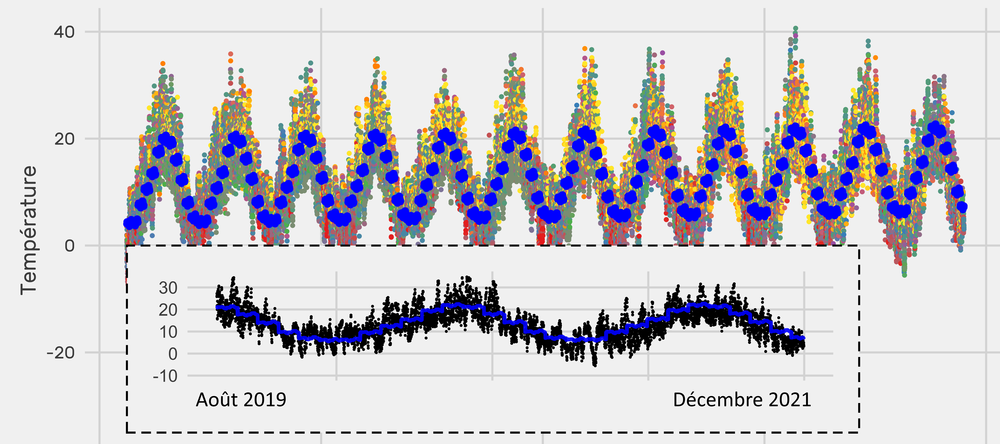
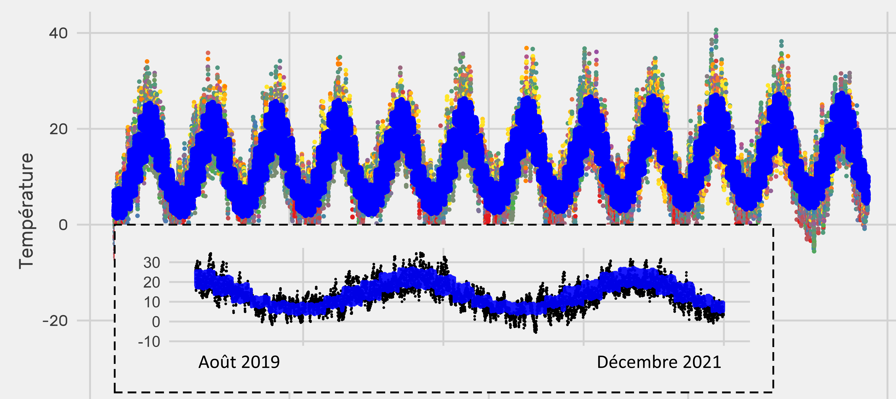
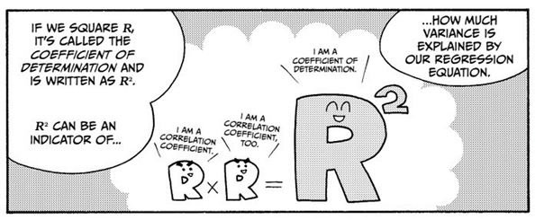

# :sunny: Prévision Météo Tours :cloud:

1.  Prévision de la météo sur Tours par modèles de lissage moyenne mobile/exponentielle, Buys-Ballot et LSTM.

2.  Régression multiple forward, backward, Ridge, Lasso et sur ACP

## Présentation données

Le jeu de données choisis est **météorologique**, nous souhaitons prévoir la température du lendemain en fonction des autres variables quantitative.

Ce jeu de données a été obtenu dans les **opens data** de la ville de Tours, le fichier est trouvable [ici](https://data.tours-metropole.fr/explore/dataset/observation-meteorologique-historiques-tours-synop/export/?sort=date).

D'après l'hébergeur les paramètres atmosphériques sont **mesurés** (température, humidité, direction et force du vent, pression atmosphérique...) ou **observés** (description des nuages, visibilité...) depuis la surface terrestre.

Nous avons cependant une limite à notre analyse. Puisque l'ensemble de ces observations est tirés d'**une seule station** d'observation.

Après lecture de la colonne Date, les données sont collectées de janvier 2010 jusqu'à décembre 2021, il en résulte plus de **30k observations** & **86 variables**.

------------------------------------------------------------------------

## I Prévisions Buys-Ballot et Lissage

### DATA Préparation

Les transformations utilisés pour le nettoyage sont les suivants :

-   Suppression des variables à plus de 15% de manquants

-   Suppression des variables qualitatives

-   PMM du package Mice sur les manquants restants

-   Winsorisation des données

-   Séparation chronologique du jeu de données

### Auto corrélation de la série temporelle

L'auto corrélation de notre série temporelle correspond à la corrélation entre une mesure du trafic $t$ et les mesures précédentes $t - k$ ou les mesures suivantes $t + k$.

L'auto covariance d'une variable 
$Xt$
de moyenne 
$\mu$
et d'écart type 
$\sigma$
à un décalage 
$k$
est donné par la formule

$\gamma_k= E((X_t-\mu)(X_{t+k}-\mu))$

On en déduit l'auto-corrélation correspondante :

$\rho_k=\frac{\gamma_k}{\sigma^2}$

On observe une **corrélation positive forte avec un décalage d'un an**. Cela indique une tendance croissante que l'on vérifie avec un test de Coax Stuart.

### Lissage Moyenne mobile

Une moyenne mobile est un filtre linéaire. Il permet de transformer une série chronologique avec comme but d'annuler une composante (tendance ou saison) pour en laisser les autres invariantes tout en réduisant le bruit.

Une moyenne mobile en t est définit comme une combinaison linéaire finie des valeurs de la série correspondantes à des dates entourant t, c'est donc un lissage de la série.

Une moyenne mobile d'ordre m peut être écrite tel que 
$\begin{equation} \hat{T}_{t} = \frac{1}{m} \sum_{j=-k}^k y_{t+j}, \end{equation}$

Avec 
$m=2k+1$

On souhaite conserver uniquement la tendance, on choisit une **moyenne mobile 2x2920** pour annuler la saisonnalité annuelle.

2920 correspond au nombre d'observations dans une année, nous avons utilisé une combinaison de moyennes mobiles pour la symétrie et la pondération. En effet, voici une moyenne mobile 2x12 : 
$\hat{T}_{t} = \frac{1}{32}y_{t-6} + \frac{1}{12}y_{t-5} + \frac{1}{12}y_{t-4} + \frac{1}{12}y_{t-3} + \frac{1}{12}y_{t-2} + \frac{1}{12}y_{t-1} +\frac{1}{12}y_{t} + \frac{1}{12}y_{t+1} +\frac{1}{12}y_{t+2} + \frac{1}{12}y_{t+3} + \frac{1}{12}y_{t+4} + \frac{1}{12}y_{t+5} + \frac{1}{32}y_{t+6}.$

### Buys-Ballot

L’approche de BUYS-BALLOT consiste à introduire des variables indicatrices correspondant à chaque saison définit par le cycle d’observation tel que $Xt = Zt + St + \mu t$

Nous avons estimer dans un premier temp la tendance $Zt$, puis dans un second temps la saisonnalité $St$, tandis que les $\mu t$ ne peuvent pas être estimer puisqu’il s’agit par définition d’accidents.

**Tendance + Saisonnalité Annuelle + Saisonnalité Mensuelle**

**Tendance + Saisonnalité Annuelle + Saisonnalité Mensuelle + Saisonnalité journalière**

### Model Validation

Soit SCE la somme des distances au carré entre chaque valeur prédite par le modèle ${\widehat y_i}$ et la moyenne des réponses 
$\overline{y}$

$\text{SCE} = \sum_{i=1}^{N}(\hat{y_i} – \overline{y})^2$

Nous obtenons alors la part de dispersion expliquée par le modèle. Puis, nous calculons la dispersion totale des données nommé SCT 
$\text{SCT} = \sum_{i=1}^{N}(y_{i } – \overline{y})^2$

*Avec* $y_i$ *une valeur prise par une variable expliquée*

Nous obtenons alors le R² par la combinaisons des calculs précédents $R^2 = \frac{SCE}{SCT}$

Pour compléter cette mesure, nous utiliserons donc l'erreur absolue moyenne en pourcentage (MAPE en anglais). Il s'agit de la moyenne des écarts en valeur absolue par rapport aux valeurs observées.

C'est donc un pourcentage et par conséquent un indicateur pratique de comparaison.

| Indicateur | Jeu Train (2010-2019) | Jeu Test (2020-2021) | Jeu globale (2010-2021) |
|------------------|------------------|------------------|-------------------|
| R²         | 0.72                  | 0.68                 | 0.65                    |
| MAPE       | 101%                  | 84%                  | 101%                    |

------------------------------------------------------------------------

## II Prévision Régressions Multiples

:fast_forward: [Rapport](https://charlesvitry.github.io/PrevisionMeteoTours/PrevisionToursMeteo.html) :rewind:

### DATA Préparation

***Bilan des problématiques rencontrés avec le jeu de données et leurs résolutions.***

<dl>
  <dt>Le nombre de variables est très important, les données qualitatives ou manquantes empêchent d'effectuer une régression</dt>
  <dd>On résume les données pour identifier les qualitatives et les supprimer.</dd>
  
  <dt>Les données manquantes empêche d'effectuer une régression</dt>
  <dd>On sélectionne les lignes avec une variables manquantes et on les supprime.</dd>
  
  <dt>Si l'on supprime  ces variables, les données seront nulle</dt>
  <dd>On décide de préalablement supprimés les variables avec des manquants.</dd>

  <dt>Une fois les variables avec des manquants supprimés, les données restantes n'expliquent rien, la régression associée a un R²     proche de 0</dt>
  <dd>On regarde combien de manquants sont présents par variables, on classe par ordre décroissant les variables selon leur nombre de manquants, puis on supprime petit à petit les variables pour avoir le bon équilibre entre variables explicatives et nombre d'observations.</dd>
  
  <dt>Nous souhaitons réaliser une prévision de la température à la prochaine observation, mais cette variable n'est pas présente</dt>
  <dd>Création de cette variable par utilisation de la méthode lag.</dd>
  
  <dt>Le modèle a un R² proche de 0 car les données ne sont pas ordonnées chronologiquement</dt>
  <dd>On ordonne selon la variable Date</dd>
  
  <dt>Les prédictions donnent de mauvais résultat, car les observations n'ont pas les même écarts temporelles entre elles, en effet certains jours il y a 0 observation, tandis que d'autres il y a 15.</dt>
 <dd>On associe à un id à chaque jour en isolant les parties de la variable date puis en effectuant le calcul jour + 30 x mois + 365 x année, ainsi chaque observation a désormais l'id de son jour. Ensuite on ne garde que la première observation de chaque id, il ne reste plus qu’une observation par jour.</dd>
</dl>

Après nettoyage, nous avons **1655 observations de 21 variables**, cela est suffisant pour la régression multiple.

------------------------------------------------------------------------

### Model Building

Nous allons effectuer plusieurs régressions pour essayer d’expliquer la température en fonction des autres variables explicatives.

| R² ajusté obtenu | Modèle                                   |
|------------------|------------------------------------------|
| 0.67             | Régression avec toutes les variables     |
| 0.60             | Régression avec variables significatives |
| 0.67             | Régression forward                       |
| 0.67             | Régression backward                      |
| 0.67             | Régression sur ACP                       |
| 0.67             | Régression Ridge                         |
| 0.67             | Régression Lasso                         |

------------------------------------------------------------------------

------------------------------------------------------------------------

### Model Validation

Nous allons utiliser le **R² ajusté** pour comparer les différentes régressions. Cette mesure indique la proportion de la variance expliquée par le modèle.

-   0 % le modèle n’explique par la variable Y
-   100 % le modèle explique la variabilité de Y lié à la liaison linéaire des variables explicatives entièrement

La régression avec toutes les variables obtient un R² de **0.67**, lorsque nous essayons d’obtenir une régression “presque aussi bien” en retirons les variables les moins explicatives, le **R² chute à 0.60**.

Ensuite, en utilisant les méthodes de **protection de la régression**, nous obtenons le même R² avec les régressions forward,backward,sur ACP, Ridge que avec la régression avec toutes les variables. Nous voyons l’efficacité de ces méthodes.

------------------------------------------------------------------------

## Conclusion :snowflake:

**En partant d’une base open-source, nous avons réussis à prédire la météo sur Tours sur une année ainsi que la température du jour suivant en l’exprimant linéairement par rapport à un ensemble de variables explicatives.**

**Nous avons besoin des données de plusieurs stations afin d'obtenir des résultats viables, les résultats de la partie II ne sont pas exploitables car les modèles ne prenaient pas en compte la tendance et la saisonnalité (analyse confirmé par l'Anova).**

*Bonus :* [Un test du package Shiny](https://www.youtube.com/watch?v=pUIEis6BMr8)
