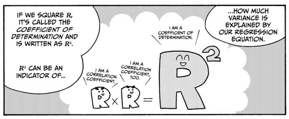

---
title: |
  {width=25%}  
  Prévision météorologique sur la Ville de Tours
author: 
- Charles Vitry
- Clovis Deletre
date: "[Régression Linéaire Multiple](https://fr.wikipedia.org/wiki/R%C3%A9gression_lin%C3%A9aire_multiple)"
output:
  rmarkdown::html_document:
    theme: cerulean
    number_sections: no
    toc: yes
    toc_float: true
---

<style type="text/css">

body{ /* Normal  */
      font-size: 20px;
  }
td {  /* Table  */
  font-size: 8px;
}
h1.title {
  font-size: 55px;
  color: DarkBlue;
}
h1 { /* Header 1 */
  font-size: 38px;
  color: DarkBlue;
}
h2 { /* Header 2 */
    font-size: 38px;
  color: DarkBlue;
}
h3 { /* Header 3 */
  font-size: 35px;
  font-family: "Times New Roman", Times, serif;
  color: DarkBlue;
}
code.r{ /* Code block */
    font-size: 12px;
}
pre { /* Code block - determines code spacing between lines */
    font-size: 14px;
}
</style>


```{r setup, include=FALSE}
#knitr::opts_chunk$set(echo = TRUE)

#install for export in pdf file
#tinytex::install_tinytex()
```

## Présentation des données

Nous étions à la recherche d'un **jeu de données** de minimum 300 observations et 15 variables quantitatives dont une à expliquer,
Nous avions des jeux de données provenant de sondages, mais leurs données étaient qualitative, donc non exploitable dans notre contexte d'étude.

Après recherche, le jeu de données choisis est météorologique, nous souhaitons prévoir la température du lendemain en fonction des autres variables quantitative. Ce jeu de données a été obtenu dans les open data de la ville de Tours, le fichier est trouvable à l'adresse suivante : <https://data.tours-metropole.fr/explore/dataset/observation-meteorologique-historiques-tours-synop/export/?sort=date>.
<br> </br>
# Import de la base de données

On ajoute le paramètre UTF 8 car les noms de variables sont en français.
```{r}
#Windows only
 # data <- 
   # read.csv("~/PrevisionMeteoTours/observation-meteorologique-historiques-tours-synop.csv",
         #  encoding="UTF-8",
     #        sep=";")

#Linux & Windows

data <- 
  read.csv("observation-meteorologique-historiques-tours-synop.csv",
           encoding="UTF-8",
           sep=";")


```

D'après l'hébergeur les paramètres atmosphériques sont mesurés (température, humidité, direction et force du vent, pression atmosphérique...) ou observés (description des nuages, visibilité...) depuis la surface terrestre.

Après lecture de la colonne Date, les données sont collectés de 2010 jusqu'à maintenant, il en résulte 34854 observations.


\newpage
Nous avons cependant une limite à notre analyse.
Puisque l'ensemble de ces observations est tirés d'une seule station d'observation.
{width=50%}

<br> </br>
Nous supprimons alors les collonnes correspondant à des indications géographiques
```{r}
#numero de la station météo
data$ID.OMM.station <- NULL
data$ID.OMM.station<- NULL
#coords géographique
data$Coordonnees <- NULL
data$Coordonnees <- NULL

data$Latitude <- NULL
data$Latitude <- NULL

data$Longitude <- NULL
data$Longitude <- NULL
#Nom de la ville et département
data$Nom <- NULL
data$Nom <- NULL

data$communes..code. <- NULL
data$communes..code. <- NULL

data$communes..name. <- NULL
data$communes..name. <- NULL

data$EPCI..name. <- NULL
data$EPCI..name.  <- NULL

data$EPCI..code. <- NULL
data$EPCI..code. <- NULL

data$department..name. <- NULL
data$department..name. <- NULL

data$department..code. <- NULL
data$department..code. <- NULL

data$region..name. <- NULL
data$region..name. <- NULL

data$region..code.<- NULL
data$region..code. <- NULL
```
<br> </br>
Les colonnes vides ou constantes sont inutilisables
```{r}
data$Niveau.baromÃ.trique  <- NULL
data$Niveau.barométrique <- NULL

data$TempÃ.rature.minimale.sur.24.heures <- NULL
data$Température.minimale.sur.24.heures...C. <- NULL

data$TempÃ.rature.minimale.sur.24.heures..Â.C. <- NULL


data$MÃ.thode.de.mesure.TempÃ.rature.du.thermomÃ.tre.mouillÃ. <- NULL
data$Méthode.de.mesure.Température.du.thermomètre.mouillé <- NULL

data$TempÃ.rature.du.thermomÃ.tre.mouillÃ. <- NULL
data$Température.du.thermomètre.mouillé <- NULL

data$Hauteur.totale.de.la.couche.de.neige..glace..autre.au.sol <- NULL
data$Hauteur.totale.de.la.couche.de.neige..glace..autre.au.sol <- NULL

data$NÃ.bulositÃ..couche.nuageuse.4 <- NULL
data$Nébulosité.couche.nuageuse.4 <- NULL

data$Hauteur.de.base.4 <- NULL
data$Hauteur.de.base.4 <- NULL

data$TempÃ.rature.minimale.sur.24.heures <- NULL
data$Température.minimale.sur.24.heures <- NULL

data$TempÃ.rature.maximale.sur.24.heures <- NULL
data$Température.maximale.sur.24.heures <- NULL

data$Altitude  <- NULL
data$Altitude <- NULL

data$NÃ.bulositÃ..couche.nuageuse.1  <- NULL
data$Nébulosité.couche.nuageuse.1 <- NULL

data$Etat.du.sol  <- NULL
data$Etat.du.sol <- NULL

data$Periode.de.mesure.de.la.rafale  <- NULL
data$Periode.de.mesure.de.la.rafale <- NULL

data$NÃ.bulositÃ...des.nuages.de.l..Ã.tage.infÃ.rieur  <- NULL
data$Nébulosité..des.nuages.de.l..étage.inférieur <- NULL

data$TempÃ.rature.minimale.du.sol.sur.12.heures..en.Â.C. <- NULL
data$Température.minimale.du.sol.sur.12.heures..en..C. <- NULL

```

<br> </br>
Retirons les variables qualitatives.

Type de tendance barométrique et temps présent est mis quali- mi quanti, nous ne les traiterons pas
```{r}
data$Type.de.tendance.baromÃ.trique <- NULL
data$Type.de.tendance.barométrique <- NULL

data$Temps.prÃ.sent <- NULL
data$Temps.présent <- NULL

data$Temps.prÃ.sent.1 <- NULL
data$Temps.présent.1 <- NULL

data$Temps.passÃ..1 <- NULL
data$Temps.passé.1 <- NULL

data$Temps.passÃ..1.1 <- NULL
data$Temps.passé.1.1 <- NULL

data$Temps.passÃ..2 <- NULL
data$Temps.passé.2 <- NULL

data$Type.de.tendance.baromÃ.trique.1 <- NULL
data$Type.de.tendance.barométrique.1 <- NULL

data$mois_de_l_annee <- NULL
data$mois_de_l_annee <- NULL


```


<br> </br>
Nous n'avons pas supprimé la variable date car elle nous est utile à trier chronologiquement les données.
```{r,echo=TRUE}

data <- data[order(as.Date(data$Date)),]

```
<br> </br>


Observons les valeurs manquantes des variables restantes
```{r,results='hide'}
#1
#sum(is.na(data$Pression.au.niveau.mer))
#2
#sum(is.na(data$Variation.de.pression.en.3.heures))
#3
#sum(is.na(data$Type.de.tendance.baromÃ.trique))
#4
#sum(is.na(data$Direction.du.vent.moyen.10.mn))
#5
#sum(is.na(data$Vitesse.du.vent.moyen.10.mn))
#6
#sum(is.na(data$TempÃ.rature))
#7
#sum(is.na(data$Point.de.rosÃ.e))
#8
#sum(is.na(data$HumiditÃ.))
#9
#sum(is.na(data$VisibilitÃ..horizontale))
#10
#sum(is.na(data$NebulositÃ..totale))
#11
#sum(is.na(data$NÃ.bulositÃ...des.nuages.de.l..Ã.tage.infÃ.rieur))
#12
#sum(is.na(data$Hauteur.de.la.base.des.nuages.de.l.Ã.tage.infÃ.rieur))
#13
#sum(is.na(data$Type.des.nuages.de.l.Ã.tage.infÃ.rieur))
#14
#sum(is.na(data$Type.des.nuages.de.l.Ã.tage.moyen))
#15
#sum(is.na(data$Type.des.nuages.de.l.Ã.tage.supÃ.rieur))
#16
#sum(is.na(data$Pression.station))
#17
#sum(is.na(data$GÃ.opotentiel))
#18
#sum(is.na(data$Variation.de.pression.en.24.heures))
#19
#sum(is.na(data$TempÃ.rature.minimale.sur.12.heures))
#20
#sum(is.na(data$TempÃ.rature.maximale.sur.12.heures))
#21
#sum(is.na(data$TempÃ.rature.minimale.du.sol.sur.12.heures))
#22
#sum(is.na(data$Rafale.sur.les.10.derniÃ.res.minutes))
#23
#sum(is.na(data$Rafales.sur.une.pÃ.riode))
#24
#sum(is.na(data$Periode.de.mesure.de.la.rafale))
#25
#sum(is.na(data$Etat.du.sol))
#26
#sum(is.na(data$Hauteur.de.la.neige.fraÃ.che))
#27
#sum(is.na(data$Periode.de.mesure.de.la.neige.fraiche))
#28
#sum(is.na(data$PrÃ.cipitations.dans.la.derniÃ.re.heure))
#29
#sum(is.na(data$PrÃ.cipitations.dans.les.3.derniÃ.res.heures))
#30
#sum(is.na(data$PrÃ.cipitations.dans.les.6.derniÃ.res.heures))
#31
#sum(is.na(data$PrÃ.cipitations.dans.les.12.derniÃ.res.heures))
#32
#sum(is.na(data$PrÃ.cipitations.dans.les.24.derniÃ.res.heures))
#33
#sum(is.na(data$PhÃ.nomÃ.ne.spÃ.cial.1))
#34
#sum(is.na(data$PhÃ.nomÃ.ne.spÃ.cial.2))
#35
#sum(is.na(data$PhÃ.nomÃ.ne.spÃ.cial.3))
#36
#sum(is.na(data$PhÃ.nomÃ.ne.spÃ.cial.4))
#37
#sum(is.na(data$NÃ.bulositÃ..couche.nuageuse.1))
#38
#sum(is.na(data$Type.nuage.1))
#39
#sum(is.na(data$Hauteur.de.base.1))
#40
#sum(is.na(data$NÃ.bulositÃ..couche.nuageuse.2))
#41
#sum(is.na(data$Type.nuage.2))
#42
#sum(is.na(data$NÃ.bulositÃ..couche.nuageuse.3))
#43
#sum(is.na(data$Type.nuage.3))
#44
#sum(is.na(data$Hauteur.de.base.3))
#45
#sum(is.na(data$Type.nuage.4))
#46
#sum(is.na(data$Temps.prÃ.sent.1))
#47
#sum(is.na(data$TempÃ.rature..Â.C.))
#48
#sum(is.na(data$TempÃ.rature.minimale.sur.12.heures..Â.C.))
#49
#sum(is.na(data$TempÃ.rature.maximale.sur.12.heures..Â.C.))
#50
#sum(is.na(data$TempÃ.rature.maximale.sur.24.heures..Â.C.))
#51
#sum(is.na(data$TempÃ.rature.minimale.du.sol.sur.12.heures..en.Â.C.))
#52
#sum(is.na(data$Altitude))
#53
#sum(is.na(data$mois_de_l_annee))

```
On en déduit cela


plus 20 000 manquants:
<ul>
* $Type.des.nuages.de.l.Ã.tage.infÃ.rieur 
* $Type.des.nuages.de.l.Ã.tage.moyen
* $Type.des.nuages.de.l.Ã.tage.supÃ.rieur
* $GÃ.opotentiel
* $TempÃ.rature.minimale.sur.12.heures
* $TempÃ.rature.maximale.sur.12.heures
* $Hauteur.de.la.neige.fraÃ.che
* $Periode.de.mesure.de.la.neige.fraiche
* $PhÃ.nomÃ.ne.spÃ.cial.1
* $PhÃ.nomÃ.ne.spÃ.cial.2
* $PhÃ.nomÃ.ne.spÃ.cial.3
* $PhÃ.nomÃ.ne.spÃ.cial.4
* $Type.nuage.1
* $Hauteur.de.base.1
* $NÃ.bulositÃ..couche.nuageuse.2
* $Type.nuage.2
* $NÃ.bulositÃ..couche.nuageuse.3
* $Type.nuage.3
* $Hauteur.de.base.3
* $Type.nuage.4
* $TempÃ.rature.minimale.sur.12.heures..Â.C.
* $TempÃ.rature.maximale.sur.12.heures..Â.C.
* $TempÃ.rature.maximale.sur.24.heures..Â.C.
</ul>


Plus de 10 000:

<ul>
* $NebulositÃ..totale
* $Hauteur.de.la.base.des.nuages.de.l.Ã.tage.infÃ.rieur
* $Variation.de.pression.en.24.heures
* $TempÃ.rature.minimale.du.sol.sur.12.heures
* $Rafale.sur.les.10.derniÃ.res.minutes
* $Etat.du.sol
* $PrÃ.cipitations.dans.les.6.derniÃ.res.heures
* $PrÃ.cipitations.dans.les.12.derniÃ.res.heures
* $PrÃ.cipitations.dans.les.24.derniÃ.res.heures
* $NÃ.bulositÃ..couche.nuageuse.1
* $TempÃ.rature.minimale.du.sol.sur.12.heures..en.Â.C.
</ul>
plus de 5000:
<ul>
* $NÃ.bulositÃ...des.nuages.de.l..Ã.tage.infÃ.rieur
</ul>

<br> </br>
Création d'un jeu de donnée où on supprimme que les plus de 30 000
```{r}
#data2 <- data 

#data2$GÃ.opotentiel <- NULL
#data2$TempÃ.rature.maximale.sur.24.heures..Â.C. <- NULL
#data2$Type.nuage.4 <- NULL
#data2$PhÃ.nomÃ.ne.spÃ.cial.4 <- NULL
#data2$Type.nuage.2 <- NULL
#data2$NÃ.bulositÃ..couche.nuageuse.3 <- NULL
#data2$Type.nuage.3 <- NULL
#data2$Hauteur.de.base.3 <- NULL
#data2$Type.nuage.4 <- NULL
```
Test des régressions sur cet ensemble : exactement les mêmes résultats.


<br> </br>
Suppression des plus de 20 000
```{r}
data$Type.des.nuages.de.l.Ã.tage.infÃ.rieur <- NULL
data$Type.des.nuages.de.l.étage.inférieur <- NULL

data$Type.des.nuages.de.l.Ã.tage.moyen <- NULL
data$Type.des.nuages.de.l.étage.moyen <- NULL

data$Type.des.nuages.de.l.Ã.tage.supÃ.rieur <- NULL
data$Type.des.nuages.de.l.étage.supérieur <- NULL

data$GÃ.opotentiel <- NULL
data$Géopotentiel <- NULL

data$TempÃ.rature.minimale.sur.12.heures <- NULL
data$Température.minimale.sur.12.heures <- NULL

data$TempÃ.rature.maximale.sur.12.heures <- NULL
data$Température.maximale.sur.12.heures <- NULL

data$Hauteur.de.la.neige.fraÃ.che <- NULL
data$Hauteur.de.la.neige.fraîche <- NULL

data$Periode.de.mesure.de.la.neige.fraiche <- NULL
data$Periode.de.mesure.de.la.neige.fraiche <- NULL

data$PhÃ.nomÃ.ne.spÃ.cial.1 <- NULL
data$Phénomène.spécial.1 <- NULL

data$PhÃ.nomÃ.ne.spÃ.cial.2 <- NULL
data$Phénomène.spécial.2 <- NULL

data$PhÃ.nomÃ.ne.spÃ.cial.3 <- NULL
data$Phénomène.spécial.3 <- NULL

data$PhÃ.nomÃ.ne.spÃ.cial.4 <- NULL
data$Phénomène.spécial.4 <- NULL

data$Type.nuage.1 <- NULL
data$Type.nuage.1 <- NULL

data$Hauteur.de.base.1 <- NULL
data$Hauteur.de.base.1 <- NULL

data$NÃ.bulositÃ..couche.nuageuse.2 <- NULL
data$Nébulosité.couche.nuageuse.2 <- NULL

data$Type.nuage.2 <- NULL
data$Type.nuage.2 <- NULL

data$NÃ.bulositÃ..couche.nuageuse.3 <- NULL
data$Nébulosité.couche.nuageuse.3 <- NULL

data$Type.nuage.3 <- NULL
data$Type.nuage.3 <- NULL

data$Hauteur.de.base.3 <- NULL
data$Hauteur.de.base.3 <- NULL

data$Type.nuage.4 <- NULL
data$Type.nuage.4 <- NULL

data$TempÃ.rature.minimale.sur.12.heures..Â.C. <- NULL
data$Température.minimale.sur.12.heures...C. <- NULL

data$TempÃ.rature.maximale.sur.12.heures..Â.C. <- NULL
data$Température.maximale.sur.12.heures...C. <- NULL

data$TempÃ.rature.maximale.sur.24.heures..Â.C. <- NULL
data$Température.maximale.sur.24.heures...C. <- NULL

```
<br> </br>
Il s'agit d'une conversion de Kelvin en celsius, cette ligne n'a pas d'utilité
```{r}
data$TempÃ.rature..Â.C. <- NULL
data$Température...C.  <- NULL

#data2$TempÃ.rature..Â.C. <- NULL
```

<br> </br>
Nous sommes alors à 22 variables.


Mais combien d'observations si l'on retire les lignes avec des manquants ?
```{r, results='hide'}
which(is.na(data))
data <- na.omit(data)


#which(is.na(data2))
#data2 <- na.omit(data2)
```

<br> </br>
On créé une colonne DateEnJour afin que chaque jour est son numéro
```{r}
#library(dplyr)
#df %>% 
#  slice(which.max(as.Date(data$Date)))

data$jour = format(as.Date(data$Date,format="%Y-%m-%d"), format = "%d")
data$mois = ( format(as.Date(data$Date,format="%Y-%m-%d"), format = "%m"))
data$annee = format(as.Date(data$Date,format="%Y-%m-%d"), format = "%Y")

#multiplieur 
#c'était un problème de classe de donnée
#data$trente <- replicate(4965, 30)
#data$troisCent <- replicate(4965, 365)

data$jour <- as.numeric(data$jour)
data$mois <- as.numeric(data$mois)
data$annee <- as.numeric(data$annee)


data$DateEnJour <- data$jour + (30 *data$mois) + ( 365*data$annee)

```


<br> </br>
On ne garde que une observation par jour pour un jeu de prévision 
en effet le nbre d'observation par jour est irrégulier.
```{r}

prevision <- do.call(rbind, by(data, list(data$DateEnJour), 
                  FUN=function(x) head(x, 1)))

```
<br> </br>
On supprimme les variables créé et la date
```{r}
data$Date <- NULL
data$DateEnJour <- NULL
data$annee <- NULL
data$mois <- NULL
data$jour <- NULL

prevision$Date <- NULL
prevision$DateEnJour <- NULL
#prevision$annee <- NULL
#prevision$mois <- NULL
prevision$jour <- NULL


```
<br> </br>
On a pas supprimmer le paramètre mois pour faire un test (en utilisant la statistique de student.)
```{r}
prevision$mois <- ifelse(prevision$mois < 5 ,"Hiver","Pas Hiver")
```
<br> </br>
Il y a t'il une différence significative de moyenne de température entre les relevés en Hiver et les autres ?
```{r}
#Welch correction inclus dans la fonction t.test()
# test1<-t.test(TempÃ.rature ~ mois, prevision)
# test1

test1<-t.test(Température ~ mois, prevision)
test1
```

t est la statistique de student (-26.435) et df est le degré de liberté,
la p-value, qui détermine la significativité du test est inférieur à 0.05, on rejette HO : "Les moyennes de températures sont égales"
La différence est très significative.
<br> </br>
<br> </br>

```{r}
prevision$mois <- NULL
prevision2 <- prevision
prevision$annee <- NULL
```
<br> </br>


<br> </br>
Pour le jeu de prévision,
nous creons une colonne température mais décaler de 1 jour.

La première méthode utilisé n'était pas correct puisque l'on décalait dans le mauvais sens la colonne avec la méthode lag,
puis on supprimait la première observation.


```{r,warning=FALSE}
#Mauvaise méthode
#data$TemperatureDecaler <- lag(data$TempÃ.rature)
#on supprimme la première observation
#data = data[-1,]


library(Hmisc)
#prevision$Precipitation_Jour_Suivant <- Lag(prevision$PrÃ.cipitations.dans.les.24.derniÃ.res.heures, shift = -1)
prevision$Temperature_Jour_Suivant <- Lag(prevision$Température, shift = -1)
#on supprimme la derniere observation
library(dplyr)
prevision = slice(prevision, 1:(n() -1))

#De même on réduit la taille du nbre d'observation de data
data = slice(data, 1:(n() -662))

```
<br> </br>
```{r}
dim(prevision)
```
On a donc 1655 observations de 21 variables,
cela est suffisant pour la régression multiple.

<br> </br>

Bilan des problèmatiques rencontrés avec le jeu de données et leurs résolutions.

**Le nombre de variables est très important, les données qualitatives ou manquantes empêche d'effectuer une régression**

* On résume les données pour identifier les qualitatives et les supprimmer.

**Les données manquantes empêche d'effectuer une régression**

* On sélectionne les lignes avec une variables manquantes et on les supprimme.

**Si l'on supprimme  ces variables, les données seront nulle**

* On décide de préalablement supprimmés les variables avec des manquants.

**Une fois les variables avec des manquants supprimmés, les données restantes n'expliquent rien, la régression associé a un R² proche de 0**

* On regarde combien de manquants sont présents par variables, on classe par ordre décroissant les variables selon leur nombre de manquants, puis on supprimme petit à petit les variables pour avoir le bon équilibre entre variables explicatives et nombre d'observations.

**Nous souhaitons réaliser une prévision de la température à la prochaine observation, mais cette variables n'est pas présente**

* Création de cette variables par utilisation de la méthode lag.

**Le modèle a un R² proche de 0 car les données ne sont pas ordonnées chronologiquement**

* On ordonne selon la variable Date

**Les prédictions donnent de mauvais résultat, car les observations n'ont pas les même écarts temporelles entre elles, en effet certains jours il y a 0 observation, tandis que d'autres il y a 15.**

* On associe à un id à chaque jour en isolant les parties de la variables date puis en effectuant le calcul jour + 30 x mois + 365 x annee, ainsi chaque observations a désormais l'id de son jour. Ensuite on ne garde que la première observation de chaque id, il ne reste plus que une observation par jour.


## Statistiques Descriptives
<br> </br>
Regardons ce qui caractérise cette base de données,
tant au niveau des moyennes, de la variance...

```{r donnee}
summary(data)
```
Nos observations sont complètes, et les variables toutes quantitatives, nous pouvons commencer la régression multiple.

<br> </br>
Nous n'avons pas importer en UTF-8 pour économiser de la place, donnons des labels corrects aux colonnes que nous allons utiliser.
```{r}
#labels <- c(
#  "Pression_Mer",
#  "Variation_Pression_3h",
#  "Direction_vent",
#  "Vitesse_vent",
#  "Temperature",
#  "Point_de_rosee",
#  "Humidite",
#  "Visibilite_horizontale",
#  "Nebulosite_total",
#  "Hauteur_Base_Nuage_Inferieur",
#  "Pression_Station",
#  "Variation_Pression",
#  "Temperature_minimale_sol",
#  "Rafales",
#  "Rafales_total",
#  "Precipitation_1h",
#  "Precipitation_3h",
#  "Precipitation_6h",
#  "Precipitation_12h",
#  "Precipitation_24h",
#  "Hauteur_Base_Nuage_Superieur"
#  "Precipitation_Jour_Suivant"
#            )
#names(data) <- labels

#label <- c(
#  "Pression_Mer",
#  "Variation_Pression_3h",
#  "Direction_vent",
#  "Vitesse_vent",
#  "Temperature",
#  "Point_de_rosee",
#  "Humidite",
#  "Visibilite_horizontale",
#  "Nebulosite_total",
#  "Hauteur_Base_Nuage_Inferieur",
#  "Pression_Station",
#  "Variation_Pression",
#  "Temperature_minimale_sol",
#  "Rafales",
# "Rafales_total",
#  "Precipitation_1h",
#  "Precipitation_3h",
#  "Precipitation_6h",
#  "Precipitation_12h",
#  "Precipitation_24h",
#  "Hauteur_Base_Nuage_Superieur",
#  "Precipitation_Jour_Suivant"
#            )
#names(prevision) <- label

```


<br> </br>
<br> </br>


```{r, results='hide'}
#Avoir toujours les mêmes résultats
# set.seed(1234) 
# 
# #on sélectionne 20% des lignes
# nb_lignes <- sample(1:nrow(prevision), nrow(prevision)*0.20)
# testing <- prevision[nb_lignes,]
# prevision <- prevision[-nb_lignes,]


```


Notre jeu de donnée pour la regression linéaire est prêt.
<br> </br>
## Régression multiple avec toutes les variables explicatives
<br> </br>

Nous allons effectuer plusieurs régressions pour essayer d'expliquer la température en fonction des autres variables explicatives. 

Nous allons utiliser le R² pour comparer les différentes régressions.
Cette mesure indique la proportion de la variance expliquée par le modèle.

* 0 % le modèle n'explique par la variable Y
* 100 % le modèle explique la variabilité de Y lié à la liaison linéaire des variables explicatives entièrement





<br> </br>
Tests de regression sur notre jeu complet.
```{r}
#reg.mul <- lm(Pression.au.niveau.mer~.,data)
#shapiro.test(reg.mul$residuals)

#reg.mul <- lm(Variation.de.pression.en.3.heures~.,data)
#shapiro.test(reg.mul$residuals)

#reg.mul <- lm(Direction.du.vent.moyen.10.mn~.,data)
#shapiro.test(reg.mul$residuals)

#reg.mul <- lm(Vitesse.du.vent.moyen.10.mn~.,data)
#shapiro.test(reg.mul$residuals)

#reg.mul <- lm(Point.de.rosÃ.e~.,data)
#shapiro.test(reg.mul$residuals)

#reg.mul <- lm(HumiditÃ.~.,data)
#shapiro.test(reg.mul$residuals)

#reg.mul <- lm(VisibilitÃ..horizontale~.,data)
#shapiro.test(reg.mul$residuals)

#reg.mul <- lm(NebulositÃ..totale~.,data)
#shapiro.test(reg.mul$residuals)

#reg.mul <- lm(Hauteur.de.la.base.des.nuages.de.l.Ã.tage.infÃ.rieur~.,data)
#shapiro.test(reg.mul$residuals)

#reg.mul <- lm(Pression.station~.,data)
#shapiro.test(reg.mul$residuals)

#reg.mul <- lm(Variation.de.pression.en.24.heures~.,data)
#shapiro.test(reg.mul$residuals)

#reg.mul <- lm(TempÃ.rature.minimale.du.sol.sur.12.heures~.,data)
#shapiro.test(reg.mul$residuals)

#reg.mul <- lm(Rafale.sur.les.10.derniÃ.res.minutes~.,data)
#shapiro.test(reg.mul$residuals)

#reg.mul <- lm(Rafales.sur.une.pÃ.riode~.,data)
#shapiro.test(reg.mul$residuals)

#reg.mul <- lm(PrÃ.cipitations.dans.la.derniÃ.re.heure~.,data)
#shapiro.test(reg.mul$residuals)

#reg.mul <- lm(PrÃ.cipitations.dans.les.3.derniÃ.res.heures~.,data)
#shapiro.test(reg.mul$residuals)

#reg.mul <- lm(PrÃ.cipitations.dans.les.6.derniÃ.res.heures~.,data)
#shapiro.test(reg.mul$residuals)

#reg.mul <- lm(PrÃ.cipitations.dans.les.12.derniÃ.res.heures~.,data)
#shapiro.test(reg.mul$residuals)

#reg.mul <- lm(PrÃ.cipitations.dans.les.24.derniÃ.res.heures~.,data)
#shapiro.test(reg.mul$residuals)

#reg.mul <- lm(Hauteur.de.base.2~.,data)
#shapiro.test(reg.mul$residuals)

#reg.mul <- lm(TempÃ.rature~.,data)
#shapiro.test(reg.mul$residuals)


```
Toutes les régressions testés affichent des résidus non gaussiens. 
Ceci n'est pas surprenant dans la mesure où nous avons 5000 observations.

<br> </br>
Regression avec toutes les variables en testant la normalité des résidus.
```{r}
reg.mul <- lm(Temperature_Jour_Suivant ~.,prevision)
shapiro.test(reg.mul$residuals)

```
<br> </br>

On test Ho : "tt les Ɛi suivent N(0,1)"
Ici la p-value est inferieur à 5% donc on rejette H0, d'après le test les Ɛi ne suivent pas des lois normales (résidus non gaussiens).

<br> </br>

Visualisons les résidus par un histogramme
```{r}
hist(reg.mul$residuals)
#hist(reg.mul.prevision$residuals)
```
<br> </br>

On réalise l'histogramme des résidus, ils ont la forme d'une Gaussienne.

Donc les résidus semblent suivre une loi gaussienne.

Le test shapiro affiche des résidus non gaussiens, mais ceci peut être expliqué par notre grand nombre d'observations.
Cette hypothèse se confirmera lorsqu'on regarde l'histogramme des résidus.

Ainsi nos tests de Fisher et student seront valables.

<br> </br>


Quels options sont possibles lorsque notre régression est mauvaise ?

Premièrement, on vérifie par un test de Fisher que le modèle est valide.

Deuxièmement,on peut ajouter la constante au modèle de regression ou d'autres variables explicatives afin de réduire les résidus.

D'autres options sont possibles : une selection de variables (forward ou backward selection), imposer des contraintes au vecteur de régression (cf Lasso ou Ridge), réaliser une régression sur les composantes principales (ACP : variables non correlés)

Continuons avec la régression multiple sur notre jeu de données.

<br> </br>
Résultat de la regression
```{r}
summary(reg.mul)
#summary(reg.mul.prevision)
```


La moyenne des résidus n'est pas affiché car elle est de 0 (ils sont gaussiens). 

La colonne Estimate correspond à notre vecteur des Bêta chapeau (notre estimateur de Bêta).

Pour tester leur significativité on regarde les test de student, les t value sont les statistiques de student, si la p-value < 0.05 on rejette H0.
Avec H0 : "Bi = 0" > Pour tout i appartenant à (1..21)

Il nous est indiqué que 5 variables sont significatives, il y en a peu car les variables doivent être très corréllés.

Attention, Nous ne pouvons écrire que Temperature du jour suivant = 40 + TempÃ.rature.minimale.du.sol.sur.12.heures  * 3.3 + Variation.de.pression.en.24.heures  * 5  ,
il faut refaire le modèle avec uniquement ces variables. 


Un R² de 0.67 est trouvé et le R²ajusté = 0.67 également. 
On test la validité du R² avec un test de fisher (f calculté = 104.6), 
  la p_value est < 0.05 on rejette H0.

Pour rappel : 
  - R² = SCE / SCT
  - R²ajusté = 1 - ( SCR / (n-p-1) ) / ( SCE / (n-p) )

D'où 57% de la variabilité est expliquée par le modèle de regréssion.

Pour comparer nos régressions,nous utiliserons le R² ajusté.


<br> </br>
Réalisons les intervalles de confiance à 95%.
```{r}
confint(reg.mul)
#confint(reg.mul.prevision)
```
Ainsi sur un échantillon de mesures météorologiques de 100 individus, 95 seront dans ces valeurs.


<br> </br>

Test d'une Regression sans la Constante :
```{r}
reg.mulSansC <- lm(Temperature_Jour_Suivant~.-1,prevision)
shapiro.test(reg.mulSansC$residuals)
summary(reg.mulSansC)
```
Le test de shapiro donne des résidus non gaussiens (sans surprise).

On trouve un R² d'environ 1, ce qui est normal.


<br> </br>
On refait une régression avec les variables significatives de reg.mul et la constante
```{r}


reg.mulfin <- lm(Temperature_Jour_Suivant~Variation.de.pression.en.24.heures +
                   Hauteur.de.base.2 +
                   Température.minimale.du.sol.sur.12.heures,
                  # TempÃ.rature.minimale.du.sol.sur.12.heures ,
                 prevision
                   
                   ) 
summary(reg.mulfin)
```
<br> </br>

On trouve un R² de 0.60 et le R² ajusté également.

Touts les paramètres sont significatifs.

```{r}
shapiro.test(reg.mulfin$residuals)
```


<br> </br>
### Matrice des corrélations des variables explicative
<br> </br>

Corrélation entre toutes les variables
```{r,results='hide'}
#correlation
mcor <- cor(prevision)

#Les Correlations sans visualisation graphique. 
mcor


```


<br> </br>
Visualisation graphique des correlations.
```{r}
#
library(corrplot)
corrplot(mcor,type="upper",
         order="hclust",
         tl.col="black",
         tl.srt=45,
         col = NULL,
          tl.pos='n'
         
         )
```

<br> </br>
La matricé était symétrique, on ne garde que le triangle supérieur. 

Bleu foncé > corrélation positive forte.
Rouge foncé > corrélation négative forte.

On remarque que des groupes entre variables de memes unités se forme tel vitesse du vent avec les données sur les rafales.

Les corrélations les plus importantes sont celles avec Temperature du jour suivant qui est fortement correlées à 3 autres variables.

A noter que nos variables ont des fortes corrélations, nous verrons cet impact avec la régression sur ACP.

<br> </br>

On représentation des résidus, on ne doit pas dépasser 5%.

```{r}
res.m <- rstudent(reg.mulfin)
plot(res.m, pch=20,cex=1, ylab = "Residus", main="",ylim=c(-4,+4))
lines(x=c(-2,0,2),y=c(2,1,2))
```

## Régression pas à pas
<br> </br>
Tentons d'obtenir une régression exploitable.
<br> </br>
### Ascendant

<br> </br>
On commence par une régression à une seule variable
```{r}
reg1 <- lm(Temperature_Jour_Suivant~1,prevision)
reg1
```
En simplifiant la formule de la régression à une seule variable, il ne reste plus que y(barre), càd la moyenne.

<br> </br>
Voyons quelle variable pouvons nous ajouter à cette régression.
On effectue un test de Fisher
```{r}


add1(reg1, scope =~Pression.au.niveau.mer +
       Variation.de.pression.en.3.heures +
       Direction.du.vent.moyen.10.mn  +
       Vitesse.du.vent.moyen.10.mn  +
       
       # Point.de.rosÃ.e  +
       # HumiditÃ.     +
       # VisibilitÃ..horizontale +
       # NebulositÃ..totale  +
       # Hauteur.de.la.base.des.nuages.de.l.Ã.tage.infÃ.rieur+
       Point.de.rosée+
       Humidité+
       Visibilité.horizontale+
       Nebulosité.totale+
       Hauteur.de.la.base.des.nuages.de.l.étage.inférieur+
       Température.minimale.du.sol.sur.12.heures+
       Rafale.sur.les.10.dernières.minutes+
       Précipitations.dans.les.3.dernières.heures+
       Précipitations.dans.les.6.dernières.heures+
       Précipitations.dans.les.12.dernières.heures+
       Précipitations.dans.les.24.dernières.heures+
       Température+
       
       Pression.station +
       Variation.de.pression.en.24.heures  +
       # TempÃ.rature.minimale.du.sol.sur.12.heures +
       # Rafale.sur.les.10.derniÃ.res.minutes   +
       # Rafales.sur.une.pÃ.riode+
       # PrÃ.cipitations.dans.la.derniÃ.re.heure  +
       # PrÃ.cipitations.dans.les.3.derniÃ.res.heures+
       # PrÃ.cipitations.dans.les.6.derniÃ.res.heures  +
       # PrÃ.cipitations.dans.les.12.derniÃ.res.heures  +
       # PrÃ.cipitations.dans.les.24.derniÃ.res.heures+
       Hauteur.de.base.2 
       # TempÃ.rature 

       
       , test="F" )
```
On remarque avec les différentes p-values que de nombreuses variables sont éligibles à la rentrée dans le modèle.

La F value nous indique si l'augmentation du R² est significative.
Par exemple, pour la variable "Pression.au.niveau.mer", l'hypothèse H0 est "Bêta^Pression.au.niveau.mer = 0"
On rejette cette hypothèse si la p-value est inférieur à 0.05, Donc Bêta^Pression.au.niveau.mer est significatif.

Si cela est significatif on peut introduire la variable dans le modèle.

On remarque que plusieurs variables affiche une pvalue de 2.2e-16 , càd le nbre le plus bas affichable par R.

On départage ces variables en prenant en compte la F value.

On prend la f-value la plus grande,, ce n'est pas préciser mais il semble qu'il s'agisse du coefficient corrigé (lorsque n/k > 40)
cela permet de maximiser la qualité de l'ajustement en pénalisant l'over-fitting.

résumé over fitting : très peu voir aucune erreurs sur notre jeu d'entrainement mais beaucoup d'erreurs avec un jeu de test.

<br> </br>
Température  a la F value la plus forte, sa pvalue permet de rejeter H0
On créé un nouveau modèle avec cette variable ajouter.
```{r, include=FALSE}
#introduction de la variable dans le modèle pour une régression à 2 variables


add1(update(reg1,~.+Température),
     scope =~Pression.au.niveau.mer +
       Variation.de.pression.en.3.heures +
       Direction.du.vent.moyen.10.mn  +
       Vitesse.du.vent.moyen.10.mn  +
       
       # Point.de.rosÃ.e  +
       # HumiditÃ.     +
       # VisibilitÃ..horizontale +
       # NebulositÃ..totale  +
       # Hauteur.de.la.base.des.nuages.de.l.Ã.tage.infÃ.rieur+
       Point.de.rosée+
       Humidité+
       Visibilité.horizontale+
       Nebulosité.totale+
       Hauteur.de.la.base.des.nuages.de.l.étage.inférieur+
       Température.minimale.du.sol.sur.12.heures+
       Rafale.sur.les.10.dernières.minutes+
       Précipitations.dans.les.3.dernières.heures+
       Précipitations.dans.les.6.dernières.heures+
       Précipitations.dans.les.12.dernières.heures+
       Précipitations.dans.les.24.dernières.heures+
       Température+
       
       Pression.station +
       Variation.de.pression.en.24.heures  +
       # TempÃ.rature.minimale.du.sol.sur.12.heures +
       # Rafale.sur.les.10.derniÃ.res.minutes   +
       # Rafales.sur.une.pÃ.riode+
       # PrÃ.cipitations.dans.la.derniÃ.re.heure  +
       # PrÃ.cipitations.dans.les.3.derniÃ.res.heures+
       # PrÃ.cipitations.dans.les.6.derniÃ.res.heures  +
       # PrÃ.cipitations.dans.les.12.derniÃ.res.heures  +
       # PrÃ.cipitations.dans.les.24.derniÃ.res.heures+
       Hauteur.de.base.2 
       # TempÃ.rature 

       
       , test="F"  )
     


```
<br> </br>
On introduit les variables jusqu'à qu'aucune n'ai une augmentation du R² significative lors de son introduction dans le modèle.
```{r,results='hide', include=FALSE}

add1(update(reg1,~.+Température
            +Température.minimale.du.sol.sur.12.heures),
     scope =~Pression.au.niveau.mer +
       Variation.de.pression.en.3.heures +
       Direction.du.vent.moyen.10.mn  +
       Vitesse.du.vent.moyen.10.mn  +
       
       # Point.de.rosÃ.e  +
       # HumiditÃ.     +
       # VisibilitÃ..horizontale +
       # NebulositÃ..totale  +
       # Hauteur.de.la.base.des.nuages.de.l.Ã.tage.infÃ.rieur+
       Point.de.rosée+
       Humidité+
       Visibilité.horizontale+
       Nebulosité.totale+
       Hauteur.de.la.base.des.nuages.de.l.étage.inférieur+
       Température.minimale.du.sol.sur.12.heures+
       Rafale.sur.les.10.dernières.minutes+
       Précipitations.dans.les.3.dernières.heures+
       Précipitations.dans.les.6.dernières.heures+
       Précipitations.dans.les.12.dernières.heures+
       Précipitations.dans.les.24.dernières.heures+
       Température+
       
       Pression.station +
       Variation.de.pression.en.24.heures  +
       # TempÃ.rature.minimale.du.sol.sur.12.heures +
       # Rafale.sur.les.10.derniÃ.res.minutes   +
       # Rafales.sur.une.pÃ.riode+
       # PrÃ.cipitations.dans.la.derniÃ.re.heure  +
       # PrÃ.cipitations.dans.les.3.derniÃ.res.heures+
       # PrÃ.cipitations.dans.les.6.derniÃ.res.heures  +
       # PrÃ.cipitations.dans.les.12.derniÃ.res.heures  +
       # PrÃ.cipitations.dans.les.24.derniÃ.res.heures+
       Hauteur.de.base.2 
       # TempÃ.rature 

       
       , test="F"  )
```

```{r,results='hide', include=FALSE}


add1(update(reg1,~.+Température
            +Température.minimale.du.sol.sur.12.heures
            +Rafale.sur.les.10.dernières.minutes),
     scope =~Pression.au.niveau.mer +
       Variation.de.pression.en.3.heures +
       Direction.du.vent.moyen.10.mn  +
       Vitesse.du.vent.moyen.10.mn  +
       
       # Point.de.rosÃ.e  +
       # HumiditÃ.     +
       # VisibilitÃ..horizontale +
       # NebulositÃ..totale  +
       # Hauteur.de.la.base.des.nuages.de.l.Ã.tage.infÃ.rieur+
       Point.de.rosée+
       Humidité+
       Visibilité.horizontale+
       Nebulosité.totale+
       Hauteur.de.la.base.des.nuages.de.l.étage.inférieur+
       Température.minimale.du.sol.sur.12.heures+
       Rafale.sur.les.10.dernières.minutes+
       Rafales.sur.une.période+
       Précipitations.dans.les.3.dernières.heures+
       Précipitations.dans.les.6.dernières.heures+
       Précipitations.dans.les.12.dernières.heures+
       Précipitations.dans.les.24.dernières.heures+
       Température+
       
       Pression.station +
       Variation.de.pression.en.24.heures  +
       # TempÃ.rature.minimale.du.sol.sur.12.heures +
       # Rafale.sur.les.10.derniÃ.res.minutes   +
       # Rafales.sur.une.pÃ.riode+
       # PrÃ.cipitations.dans.la.derniÃ.re.heure  +
       # PrÃ.cipitations.dans.les.3.derniÃ.res.heures+
       # PrÃ.cipitations.dans.les.6.derniÃ.res.heures  +
       # PrÃ.cipitations.dans.les.12.derniÃ.res.heures  +
       # PrÃ.cipitations.dans.les.24.derniÃ.res.heures+
       Hauteur.de.base.2 
       # TempÃ.rature 

       
       , test="F"  )
```

```{r,results='hide', include=FALSE}
add1(update(reg1,~.+Température
            +Température.minimale.du.sol.sur.12.heures
            +Rafale.sur.les.10.dernières.minutes
            +Hauteur.de.base.2),
     scope =~Pression.au.niveau.mer +
       Variation.de.pression.en.3.heures +
       Direction.du.vent.moyen.10.mn  +
       Vitesse.du.vent.moyen.10.mn  +
       
       # Point.de.rosÃ.e  +
       # HumiditÃ.     +
       # VisibilitÃ..horizontale +
       # NebulositÃ..totale  +
       # Hauteur.de.la.base.des.nuages.de.l.Ã.tage.infÃ.rieur+
       Point.de.rosée+
       Humidité+
       Visibilité.horizontale+
       Nebulosité.totale+
       Hauteur.de.la.base.des.nuages.de.l.étage.inférieur+
       Température.minimale.du.sol.sur.12.heures+
       Rafale.sur.les.10.dernières.minutes+
       Précipitations.dans.les.3.dernières.heures+
       Précipitations.dans.les.6.dernières.heures+
       Précipitations.dans.les.12.dernières.heures+
       Précipitations.dans.les.24.dernières.heures+
       Température+
         Rafales.sur.une.période+
       Pression.station +
       Variation.de.pression.en.24.heures  +
       # TempÃ.rature.minimale.du.sol.sur.12.heures +
       # Rafale.sur.les.10.derniÃ.res.minutes   +
       # Rafales.sur.une.pÃ.riode+
       # PrÃ.cipitations.dans.la.derniÃ.re.heure  +
       # PrÃ.cipitations.dans.les.3.derniÃ.res.heures+
       # PrÃ.cipitations.dans.les.6.derniÃ.res.heures  +
       # PrÃ.cipitations.dans.les.12.derniÃ.res.heures  +
       # PrÃ.cipitations.dans.les.24.derniÃ.res.heures+
       Hauteur.de.base.2 
       # TempÃ.rature 

       
       , test="F"  )
```

```{r,results='hide', include=FALSE}
add1(update(reg1,~.+Température
            +Température.minimale.du.sol.sur.12.heures
            +Rafale.sur.les.10.dernières.minutes
            +Hauteur.de.base.2
            +Pression.station),
     scope =~Pression.au.niveau.mer +
       Variation.de.pression.en.3.heures +
       Direction.du.vent.moyen.10.mn  +
       Vitesse.du.vent.moyen.10.mn  +
         Rafales.sur.une.période+
       # Point.de.rosÃ.e  +
       # HumiditÃ.     +
       # VisibilitÃ..horizontale +
       # NebulositÃ..totale  +
       # Hauteur.de.la.base.des.nuages.de.l.Ã.tage.infÃ.rieur+
       Point.de.rosée+
       Humidité+
       Visibilité.horizontale+
       Nebulosité.totale+
       Hauteur.de.la.base.des.nuages.de.l.étage.inférieur+
       Température.minimale.du.sol.sur.12.heures+
       Rafale.sur.les.10.dernières.minutes+
       Précipitations.dans.les.3.dernières.heures+
       Précipitations.dans.les.6.dernières.heures+
       Précipitations.dans.les.12.dernières.heures+
       Précipitations.dans.les.24.dernières.heures+
       Température+
       
       Pression.station +
       Variation.de.pression.en.24.heures  +
       # TempÃ.rature.minimale.du.sol.sur.12.heures +
       # Rafale.sur.les.10.derniÃ.res.minutes   +
       # Rafales.sur.une.pÃ.riode+
       # PrÃ.cipitations.dans.la.derniÃ.re.heure  +
       # PrÃ.cipitations.dans.les.3.derniÃ.res.heures+
       # PrÃ.cipitations.dans.les.6.derniÃ.res.heures  +
       # PrÃ.cipitations.dans.les.12.derniÃ.res.heures  +
       # PrÃ.cipitations.dans.les.24.derniÃ.res.heures+
       Hauteur.de.base.2 
       # TempÃ.rature 

       
       , test="F"  )
```

```{r,results='hide', include=FALSE}


add1(update(reg1,~.+Température
            +Température.minimale.du.sol.sur.12.heures
            +Rafale.sur.les.10.dernières.minutes
            +Hauteur.de.base.2
            +Pression.station
            +Point.de.rosée),
     scope =~Pression.au.niveau.mer +
       Variation.de.pression.en.3.heures +
       Direction.du.vent.moyen.10.mn  +
       Vitesse.du.vent.moyen.10.mn  +
         Rafales.sur.une.période+
       # Point.de.rosÃ.e  +
       # HumiditÃ.     +
       # VisibilitÃ..horizontale +
       # NebulositÃ..totale  +
       # Hauteur.de.la.base.des.nuages.de.l.Ã.tage.infÃ.rieur+
       Point.de.rosée+
       Humidité+
       Visibilité.horizontale+
       Nebulosité.totale+
       Hauteur.de.la.base.des.nuages.de.l.étage.inférieur+
       Température.minimale.du.sol.sur.12.heures+
       Rafale.sur.les.10.dernières.minutes+
       Précipitations.dans.les.3.dernières.heures+
       Précipitations.dans.les.6.dernières.heures+
       Précipitations.dans.les.12.dernières.heures+
       Précipitations.dans.les.24.dernières.heures+
       Température+
       
       Pression.station +
       Variation.de.pression.en.24.heures  +
       # TempÃ.rature.minimale.du.sol.sur.12.heures +
       # Rafale.sur.les.10.derniÃ.res.minutes   +
       # Rafales.sur.une.pÃ.riode+
       # PrÃ.cipitations.dans.la.derniÃ.re.heure  +
       # PrÃ.cipitations.dans.les.3.derniÃ.res.heures+
       # PrÃ.cipitations.dans.les.6.derniÃ.res.heures  +
       # PrÃ.cipitations.dans.les.12.derniÃ.res.heures  +
       # PrÃ.cipitations.dans.les.24.derniÃ.res.heures+
       Hauteur.de.base.2 
       # TempÃ.rature 

       
       , test="F"  )
```

```{r,results='hide', include=FALSE}


add1(update(reg1,~.+Température
            +Température.minimale.du.sol.sur.12.heures
            +Rafale.sur.les.10.dernières.minutes
            +Hauteur.de.base.2
            +Pression.station
            +Point.de.rosée
            +Variation.de.pression.en.24.heures ),
     scope =~Pression.au.niveau.mer +
       Variation.de.pression.en.3.heures +
       Direction.du.vent.moyen.10.mn  +
       Vitesse.du.vent.moyen.10.mn  +
       
       # Point.de.rosÃ.e  +
       # HumiditÃ.     +
       # VisibilitÃ..horizontale +
       # NebulositÃ..totale  +
       # Hauteur.de.la.base.des.nuages.de.l.Ã.tage.infÃ.rieur+
       Point.de.rosée+
       Humidité+
       Visibilité.horizontale+
       Nebulosité.totale+
       Hauteur.de.la.base.des.nuages.de.l.étage.inférieur+
       Température.minimale.du.sol.sur.12.heures+
       Rafale.sur.les.10.dernières.minutes+
       Précipitations.dans.les.3.dernières.heures+
       Précipitations.dans.les.6.dernières.heures+
       Précipitations.dans.les.12.dernières.heures+
       Précipitations.dans.les.24.dernières.heures+
       Température+
       Rafales.sur.une.période+
       Pression.station +
       Variation.de.pression.en.24.heures  +
       # TempÃ.rature.minimale.du.sol.sur.12.heures +
       # Rafale.sur.les.10.derniÃ.res.minutes   +
       # Rafales.sur.une.pÃ.riode+
       # PrÃ.cipitations.dans.la.derniÃ.re.heure  +
       # PrÃ.cipitations.dans.les.3.derniÃ.res.heures+
       # PrÃ.cipitations.dans.les.6.derniÃ.res.heures  +
       # PrÃ.cipitations.dans.les.12.derniÃ.res.heures  +
       # PrÃ.cipitations.dans.les.24.derniÃ.res.heures+
       Hauteur.de.base.2 
       # TempÃ.rature 

       
       , test="F"  )
```


```{r,results='hide'}
add1(update(reg1,~.+Température
            +Température.minimale.du.sol.sur.12.heures
            +Rafale.sur.les.10.dernières.minutes
            +Hauteur.de.base.2
            +Pression.station
            +Point.de.rosée
            +Variation.de.pression.en.24.heures
            +Rafales.sur.une.période),
     scope =~Pression.au.niveau.mer +
       Variation.de.pression.en.3.heures +
       Direction.du.vent.moyen.10.mn  +
       Vitesse.du.vent.moyen.10.mn  +
       
       # Point.de.rosÃ.e  +
       # HumiditÃ.     +
       # VisibilitÃ..horizontale +
       # NebulositÃ..totale  +
       # Hauteur.de.la.base.des.nuages.de.l.Ã.tage.infÃ.rieur+
       Point.de.rosée+
       Humidité+
       Visibilité.horizontale+
       Nebulosité.totale+
       Hauteur.de.la.base.des.nuages.de.l.étage.inférieur+
       Température.minimale.du.sol.sur.12.heures+
       Rafale.sur.les.10.dernières.minutes+
       Précipitations.dans.les.3.dernières.heures+
       Précipitations.dans.les.6.dernières.heures+
       Précipitations.dans.les.12.dernières.heures+
       Précipitations.dans.les.24.dernières.heures+
       Température+
       Rafales.sur.une.période+
       Pression.station +
       Variation.de.pression.en.24.heures  +
       # TempÃ.rature.minimale.du.sol.sur.12.heures +
       # Rafale.sur.les.10.derniÃ.res.minutes   +
       # Rafales.sur.une.pÃ.riode+
       # PrÃ.cipitations.dans.la.derniÃ.re.heure  +
       # PrÃ.cipitations.dans.les.3.derniÃ.res.heures+
       # PrÃ.cipitations.dans.les.6.derniÃ.res.heures  +
       # PrÃ.cipitations.dans.les.12.derniÃ.res.heures  +
       # PrÃ.cipitations.dans.les.24.derniÃ.res.heures+
       Hauteur.de.base.2 
       # TempÃ.rature 

       
       , test="F"  )
```
```{r,results='hide'}
add1(update(reg1,~.+Température
            +Température.minimale.du.sol.sur.12.heures
            +Rafale.sur.les.10.dernières.minutes
            +Hauteur.de.base.2
            +Pression.station
            +Point.de.rosée
            +Variation.de.pression.en.24.heures
            +Rafales.sur.une.période
            +Variation.de.pression.en.3.heures),
     scope =~Pression.au.niveau.mer +
       Variation.de.pression.en.3.heures +
       Direction.du.vent.moyen.10.mn  +
       Vitesse.du.vent.moyen.10.mn  +
       
       # Point.de.rosÃ.e  +
       # HumiditÃ.     +
       # VisibilitÃ..horizontale +
       # NebulositÃ..totale  +
       # Hauteur.de.la.base.des.nuages.de.l.Ã.tage.infÃ.rieur+
       Point.de.rosée+
       Humidité+
       Visibilité.horizontale+
       Nebulosité.totale+
       Hauteur.de.la.base.des.nuages.de.l.étage.inférieur+
       Température.minimale.du.sol.sur.12.heures+
       Rafale.sur.les.10.dernières.minutes+
       Précipitations.dans.les.3.dernières.heures+
       Précipitations.dans.les.6.dernières.heures+
       Précipitations.dans.les.12.dernières.heures+
       Précipitations.dans.les.24.dernières.heures+
       Température+
       Rafales.sur.une.période+
       Pression.station +
       Variation.de.pression.en.24.heures  +
       # TempÃ.rature.minimale.du.sol.sur.12.heures +
       # Rafale.sur.les.10.derniÃ.res.minutes   +
       # Rafales.sur.une.pÃ.riode+
       # PrÃ.cipitations.dans.la.derniÃ.re.heure  +
       # PrÃ.cipitations.dans.les.3.derniÃ.res.heures+
       # PrÃ.cipitations.dans.les.6.derniÃ.res.heures  +
       # PrÃ.cipitations.dans.les.12.derniÃ.res.heures  +
       # PrÃ.cipitations.dans.les.24.derniÃ.res.heures+
       Hauteur.de.base.2 
       # TempÃ.rature 

       
       , test="F"  )
```

Aucune variable à introduire, on arrête notre forward selection ici.
<br> </br>
Modele de la forward regression
```{r}
reg.mul.forward <- lm(Temperature_Jour_Suivant~Température
            +Température.minimale.du.sol.sur.12.heures
            +Rafale.sur.les.10.dernières.minutes
            +Hauteur.de.base.2
            +Pression.station
            +Point.de.rosée
            +Variation.de.pression.en.24.heures
            +Rafales.sur.une.période
            +Variation.de.pression.en.3.heures
                   
                   ,
                 prevision
                   
                   ) 

summary(reg.mul.forward)
```
<br> </br>

Avec cette méthode on peut écrire l'équation du modèle.
Y : la température et Bêta chapeau le vecteur issues de la colonne Estimate de dimension 9 (avec la constante).

On a un R² de 0.67 et un R² également. 

On test les résidus

<br> </br>
```{r}
shapiro.test(reg.mul.forward$residuals)
```
<br> </br> 

Les résidus ne sont toujours pas Gaussiens par le test de Shapiro.

<br> </br>

Méthode forwards (procédure automatique).

```{r}
full <- lm(Temperature_Jour_Suivant ~.,prevision)
null <-   lm(Temperature_Jour_Suivant ~1,prevision)

forw <- step(null,scope=list(lower=null, upper = full),direction = "forward",trace=0)
formula(forw)

summary(lm(forw,prevision))
shapiro.test(lm(forw,prevision)$residuals)
```
<br> </br>

Entre la procédure automatique et manuelle on a quelques variables différentes, mais on trouve un R² similaire. 


<br> </br>
### Descendant
Méthode Backward selection (procédure manuelle).
<br> </br>
On commence par voir quel paramètre on retirera en premier. 

On utilise le test de Fisher pour cela pour déterminer celui qui est la moins significative > celle qui fait diminuer le R².

On rappel que pour le test de fisher, la statistique calculée est :
    - ( SCE / n ) / ( SCR / (n-p-1))
    
On regarde la variable qui a la plus petite F Value, et on la supprime du modèle. 

```{r}
lm.full <- lm(Temperature_Jour_Suivant ~.,prevision)
drop1(lm.full,test="F")
```
à chaque itération, on retire la p-value de F la plus faible, ici Humidité
```{r,results='hide' ,eval=FALSE, include=FALSE}
drop1(update(lm.full,~.-Humidité-
             ), test="F")
```

```{r,results='hide',eval=FALSE, include=FALSE}
drop1(update(lm.full,~.-Humidité-Précipitations.dans.les.12.dernières.heures
             ), test="F")
```

```{r,results='hide',eval=FALSE, include=FALSE}
drop1(update(lm.full,~.-Humidité-Précipitations.dans.les.12.dernières.heures-Précipitations.dans.les.3.dernières.heures
             ), test="F")
```

```{r,results='hide',eval=FALSE, include=FALSE}
drop1(update(lm.full,~.-Humidité-Précipitations.dans.les.12.dernières.heures-Précipitations.dans.les.3.dernières.heures-Précipitations.dans.les.6.dernières.heures
             ), test="F")
```

```{r,results='hide',eval=FALSE, include=FALSE}
drop1(update(lm.full,~.-Humidité-Précipitations.dans.les.12.dernières.heures-Précipitations.dans.les.3.dernières.heures-Précipitations.dans.les.6.dernières.heures-Rafale.sur.les.10.dernières.minutes
             ), test="F")
```

```{r,results='hide',eval=FALSE, include=FALSE}
drop1(update(lm.full,~.-Humidité-Précipitations.dans.les.12.dernières.heures-Précipitations.dans.les.3.dernières.heures-Précipitations.dans.les.6.dernières.heures-Rafale.sur.les.10.dernières.minutes-Précipitations.dans.les.24.dernières.heures 
             ), test="F")
```

```{r,results='hide',eval=FALSE, include=FALSE}
drop1(update(lm.full,~.-Humidité-Précipitations.dans.les.12.dernières.heures-Précipitations.dans.les.3.dernières.heures-Précipitations.dans.les.6.dernières.heures-Rafale.sur.les.10.dernières.minutes-Précipitations.dans.les.24.dernières.heures-Hauteur.de.la.base.des.nuages.de.l.étage.inférieur 
             ), test="F")
```

```{r,results='hide',eval=FALSE, include=FALSE}

drop1(update(lm.full,~.-Humidité-Précipitations.dans.les.12.dernières.heures-Précipitations.dans.les.3.dernières.heures-Précipitations.dans.les.6.dernières.heures-Rafale.sur.les.10.dernières.minutes-Précipitations.dans.les.24.dernières.heures-Hauteur.de.la.base.des.nuages.de.l.étage.inférieur-Précipitations.dans.la.dernière.heure
             ), test="F")

```

```{r,results='hide',eval=FALSE, include=FALSE}
drop1(update(lm.full,~.-Vitesse.du.vent.moyen.10.mn-Température-Hauteur.de.base.2-Variation.de.pression.en.3.heures-Précipitations.dans.les.24.dernières.heures-Direction.du.vent.moyen.10.mn-Précipitations.dans.les.3.dernières.heures-Rafale.sur.les.10.dernières.minutes-Visibilité.horizontale           
             ), test="F")
```

```{r,results='hide',eval=FALSE, include=FALSE}
drop1(update(lm.full,~.-Humidité-Précipitations.dans.les.12.dernières.heures-Précipitations.dans.les.3.dernières.heures-Précipitations.dans.les.6.dernières.heures-Rafale.sur.les.10.dernières.minutes-Précipitations.dans.les.24.dernières.heures-Hauteur.de.la.base.des.nuages.de.l.étage.inférieur-Précipitations.dans.la.dernière.heure-Vitesse.du.vent.moyen.10.mn   
             ), test="F")
```

```{r,results='hide',eval=FALSE, include=FALSE}
drop1(update(lm.full,~.-Humidité-Précipitations.dans.les.12.dernières.heures-Précipitations.dans.les.3.dernières.heures-Précipitations.dans.les.6.dernières.heures-Rafale.sur.les.10.dernières.minutes-Précipitations.dans.les.24.dernières.heures-Hauteur.de.la.base.des.nuages.de.l.étage.inférieur-Précipitations.dans.la.dernière.heure-Vitesse.du.vent.moyen.10.mn-Nebulosité.totale
             ), test="F")
```

```{r,results='hide',eval=FALSE, include=FALSE}
drop1(update(lm.full,~.-Vitesse.du.vent.moyen.10.mn-Température-Hauteur.de.base.2-Variation.de.pression.en.3.heures-Précipitations.dans.les.24.dernières.heures-Direction.du.vent.moyen.10.mn-Précipitations.dans.les.3.dernières.heures-Rafale.sur.les.10.dernières.minutes-Visibilité.horizontale-Pression.station-Précipitations.dans.les.6.dernières.heures-Précipitations.dans.les.12.dernières.heures   
             ), test="F")
```

```{r,results='hide',eval=FALSE, include=FALSE}
drop1(update(lm.full,~.-Vitesse.du.vent.moyen.10.mn-Température-Hauteur.de.base.2-Variation.de.pression.en.3.heures-Précipitations.dans.les.24.dernières.heures-Direction.du.vent.moyen.10.mn-Précipitations.dans.les.3.dernières.heures-Rafale.sur.les.10.dernières.minutes-Visibilité.horizontale-Pression.station-Précipitations.dans.les.6.dernières.heures-Précipitations.dans.les.12.dernières.heures-Pression.au.niveau.mer   
             ), test="F")
```

```{r,results='hide',eval=FALSE, include=FALSE}
drop1(update(lm.full,~.-Vitesse.du.vent.moyen.10.mn-Température-Hauteur.de.base.2-Variation.de.pression.en.3.heures-Précipitations.dans.les.24.dernières.heures-Direction.du.vent.moyen.10.mn-Précipitations.dans.les.3.dernières.heures-Rafale.sur.les.10.dernières.minutes-Visibilité.horizontale-Pression.station-Précipitations.dans.les.6.dernières.heures-Précipitations.dans.les.12.dernières.heures-Pression.au.niveau.mer-Précipitations.dans.la.dernière.heure  
             ), test="F")
```

<br> </br>
Toutes les variables sont significatives, on a le modele backward selection complet.
```{r}

summary(update(lm.full,~.-Vitesse.du.vent.moyen.10.mn
               -Température-Hauteur.de.base.2
               -Variation.de.pression.en.3.heures
               -Précipitations.dans.les.24.dernières.heures
               -Direction.du.vent.moyen.10.mn
               -Précipitations.dans.les.3.dernières.heures
               -Rafale.sur.les.10.dernières.minutes
               -Visibilité.horizontale
               -Pression.station
               -Précipitations.dans.les.6.dernières.heures
               -Précipitations.dans.les.12.dernières.heures
               -Pression.au.niveau.mer
               -Précipitations.dans.la.dernière.heure ))


shapiro.test(update(lm.full,~.-Vitesse.du.vent.moyen.10.mn
               -Température-Hauteur.de.base.2
               -Variation.de.pression.en.3.heures
               -Précipitations.dans.les.24.dernières.heures
               -Direction.du.vent.moyen.10.mn
               -Précipitations.dans.les.3.dernières.heures
               -Rafale.sur.les.10.dernières.minutes
               -Visibilité.horizontale
               -Pression.station
               -Précipitations.dans.les.6.dernières.heures
               -Précipitations.dans.les.12.dernières.heures
               -Pression.au.niveau.mer
               -Précipitations.dans.la.dernière.heure )$residuals)

# summary(update(lm.full,~.-HumiditÃ.
#              -PrÃ.cipitations.dans.les.3.derniÃ.res.heures
#              -PrÃ.cipitations.dans.les.12.derniÃ.res.heures
#              -PrÃ.cipitations.dans.les.6.derniÃ.res.heures
#              -Rafale.sur.les.10.derniÃ.res.minutes
#              -PrÃ.cipitations.dans.les.24.derniÃ.res.heures
#              -Hauteur.de.la.base.des.nuages.de.l.Ã.tage.infÃ.rieur
#              -PrÃ.cipitations.dans.la.derniÃ.re.heure
#              -Vitesse.du.vent.moyen.10.mn
#              -NebulositÃ..totale
#              -Pression.au.niveau.mer
#              -Direction.du.vent.moyen.10.mn
#              -VisibilitÃ..horizontale   ))
# 
# 
# shapiro.test(update(lm.full,~.-HumiditÃ.
#              -PrÃ.cipitations.dans.les.3.derniÃ.res.heures
#              -PrÃ.cipitations.dans.les.12.derniÃ.res.heures
#              -PrÃ.cipitations.dans.les.6.derniÃ.res.heures
#              -Rafale.sur.les.10.derniÃ.res.minutes
#              -PrÃ.cipitations.dans.les.24.derniÃ.res.heures
#              -Hauteur.de.la.base.des.nuages.de.l.Ã.tage.infÃ.rieur
#              -PrÃ.cipitations.dans.la.derniÃ.re.heure
#              -Vitesse.du.vent.moyen.10.mn
#              -NebulositÃ..totale
#              -Pression.au.niveau.mer
#              -Direction.du.vent.moyen.10.mn
#              -VisibilitÃ..horizontale   )$residuals)
```
<br>

Avec cette méthode on a un R² de 0.67, c'est également le cas du R² ajusté.

On peut écrire le modèle avec le Béta chapeau : la colonne estimate.

</br>
Test par réalisation automatique de la backward selection.
```{r,results='hide'}
back <- step(full, direction="backward")
```

```{r}
formula(back)
reg.mul.backward <- lm(back,prevision)

summary(reg.mul.backward)

shapiro.test(reg.mul.backward$residuals)
```


Les variables sélectionnés sont en grande partie semblables et donne un R² similaire. 

<br> </br>

## Régression sur ACP

Continuons à rechercher une régression valide.
<br> </br>
On réalise une ACP normée avec 21 composantes principales.

Les valeurs sont centrées et réduites : scale.unit = True,
Nombre de composantes principales 21 : ncp.

```{r,fig.show='hide'}
library(FactoMineR)
res.pca = PCA(prevision[,1:21],scale.unit=TRUE, ncp=21,graph=T)

```

```{r}
plot.PCA(res.pca, axes=c(1, 2), choix="ind", habillage=5,label="var",graph.type = "ggplot")
```
<br> </br>
On sort les valeurs propre de la matrice de corrélation
```{r}
res.pca$eig
```
On remarque que avec les pts projeté sur la composante 1, on récupère 23% de la variance total (lamba / ncp) avec eigenvalue la valeur de lambda.

On détermine la matrice des scores, toutes les dims sont orthogonaux.
<br> </br>
```{r, results='hide'}
res.pca$ind$coord
novariables<-res.pca$ind$coord


```

<br> </br>
```{r}
previsionACP <- as.data.frame(res.pca$ind$coord)
previsionACP$Temperature_Jour_Suivant <- prevision$Temperature_Jour_Suivant


```

<br> </br>
Méthode de régression sur ACP :

Méthode Forward : 

Sur toutes les données, et sur la constante.

```{r}
lm.full <- lm(Temperature_Jour_Suivant ~.,previsionACP)
lm.full

lm.null <- lm(Temperature_Jour_Suivant ~1,previsionACP)
lm.null
```
<br> </br>

Le principe est de tester pour chaque dim trouvé, si elle est significative par un test de fisher. 

On ajoute à notre modèle celui qui est la plus significative.

Dans la première itération : 
*   -> Dim 2 à une F value de 827.3598 pour une probabilité d'être supérieur à F < 2.2e-16. (donc très significative)
*   -> On l'ajoute au modèle
*   -> on passe à l'itération suivante, jusqu'à ne plus avoir de variables significatives.

<br> </br>

```{r, include=FALSE}
add1(lm.null,
     scope=~
       Dim.1+
       Dim.2+
       Dim.3+
       Dim.4+
       Dim.5+
       Dim.6+
       Dim.7+
       Dim.8+
       Dim.9+
       Dim.10+
       Dim.11+
       Dim.12+
       Dim.13+
       Dim.14+
       Dim.15+
       Dim.16+
       Dim.17+
       Dim.18+
       Dim.19+
       Dim.20+
       Dim.21
     , 
     test="F"
       )
```

```{r,echo=FALSE,results='hide', include=FALSE}
add1(update(lm.null,~.+Dim.2
            ),
     scope=~
       Dim.1+
       Dim.2+
       Dim.3+
       Dim.4+
       Dim.5+
       Dim.6+
       Dim.7+
       Dim.8+
       Dim.9+
       Dim.10+
       Dim.11+
       Dim.12+
       Dim.13+
       Dim.14+
       Dim.15+
       Dim.16+
       Dim.17+
       Dim.18+
       Dim.19+
       Dim.20+
       Dim.21
     , 
     test="F"
     
     
     )
```

```{r,echo=FALSE,results='hide', include=FALSE}
add1(update(lm.null,~. + Dim.2 + Dim.3
            ),
     scope=~
       Dim.1+
       Dim.2+
       Dim.3+
       Dim.4+
       Dim.5+
       Dim.6+
       Dim.7+
       Dim.8+
       Dim.9+
       Dim.10+
       Dim.11+
       Dim.12+
       Dim.13+
       Dim.14+
       Dim.15+
       Dim.16+
       Dim.17+
       Dim.18+
       Dim.19+
       Dim.20+
       Dim.21
     , 
     test="F"
     
     
     )
```

```{r,echo=FALSE,results='hide', include=FALSE}
add1(update(lm.null,~.+Dim.1 +  Dim.2 +    Dim.3
            ),
     scope=~
       Dim.1+
       Dim.2+
       Dim.3+
       Dim.4+
       Dim.5+
       Dim.6+
       Dim.7+
       Dim.8+
       Dim.9+
       Dim.10+
       Dim.11+
       Dim.12+
       Dim.13+
       Dim.14+
       Dim.15+
       Dim.16+
       Dim.17+
       Dim.18+
       Dim.19+
       Dim.20+
       Dim.21
     , 
     test="F"
     
     
     )
```

```{r,echo=FALSE,results='hide', include=FALSE}
add1(update(lm.null,~.+Dim.1 +  Dim.2 +    Dim.3 +   Dim.4
            ),
     scope=~
       Dim.1+
       Dim.2+
       Dim.3+
       Dim.4+
       Dim.5+
       Dim.6+
       Dim.7+
       Dim.8+
       Dim.9+
       Dim.10+
       Dim.11+
       Dim.12+
       Dim.13+
       Dim.14+
       Dim.15+
       Dim.16+
       Dim.17+
       Dim.18+
       Dim.19+
       Dim.20+
       Dim.21
     , 
     test="F"
     
     
     )
```

```{r,echo=FALSE,results='hide', include=FALSE}
add1(update(lm.null,~.+Dim.1 +  Dim.2 +    Dim.3 +   Dim.4 +   Dim.7 
            ),
     scope=~
       Dim.1+
       Dim.2+
       Dim.3+
       Dim.4+
       Dim.5+
       Dim.6+
       Dim.7+
       Dim.8+
       Dim.9+
       Dim.10+
       Dim.11+
       Dim.12+
       Dim.13+
       Dim.14+
       Dim.15+
       Dim.16+
       Dim.17+
       Dim.18+
       Dim.19+
       Dim.20+
       Dim.21
     , 
     test="F"
     
     
     )
```

```{r,echo=FALSE,results='hide', include=FALSE}
add1(update(lm.null,~.+Dim.1 +  Dim.2 +    Dim.3 +   Dim.4 + Dim.6+  Dim.7  
            ),
     scope=~
       Dim.1+
       Dim.2+
       Dim.3+
       Dim.4+
       Dim.5+
       Dim.6+
       Dim.7+
       Dim.8+
       Dim.9+
       Dim.10+
       Dim.11+
       Dim.12+
       Dim.13+
       Dim.14+
       Dim.15+
       Dim.16+
       Dim.17+
       Dim.18+
       Dim.19+
       Dim.20+
       Dim.21
     , 
     test="F"
     
     
     )
```

```{r,echo=FALSE,results='hide', include=FALSE}
add1(update(lm.null,~.+Dim.1 +  Dim.2 +    Dim.3 +   Dim.4 +Dim.5+ Dim.6+  Dim.7  
            ),
     scope=~
       Dim.1+
       Dim.2+
       Dim.3+
       Dim.4+
       Dim.5+
       Dim.6+
       Dim.7+
       Dim.8+
       Dim.9+
       Dim.10+
       Dim.11+
       Dim.12+
       Dim.13+
       Dim.14+
       Dim.15+
       Dim.16+
       Dim.17+
       Dim.18+
       Dim.19+
       Dim.20+
       Dim.21
     , 
     test="F"
     
     
     )
```

```{r,echo=FALSE,results='hide', include=FALSE}
add1(update(lm.null,~.+Dim.1 +  Dim.2 +    Dim.3 +   Dim.4 +    Dim.5 +  Dim.6 + Dim.7 +  Dim.8
            ),
     scope=~
       Dim.1+
       Dim.2+
       Dim.3+
       Dim.4+
       Dim.5+
       Dim.6+
       Dim.7+
       Dim.8+
       Dim.9+
       Dim.10+
       Dim.11+
       Dim.12+
       Dim.13+
       Dim.14+
       Dim.15+
       Dim.16+
       Dim.17+
       Dim.18+
       Dim.19+
       Dim.20+
       Dim.21
     , 
     test="F"
     
     
     )
```

```{r,echo=FALSE,results='hide', include=FALSE}
add1(update(lm.null,~.+Dim.1 +  Dim.2 +    Dim.3 +   Dim.4 +    Dim.5 +  Dim.6 + Dim.7 +  Dim.8 +  Dim.11
            ),
     scope=~
       Dim.1+
       Dim.2+
       Dim.3+
       Dim.4+
       Dim.5+
       Dim.6+
       Dim.7+
       Dim.8+
       Dim.9+
       Dim.10+
       Dim.11+
       Dim.12+
       Dim.13+
       Dim.14+
       Dim.15+
       Dim.16+
       Dim.17+
       Dim.18+
       Dim.19+
       Dim.20+
       Dim.21
     , 
     test="F"
     
     
     )
```

```{r,echo=FALSE,results='hide'}
add1(update(lm.null,~.+Dim.1 +  Dim.2 +    Dim.3 +   Dim.4 +    Dim.5 +  Dim.6 + Dim.7 +  Dim.8 +  Dim.11 +   Dim.10
            ),
     scope=~
       Dim.1+
       Dim.2+
       Dim.3+
       Dim.4+
       Dim.5+
       Dim.6+
       Dim.7+
       Dim.8+
       Dim.9+
       Dim.10+
       Dim.11+
       Dim.12+
       Dim.13+
       Dim.14+
       Dim.15+
       Dim.16+
       Dim.17+
       Dim.18+
       Dim.19+
       Dim.20+
       Dim.21
     , 
     test="F"
     
     
     )
```
<br> </br><br> </br>

En refaisant cette regression en prenant soit le plus petit RSS ou soit les dimensions dans l'ordre, le résultat est le meme.

On a donc :


```{r}

reg.ACP <- lm(Temperature_Jour_Suivant~Dim.1 +  Dim.2 +    Dim.3 +   Dim.4 +    Dim.5 +  Dim.6 + Dim.7 +  Dim.8 +  Dim.11 +   Dim.10,previsionACP)

summary(reg.ACP)
```
<br> </br>

On a donc un modèle avec l'équation Y (température) et le Bêta chapeau qui est le vecteur estimate. 

On obtient un R² de 0.67 et un R² de même valeur.

<br> </br> 
```{r}
shapiro.test(reg.ACP$residuals)
```


<br> </br>
## Régression Ridge

Quel est la différence avec la régression que nous venons d'effectuer ?

la MLR estime les paramètres  sans biais. Tandis que Lasso applique une contrainte linéaire et Ridge une contrainte non linéaire à ces paramètres à estimer.

Cependant, en MLR les coefficients peuvent être très sensibles à l'échantillonnage, et des coefficients censés être positifs pour avoir un sens (ex: une surface) sont négatifs.

Avec les méthodes Lasso et Ridge, en posant des contraintes, on évite ces problèmes.

<br> </br>
```{r}
library(MASS)

mod.ridge = lm.ridge(Temperature_Jour_Suivant ~.,prevision, lambda=seq(0,200,0.01))
plot(mod.ridge)
legend("topright",legend=rownames(mod.ridge$coef),col=1:21,lty=1:3)
```
<br> </br>
On optimise la régression Ridge
```{r}
select(mod.ridge)
```
<br> </br>
Création du modèle optimiser
```{r}
mod.ridgeopt =lm.ridge(Temperature_Jour_Suivant ~. , data=prevision, lambda = 69.36 )
```
<br> </br>
Coefficient du modele
```{r}
coeff = coef(mod.ridgeopt)
coeff
```
<br> </br>
Test du modèle obtenu
```{r}
summary(mod.ridgeopt)
#shapiro.test(mod.ridgeopt$residuals)

```
<br> </br>


<br> </br>
Utilisation d'une autre librairie pour réaliser une prédiction de la régression Ridge.

Cette librairie ne fonctionne pas avec des data frame, on convertit nos données
```{r}
var <- prevision[,names(prevision) != 'Temperature_Jour_Suivant']
var <- as.matrix(var)
```


<br> </br>
On utilise la validation croisé pour éviter le sur-apprentissage.
```{r,results='hide'}
library(glmnet)


ridge_opti = cv.glmnet(x = var, 
                       y = prevision$Temperature_Jour_Suivant, 
                       family = 'gaussian',
                       nfolds = 10
                       )

ridge_lambda <- ridge_opti$lambda.min 

ridge_lambda

summary(ridge_opti)

```

<br> </br>
On réalise une prédiction sur nos variables à partir du modèle
```{r}
pred <- predict(ridge_opti, s = ridge_lambda, newx = var)
```

<br> </br>
On calcule SCE, SCT et Rcarre_ajuste avec les formules du cours
```{r}
SCR <- sum((pred - prevision$Temperature_Jour_Suivant)^2)

SCT <- sum((prevision$Temperature_Jour_Suivant - mean(prevision$Temperature_Jour_Suivant))^2)

#on calcule le R² classique
Rcarre <- 1 - (SCR / SCT)

#                 (SCR)/n-p-1
#R² ajusté = 1 -  ____________  
#                 (SCT)/n-p
# SCT = SCR + SCE => SCR = SCT - SCT
RcarreAjust = 1 - ((SCR)/(nrow(prevision) -22 )/ (SCT/(nrow(prevision)-21)))

SCR
SCT
Rcarre
RcarreAjust


```
Un R carré de 0.668 est obtenu

<br> </br>
## Lasso
<br> </br>
```{r}
lasso <- cv.glmnet(x = var, 
                     y = prevision$Temperature_Jour_Suivant, 
                       alpha = 1,
                       standardize = TRUE,
                       nfolds = 5)

lasso_lambda <- lasso$lambda.min 

lasso_lambda


```
```{r}
predict_lasso <- predict(lasso, s = lasso_lambda, newx = var)
```

<br> </br>
```{r}
SCR <- sum((predict_lasso - prevision$Temperature_Jour_Suivant)^2)

SCT <- sum((prevision$Temperature_Jour_Suivant - mean(prevision$Temperature_Jour_Suivant))^2)

#on calcule le R² classique
Rcarre <- 1 - (SCR / SCT)

#                 (SCR)/n-p-1
#R² ajusté = 1 -  ____________  
#                 (SCT)/n-p
# SCT = SCR + SCE => SCR = SCT - SCT
RcarreAjust = 1 - ((SCR)/(nrow(prevision) -22 )/ (SCT/(nrow(prevision)-21)))

SCR
SCT
Rcarre
RcarreAjust
```
Un R² de 0.668 a été trouvé


<br> </br>


## Comparaison

<br> </br>

Pour les comparaisons qui suivent, nous utilisons nos différents 

<br> </br>
Test de l'AUC, on utilise un des modèles prédictifs sur le jeu d'entrainement (1324 obs) et sur le jeu de test (331 obs).
```{r,warning=FALSE}
# library(ROCR)
# library(pROC)
# #prediction
# PredictEntrainement = predict(reg.mul, newdata = prevision)
# PredictTesting = predict(reg.mul, newdata = testing)
# 
# #jeu d'entrainement
# auc(prevision$Temperature_Jour_Suivant, PredictEntrainement)
# 
# #jeu de test
# auc(testing$Temperature_Jour_Suivant, PredictTesting)

```
Le résultat est une prédiction parfaite, cependant cet indicateur n'est pas interprétable pour notre modèle.

En effet, l'AUC est valable sur la prédiction de classe , pas sur des prévisions qualitatives.


<br> </br>
Comparons nos régressions avec un indicateur ..


Les différents R² ajusté obtenus, sont :

* 0.99 : Régression sans la constante

* 0.67 : Régression avec toutes les variables 

* 0.60 : Régression avec variables significatives

* 0.67 : Régression forward

* 0.67 : Régression backward

* 0.67 : Régression sur ACP

* 0.67 : Régression Ridge

* 0.67 : Régression Lasso

La régression sans la constante obtiens un R² ajusté de 1, ce qui est logique puisque la droite de régression passe par l'origine.

La régression avec toutes les variables obtient un R² de 0.67, lorsque nous essayons d'obtenir une régression "presque aussi bien" en retirons les variables les moins explicatives, le R² chute à 0.60.

Ensuite, en utilisant les méthodes de protection de la régression, nous obtenons le même R² avec les régressions forward,backward,sur ACP, Ridge que avec la régression avec toutes les variables ! Nous voyons l'efficacité de ces méthodes.


En partant d'une base open-source non construit pour cet effet, nous avons réussis à prédire (à notre échelle) la température du jour suivant en l'exprimant linéairment par rapport à un ensemble de variables explicatives.
<br> </br>
## Ouverture (Bonus)

Le test est fait à J+1 : nous essayons de prédire la température du lendemain, mais en changeant notre décalage , nous pouvons prédire à J+n.

Pour un décalage à J+10, on effectue

<br> </br>
Voici les résultats du R² à J+100 par exemple : 


**J+100**

* 0.99 : Régression sans la constante

* 0.21 : Régression avec toutes les variables 

* 0.18 : Régression avec variables significatives

* 0.21 : Régression forward

* 0.21 : Régression backward

* 0.21 : Régression sur ACP

* 0.21 : Régression Ridge

* 0.21 : Régression Lasso

Les résultats à J+100 sont inexploitable.

<br> </br>

Affichage des Rcarres sur 10 jours
```{r}
require(ggplot2)
require(reshape2)

joursDeca <- c( 1 ,   2  ,   3 ,    4 ,   5  ,  6   , 7  ,  8  ,  9  ,  10)
Rcarre_Avec_Protection_Regression  <- c(0.67 , 0.57 , 0.52 , 0.50 ,0.49 ,0.47 ,0.45 ,0.45 ,0.44 ,0.44) 
Rcarre_Avec_Var_Significatives <-  c(0.60 , 0.53 , 0.49 , 0.47 ,0.45 ,0.43 ,0.41 ,0.40 ,0.40 ,0.40) 


df <- data.frame(joursDeca,Rcarre_Avec_Protection_Regression,Rcarre_Avec_Var_Significatives)
df <- melt(df ,  id.vars = 'joursDeca', variable.name = 'Rcarres')
ggplot(df, aes(joursDeca,value)) + geom_line(aes(colour = Rcarres))
```

Les prédictions sont plus difficiles avec le décalage des jours.

Néanmoins, un résultat à J+1 de 0.64 de Rcarre ajusté reste mauvais.

Nous avons fait de nombreuses hypothèses pour expliquer ce résultat.

Nous pensons que les contraintes du jeu de données ont beaucoup influé : les jours où il n'y a aucune observation ne sont pas négligables ainsi que la sélection de la première observation par jour ne rend pas compte de l'ensemble de toutes les données de la journées.

De plus,nous estimons que nos modèle ne tiennent pas en compte la tendance et la saisonnalité (nos données sont chronologique).

Vérifions cette hypothèse en comparant les moyennes de température entre les années.


On utilise pour cela l'Anova
```{r }
# modele <- aov( TempÃ.rature ~mois ,prevision)
# 
# anova(modele)

modele <- aov( Température ~annee ,prevision2)

anova(modele)

```
<br> </br>

Test sur les résidus
```{r }
residus <- residuals(modele)
shapiro.test(residus)
```
Le test n'est pas significatif.
<br> </br>

Puisque le test n'est pas significatif,Réalisons un test de Kruskal.
```{r }
# kruskal.test(TempÃ.rature ~mois ,prevision)
# prevision$mois <- NULL

kruskal.test(Température ~annee ,prevision2)


#un test de bartlett
bartlett.test(Température ~annee ,prevision2)


```
La différence est très significative.

<br> </br>


La différence de moyenne  est aussi significative , même lorsque l'on regroupe les années en 3 groupes.
```{r}
# #library(questionr)
# #icut(prevision, annee)
# 
# 
# ## Recodage de prevision$annee en prevision$annee_rec
# prevision$annee_rec <- cut(prevision$annee,
#   include.lowest = TRUE,
#   right = FALSE,
#   dig.lab = 4,
#   breaks = 3
# )


```


<br> </br>


Les différences étant très significative, cela explique les résultats peu convaincants à J+1.

Nous ajouterons prochainement un modèle plus adapté à notre problèmatique, tel le modèle de Buys Ballot.


