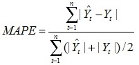
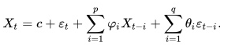

```{=html}
<style type="text/css">

body{ /* Normal  */
      font-size: 20px;
  }
td {  /* Table  */
  font-size: 8px;
}
h1.title {
  font-size: 55px;
  color: DarkBlue;
}
h1 { /* Header 1 */
  font-size: 38px;
  color: DarkBlue;
}
h2 { /* Header 2 */
    font-size: 28px;
  color: DarkBlue;
}
h3 { /* Header 3 */
  font-size: 35px;
  font-family: "Times New Roman", Times, serif;
  color: DarkBlue;
}
code.r{ /* Code block */
    font-size: 12px;
}
pre { /* Code block - determines code spacing between lines */
    font-size: 14px;
}
</style>
```
```{r setup, include=FALSE}
knitr::opts_chunk$set(echo = TRUE)

source("Fonctions.R", local = knitr::knit_global())

#install for export in pdf file
#tinytex::install_tinytex()
```

<br> </br>

```{r include=FALSE}
if(!require(forecast)) install.packages("tm", repos = "http://cran.us.r-project.org")
require(forecast)

if(!require(fpp2)) install.packages("tm", repos = "http://cran.us.r-project.org")
require(fpp2)

if(!require(MLmetrics)) install.packages("tm", repos = "http://cran.us.r-project.org")
require(MLmetrics)

if(!require(ggplot2)) install.packages("tm", repos = "http://cran.us.r-project.org")
require(ggplot2)

if(!require(fpp2)) install.packages("tm", repos = "http://cran.us.r-project.org")
require(fpp2)

if(!require(TSstudio)) install.packages("tm", repos = "http://cran.us.r-project.org")
require(TSstudio)

if(!require(ggthemes)) install.packages("tm", repos = "http://cran.us.r-project.org")
require(ggthemes)

if(!require(timetk)) install.packages("tm", repos = "http://cran.us.r-project.org")
require(timetk)


```

```{r include=FALSE}
if(!require(keras)) install.packages("tm", repos = "http://cran.us.r-project.org")
require(keras)
if(!require(tensorflow)) install.packages("tm", repos = "http://cran.us.r-project.org")
require(tensorflow)
library(keras)
library(tensorflow)
#install_keras()
#install_tensorflow(version = "nightly")

#Set up Font
windowsFonts("Rubik" = windowsFont("Rubik"))
```

# Introduction

Nous souhaitons réalisé l'**étude d'une série temporelle** et faire des
prévisions sur celle-ci.

Cette série temporelle est le trafic mensuel d'une Compagnie aérienne de
janvier 2011 à août 2019.

Nos prévisions portent sur les 8 mois de l'année 2019

# Représentation graphique de la série.

## Import des données

Import de la base, on sélectionne la colonne des valeurs de trafic.

```{r message=FALSE}
library(readr)
data <- read_delim("Trafic-voyageurs.csv", 
    delim = ";", locale = locale(encoding = "ISO-8859-1"))
```

```{r}
data_value <- data[,2]
summary(data)
```

## Création de notre série temporelle

Nous représentons nos données sous forme de série temporelle.

Une série temporelle est un ensemble de métrique mesurée sur des
intervalles de temps réguliers.

Création de la série chronologique avec la librairie TSstudio :

-   start : année de début,
-   frequency : La fréquence est mensuelle donc on sélectionne une
    fréquence de 12/an

```{r}
library(TSstudio)
data_ts <- ts(data_value, start = 2011, frequency = 12)
plot_1_TimeSeries(data_ts)


```

## Séparation jeux de données

```{r}
data_ts_train <-
  window(data_ts, start = c(2011, 1), end = c(2018, 12))
data_ts_test <- window(data_ts, start = c(2019, 1), end = c(2019, 8))

names(data)[1] <- "ds"
names(data)[2] <- "y"
data_train <- data[1:96, ]
data_test <- data[97:104, ]


plot(data_ts, xlim = c(2011, 2020))
lines(data_ts_test, col = 3)
legend(
  "topleft",
  lty = 1,
  col = c(1, 3),
  legend = c("Série chronologique Train", "Série chronologique Test")
)
```

On observe une forte tendance, et un paterne semble se répété, s'agit-il
d'une saisonnalité ?

## Analyse de notre série temporelle

Pour commencer nous allons nous intéresser à savoir si notre série est
stationnaire ou non.

La stationnarité d'une série signifie que le processus qui génère la
série ne change pas dans le temps. Cela ne veut pas dire que la série ne
change pas dans le temps, mais que la façon dont elle change, n'est pas
modifié dans le temps.

Testons si la série est stationnaire :

Par la suite la library tsutils permet de vérifier automatiquement s'il
y a une tendance et une saisonnalité grâce au test effectué par la
fonction seasplot().

```{r}
library(tseries)
adf.test(data_ts) #p-value <0.5 => on ne rejete pas H0 => non stationnaire
kpss.test(data_ts)


library(tsutils)
seasplot(data_ts) #TRUE | TRUE

```

Donc notre série est bien **non-stationnaire**.

## Décomposition de la série chronologique :

Généralement les séries chronologiques sont divisées en plusieurs
composantes qui peuvent être additionnées ou multipliées entre elles.

Additive : Ts = Tendance + Saisonnalité+ Erreur

Multiplicative : Ts = Tendance \* Saisonnalité \* Erreur

Donc chaque point de notre série temporelle peut être exprimer par :

-   Tendance $Tt$ : qui correspond à l'indicateur de si nos données
    changent sur le long terme ou non, elle permet de savoir si la série
    se déplace de manière fluide ou progressivement.

-   Saisonnalité $St$ : décrit un pattern qui se reproduit sur un
    intervalle de temps régulier (ici une année), c'est à dire que
    chaque année, le même pattern est présent.

-   Erreur $ϵt$ : ou résidus correspond aux "restes" quand on a supprimé
    la tendance et la saisonnalité. Ces valeurs peuvent s'expliquer par
    des évènements aléatoire qui affecte la valeur de la série
    (pandémie, choc boursiers, inflation ...)

Pour la suite, nous supposons que la décomposition est additive.

```{r}
decomposed_data <- decompose(data_ts_train, type="additive")
plot(decomposed_data$trend)
plot(decomposed_data$seasonal)
plot(decomposed_data$random)

boxplot(data_ts ~ cycle(data_ts))
```

Le choix d'une décomposition additive semble visuellement correct.

## Analyse des résidus

L'ACF est le test de l'auto-corrélation par le décalage d'elle même,
c'est un test important car il montre si les états précédents
(observations décalées) de la série chronologique ont une influence sur
l'état actuel.

Si l'auto-corrélation croise la ligne bleue, cela implique qu'un
décalage est significativement corrélé avec la série actuelle.

On peut également regarder la distribution des résidus qui ici suit une
courbe gaussienne centrée en 0 avec quelques outliers.

```{r}
checkresiduals(remainder(decomposed_data))
```

## Représentation de la saisonnalité

En superposant les différentes années on peut observer une saisonnalité
qui se répète chaque année.

Ce phénomène est encore plus remarquable quand on supprime la tendance.

On peut noter plusieurs "pic haut" :

-   Décembre / Janvier

-   Mars

-   Juin

-   Septembre (le plus haut)

Et plusieurs "pics faible" :

-   Avril

-   Juillet - Août (la période estivale)

-   Novembre

```{r}

ggseasonplot(data_ts)

#on supprime la tendance
data_ts_without_trend = diff(data_ts)
SeasonPlot <-  ggseasonplot(data_ts_without_trend) +
  labs(
    title = "Trafic sans la tendance",
    subtitle = "Visualisation de la saisonnalité",
    x = "Mois",
    y = "Nombre de Voyageurs"
  ) +
  geom_line(size = 1.1, alpha = 0.65) +
  theme_fivethirtyeight() +
  theme(axis.title = element_text()) +
  scale_color_brewer(palette = "Paired") +
  theme(axis.title = element_text(), text = element_text(family = "Rubik"))

SeasonPlot
```

# Modèles Espace-état

Pour commencer nos prédictions des 8 premiers mois de l'année 2019, nous
allons essayer quelques modèles basiques :

-   meanf : Average Method : prend la valeur moyenne de toute les
    observations pour toutes les prédictions,
-   naive : Naive Method : prend la dernière observation pour toutes les
    prédictions,
-   drift : Drift Method : prend la première et la dernière observations
    et trace une lignes entre les deux, on utilise la courbe pour les
    prédictions,
-   snaive : Seasonal Naive Forecast : Prend la dernière valeur de la
    saison précédente comme prédiction (ex : sept 2018 = sep 2019 +
    erreur)

Pour évaluer notre modèle on regarde :

-   MAE : Mean Absolute Error

-   RMSE : Root Mean Squarred Error

-   MASE : Mean Absolute Scaled Error

-   MAPE : Mean Absolute Percentage Error

Au formules associés :

-   res = pred - val

-   MAE = sum(abs(res))/length(val)

-   RSS = sum(res\^2)

-   MSE = RSS/length(val)

-   RMSE = sqrt(MSE)

La plus populaire est la MAPE

MAPE(y_pred, y_true)

{width="188"}

Concrètement si on a une MAPE de valeur 6% cela signifie la différence
moyenne entre la prédiction et la valeur réelle est de 6%.

```{r}
library(forecast)
mean <- meanf(data_ts_train, h=8)
naivem <- naive(data_ts_train, h=8)
driftm <- rwf(data_ts_train, h=8, drif=T)
snaivem <- snaive(data_ts_train, h=8)
```

```{r echo=FALSE}
plot(mean, plot.conf = F, main="")
lines(naivem$mean, col=2, lty=1)
lines(driftm$mean, col=5, lty=1)
lines(snaivem$mean, col = 4, lty=1)
legend("topleft", lty=1, col=c(1,2,3,4), legend=c("Mean Method", "Naive Method", "Drif Method", "Seasonal Naive"))


#comparaison :
plot(snaivem, plot.conf = F, main="")
lines(data_ts_test, col = 6, lty=1, lwd=3)

plot(driftm, plot.conf = F, main="")
lines(data_ts_test, col = 6, lty=1, lwd=3)

```

```{r}
#summary(mean)
checkresiduals(mean)
accuracy(mean, data_ts_test)# MAPE : 22%


```

```{r}
summary(naivem)
checkresiduals(naivem)
accuracy(naivem, data_ts_test) # MAPE : 8.5%

```

```{r}
summary(driftm)
checkresiduals(driftm)
accuracy(driftm, data_ts_test)   # MAPE : 7.5%

```

```{r}
summary(snaivem)
checkresiduals(snaivem)
accuracy(snaivem, data_ts_test) # MAPE : 3.6%

```

# Etude du Modèle de Buys-Ballot

## Modèle

L'approche de BUYS-BALLOT consiste à introduire des variables
indicatrices correspondant à chaque saison définit par le cycle
d'observation. Pour les données trimestrielles, on intègre 4 variables
indicatrices. Et pour les données mensuelles, on intègre 12 variables
indicatrices.

Le modèle doit alors être estimé (sans constante) avec ces variables
indicatrices.

Soit le modèle de Buys-Ballot tel que $Xt = Zt + St + \mu t$

Nous allons estimé dans un premier temp la tendance $Zt$, puis dans un
second temps la saisonnalité $St$, tandis que les $\mu t$ ne pourrons
pas être estimer puisqu'il s'agit par définition d'accidents.

{width="400"}

## Préparation des données

```{r}
Annees=as.numeric(time(data_ts_train))
ts_DataFrame =data.frame(trafic=data_ts_train,X=as.numeric(Annees))
```

## Estimation de la tendance

```{r}
Regression <- lm(trafic~X,data = ts_DataFrame)
```

On utilise la droite de régression obtenu pour prédire la tendance des 8
mois de 2019

```{r}
tendance=predict(Regression)

#les 8 prochains mois
AnneeMoisNumericFutur=seq(max(Annees)+1/12,length=8,by=1/12)  

tendance2=predict(Regression, newdata=data.frame(X=AnneeMoisNumericFutur)) 
```

## Estimation de la saisonnalité

On récupère les résidus issu de l'estimation de la tendance.

```{r}
ts_DataFrame$trafic_residual <- residuals(Regression)
```

On définit la saisonnalité avec les mois.

```{r}
ts_DataFrame$mois <- round(ts_DataFrame$X - trunc(ts_DataFrame$X),digit=4)
```

On estime la saisonnalité à partir des résidus du modèle comportant
uniquement la tendance.

```{r}
Regression2 =lm(trafic_residual~0+as.factor(mois),data=ts_DataFrame)
```

Prédiction de la saisonnalité sur le jeu d'entraînement

```{r}
prediction2 =predict(Regression2)
```

Prédiction sur les 8 mois de 2019

```{r}
MoisNumeric= round(AnneeMoisNumericFutur - trunc(AnneeMoisNumericFutur
                     ),4)
Prediction3 =predict( Regression2, newdata= data.frame(mois=MoisNumeric))

```

Calculons une région de confiance avec l'erreur d'ajustement

```{r}
ResidusRegression2=residuals(Regression2)
hist(ResidusRegression2)
1.96*sqrt(var(ResidusRegression2))
```

## Auto corrélation de la série temporelle

L'auto corrélation de notre série temporelle correspond à la corrélation
entre une mesure du trafic $t$ et les mesures précédentes $t - k$ ou les
mesures suivantes $t + k$.

L'auto covariance d'une variable $Xt$ de moyenne $\mu$ et d'écart type
$\sigma$ à un décalage $k$ est donné par la formule

$\gamma_k= E((X_t-\mu)(X_{t+k}-\mu))$

On en déduit l'auto-corrélation correspondante :

$\rho_k=\frac{\gamma_k}{\sigma^2}$

Affichons les auto-corrélations de la séries *prédite* grâce à un
corrélogramme

```{r}
ACF_Sur_Valeurs_Predites <- acf(prediction2)
```

Il est normal que la série soit auto corrélé totalement à elle avec un
décalage nulle.

On observe une corrélation forte (0.87) avec un décalage (lag) de 12,
cela correspond bien à une saisonnalité annuelle.

```{r}
print(data.frame(ACF_Sur_Valeurs_Predites$lag,ACF_Sur_Valeurs_Predites$acf)[1:13,])
```

Recalculons la valeur d'auto-corrélation obtenu en appliquant la
formule.

Observons l'application de la formule, en choisissant un décalage de 12

```{r}
#Constantes
Nombre_Observations=96
decalage=12

#Estimations
moyenneMu=mean(prediction2)
sdSigma=sd(prediction2)


Serie1=prediction2[(decalage+1): 96   ]
Serie2=prediction2[   1 :(96-decalage)]

GammaDecalage12=mean((Serie1-moyenneMu)*(Serie2-moyenneMu))*((Nombre_Observations-decalage)/(Nombre_Observations))

RhoDecalage12=GammaDecalage12/(sdSigma^2)
RhoDecalage12
```

Le résultat obtenu est correct. L'auto corrélation avec un décalage de
12 est donc très forte.

De plus cette auto corrélation étant positive, cela indique une tendance
croissante.

la deuxième plus forte corrélation est observé avec un décalage de 5,
observons cela graphiquement

```{r}
plot  ( 1:length(prediction2),   prediction2,type="l")
points((1:length(prediction2))-5,prediction2,type="l",col="red")
```

Cette corrélation est peu pertinente.

```{r include=FALSE}
print(data.frame(ACF_Sur_Valeurs_Predites$lag,ACF_Sur_Valeurs_Predites$acf)[1:13,])
```

Après avoir étudier les auto-corrélations sur l'ensemble du modèle,
Observons les auto-corrélations sur les résidus du modèle de
Buys-Ballot.

Une auto corrélation de ces résidus signifierait que les accidents
seraient prévisibles, cela n'aurait aucun sens et invaliderait notre
modèle.

```{r}
plot(acf(ResidusRegression2))
```

Pour notre modèle, il n'y a aucune auto-corrélation significative des
résidus (symbolisé par la ligne bleu).

Notre modèle est donc viable.

## Comparaison des prédictions et des valeurs réelles

Affichage de la tendance

```{r echo=FALSE, warning=FALSE}
Buys_ballot_plot_tendance <- plot(data_ts,
                         main = "Application du modèle de Buys_Ballot",
                         xlab = "Années",
                         ylab = "Nombre de Voyageurs") 

#droite de tendance
lines(Annees,tendance,col="blue",lwd=2)  

#prédiction de la tendance futur
lines(AnneeMoisNumericFutur,tendance2,col="red")


```

Affichage du modèle de Buys Ballot

```{r echo=FALSE}

Buys_ballot_plot <- plot(data_ts,
                         main = "Application du modèle de Buys_Ballot",
                         xlab = "Années",
                         ylab = "Nombre de Voyageurs") 


#prédiction du modèle de Buys ballot
lines(Annees,tendance+prediction2,col="blue",lwd=2)

#Interval de confiance
 polygon(c(AnneeMoisNumericFutur,rev(AnneeMoisNumericFutur)),
 c(tendance2+Prediction3-1.96*sqrt(var(ResidusRegression2)),
 rev(tendance2+Prediction3+1.96*sqrt(var(ResidusRegression2)))),
 col="cadetblue1",border=NA)
 
 #Prediction des valeurs
 lines(AnneeMoisNumericFutur,tendance2+Prediction3,col="blue",lwd=2)
 
 
 lines(data_ts_test,col="black",lwd=3)
```

Affichage de la prédiction sur les 8 mois de 2020

```{r echo=FALSE}

Buys_ballot_plot <- plot(data_ts_test,
                         main = "Application du modèle de Buys_Ballot",
                         xlab = "Années",
                         ylab = "Nombre de Voyageurs") 


#prédiction du modèle de Buys ballot
lines(Annees,tendance+prediction2,col="blue",lwd=2)

#Interval de confiance
 polygon(c(AnneeMoisNumericFutur,rev(AnneeMoisNumericFutur)),
 c(tendance2+Prediction3-1.96*sqrt(var(ResidusRegression2)),
 rev(tendance2+Prediction3+1.96*sqrt(var(ResidusRegression2)))),
 col="cadetblue1",border=NA)
 
 #Prediction des valeurs
 lines(AnneeMoisNumericFutur,tendance2+Prediction3,col="blue",lwd=2)
 
 
 lines(data_ts_test,col="black",lwd=3)
```

Préparation DataFrame pour affichage ggplot

```{r include=FALSE}
DataAffichageGGplot = as.data.frame(data_ts)
DataAffichageGGplot$Annees = c(Annees, AnneeMoisNumericFutur)
DataAffichageGGplot$AnneesRound = round(DataAffichageGGplot$Annees)
DataAffichageGGplot$PredictionTendanceBuysBalot = c(tendance ,tendance2)
DataAffichageGGplot$BuysBalotModele = c(tendance+prediction2,tendance2+Prediction3 )


```

Reproduisons les graphiques avec ggplot2 pour un résultat plus
professsionnel.

```{r warning=FALSE}
plotBuysBallot <- Affichage_Prediction(DataAffichageGGplot, DataAffichageGGplot$BuysBalotModele)
plotBuysBallot
```

Sauvegarde de l'image pour utilisation ultérieur dans l'application web.

```{r include=FALSE}
library(tidyverse)
#Utilisation de Cairo pour appliquer de l'anti-Aliasing sur le plot
library('Cairo')

ggsave(plotBuysBallot, path= "Shiny/www",  filename = 'BuysBallotPlotPrediction.png', dpi = 1500, type = 'cairo',
       width = 8, height = 5, units = 'in')

#Save aussi du SeasonPlot
ggsave(SeasonPlot, path= "Shiny/www",  filename = 'SeasonPlot.png', dpi = 1500, type = 'cairo',
       width = 8, height = 5, units = 'in')

```

Nous avons réussi à Créer un modèle de prédiction correct avec
Buys-Ballot. On remarque que la prédiction semble bien correspondre à la
réalité si on fait abstraction du dernier mois où le nombre de voyageurs
a bien plus chuté que la prédiction du modèle de Buys-Balot.

Comparons avec un ajustement local réalisé par lissage moyennes mobiles.

## Comparaison avec les valeurs observées

# Lissage moyenne mobile

## Définition

Une moyenne mobile est un filtre linéaire. Il permet de transformer une
série chronologique avec comme but d'annuler une composante (tendance ou
saison) pour en laisser les autres invariantes tout en réduisant le
bruit.

Une moyenne mobile en t est définit comme une combinaison linéaire finie
des valeurs de la série correspondantes à des dates entourant t, c'est
donc un lissage de la série.

Une moyenne mobile d'ordre m peut être écrite tel que
$\begin{equation} \hat{T}_{t} = \frac{1}{m} \sum_{j=-k}^k y_{t+j}, \end{equation}$

Avec $m=2k+1$

L'estimation de la tendance + saisonnalité au temps t est obtenue en
faisant la moyenne des valeurs de la série chronologique dans les k
périodes de t. Les observations qui sont proches dans le temps sont
également susceptibles d'être proches en valeur estimé.

Par conséquent, la moyenne élimine une partie du caractère aléatoire des
données, laissant une composante tendance + saisonnalité lisse.

## Choix Moyenne mobiles

Commençons notre analyse avec une moyenne mobile d'ordre 11, décidé de
façon arbitraire

```{r}
library(forecast)
MM_ordre_11 <-  ma(DataAffichageGGplot$trafic[1:96] , 11,centre=FALSE)
```

La première valeur (non manquante) de cette colonne est la moyenne des
onze premières observations càd de janvier à novembre 2011. La deuxième
valeur est la moyenne des valeurs de février 2011 à décembre 2011 et
ainsi de suite. De façon à que chaque valeur est la moyenne des
observations sur 11 mois centrée sur le mois correspondant.

Il est donc normale qu'il manque 5 estimations pour les premiers &
derniers mois puisque les données antérieur à 2011 ne sont pas
disponibles tout comme les données futur sont inconnus.

Il existe une méthode qui permet l'estimation des points extrêmes que
nous utiliserons pour la suite.

Affichage de la moyenne mobile simple d'ordre 11

```{r}
Affichage_Prediction(DataAffichageGGplot,c(MM_ordre_11,  rep(NA, 8)) )
```

On remarque que les données estimées (ici en bleu) représente bien la
tendance générale de la série, dans le cas d'une moyenne mobile, plus
son ordre est élevé, plus la courbe des estimations sera lisse.

Voici pour exemple l'affichage de différentes moyennes mobiles simples.

```{r echo=FALSE}
MM_ordre_3 <-  ma(DataAffichageGGplot$trafic[1:96] , 3,centre=FALSE)
MM_ordre_5 <-  ma(DataAffichageGGplot$trafic[1:96] , 5,centre=FALSE)
MM_ordre_15 <-  ma(DataAffichageGGplot$trafic[1:96] , 15,centre=FALSE)

Affichage_Prediction(DataAffichageGGplot,c(MM_ordre_3,  rep(NA, 8)) ) + labs(title = "Moyenne Mobile d'ordre 3")
Affichage_Prediction(DataAffichageGGplot,c(MM_ordre_5,  rep(NA, 8)) ) + labs(title = "Moyenne Mobile d'ordre 5")
Affichage_Prediction(DataAffichageGGplot,c(MM_ordre_15,  rep(NA, 8)) ) + labs(title = "Moyenne Mobile d'ordre 15")
```

Nous avons choisi des moyennes mobiles simples d'un ordre impair pour
qu'elles soient symétriques. En effet, dans une moyenne mobile d'ordre
m=2k+1, on fait la moyenne de l'observation centrale et des k
observations de chaque côté. Mais si m était pair, elle ne serait plus
symétrique.

## Moyenne mobile d'une Moyenne mobile

Il est possible d'appliquer une moyenne mobile à une moyenne mobile.
Cela permet de rendre symétrique une moyenne mobile d'ordre pair.

Appliquons cela par une moyenne mobile d'ordre 2 sur une moyenne mobile
d'ordre 4

```{r}
MM_ordre_4 <-  ma(DataAffichageGGplot$trafic[1:96] , 4,centre=FALSE)
MM_Ordre_2x4 <- ma(DataAffichageGGplot$trafic[1:96], 4, centre=TRUE)

head(MM_ordre_4)
head(MM_Ordre_2x4)
```

Une MM 2x4 signifie une MM d'ordre 4 suivi d'une MM d'ordre 2.
Concrètement, les 5 premières valeurs de la série chronologique sont
245900, 238000, 263227,277991 et 286691. Les deux premiers termes de la
MM d'ordre 4 sera

1.  (245900+238000+263227+277991) /4 = 1 025 118/4 = 256279.5

2.  (238000+263227+277991+286691) /4 = 266477.2

Donc le premier terme de la moyenne mobile d'ordre 2, calculé à partir
des 2 premiers termes de la MM d'ordre 4, donnera (256279.5 +
266477.2)/2 = 261378.4

On combinant ces deux moyennes mobiles, nous avons obtenu une moyenne
mobile centrée d'ordre 4, les valeurs calculées obtenues sont
symétriques, en effet, nous avons appliqué cela aux données :

$\begin{align*} \hat{T}_{t} &= \frac{1}{2}\Big[ \frac{1}{4} (y_{t-2}+y_{t-1}+y_{t}+y_{t+1}) + \frac{1}{4} (y_{t-1}+y_{t}+y_{t+1}+y_{t+2})\Big] \\ &= \frac{1}{8}y_{t-2}+\frac14y_{t-1} + \frac14y_{t}+\frac14y_{t+1}+\frac18y_{t+2}. \end{align*}$

Ainsi si l'on combine 2 moyennes mobiles, nous devons appliqués une
moyenne mobile pair après une moyenne mobile pair et une moyenne mobile
impair après une moyenne mobile impair afin que nos résultats soit
symétriques.

## Conservation & Annulation

Soit la Moyenne mobile 2x12
$\hat{T}_{t} = \frac{1}{32}y_{t-6} + \frac{1}{12}y_{t-5} + \frac{1}{12}y_{t-4} + \frac{1}{12}y_{t-3} + \frac{1}{12}y_{t-2} + \frac{1}{12}y_{t-1} +\frac{1}{12}y_{t} + \frac{1}{12}y_{t+1} +\frac{1}{12}y_{t+2} + \frac{1}{12}y_{t+3} + \frac{1}{12}y_{t+4} + \frac{1}{12}y_{t+5} + \frac{1}{32}y_{t+6}.$

Appliquée au trafic qui a une saisonnalité annuelle, chaque mois de
l'année a le même poids, car le premier et le dernier terme s'appliquent
au même mois des années consécutives. Ainsi, la variation saisonnière
est éliminée.

Un autre choix de Moyenne mobile entraînera une estimation soumis à la
saisonnalité.

```{r}
MM_ordre_2x12 <- ma(DataAffichageGGplot$trafic[1:96], 12)
Affichage_Prediction(DataAffichageGGplot,c(MM_ordre_2x12,  rep(NA, 8)) ) + labs(title = "Moyenne Mobile d'ordre 2x12")
```

La droite de prédiction obtenu ne présente aucune trace de saisonnalité.
Un autre choix de moyenne mobile (hormis 12k $k \in N$) aurait présenter
des traces de saisonnalités.

Nous avons vu que la combinaison de moyennes mobiles produisait des
moyennes mobiles pondérés, la combinaison que nous avons utilisés
produisait les poids suivants
$\left[\frac{1}{32},\frac{1}{32},\frac{1}{12},\frac{1}{12},\frac{1}{12},\frac{1}{12},\frac{1}{12},\frac{1}{12},\frac{1}{12},\frac{1}{12},\frac{1}{12},\frac{1}{12},\frac{1}{32}\right]$

En effet, une moyenne mobile d'ordre m s'écrit tel que
$\hat{T}_t = \sum_{j=-k}^k a_j y_{t+j}$ Avec $k=(m-1)/2$ et les poids
$\left[a_{-k},\dots,a_k\right]$ Si leur somme vaut 1 et que ces poids
sont symétriques (tq $a_j = a_{-j}$) alors la courbe obtenu sera plus
lisse.

En conclusion, nous avons pu éliminer les saisonnalités de période 12 et
conserver la tendance, notre choix d'ordre de moyenne mobile est
correct, on remarque que choisir un ordre arbitrairement grand est
inutile, il suffit de comparer les moyennes mobiles d'ordre 15 et 12,
celle à 12 annule de façon bien plus performante les saisonnalités.

# Lissage exponentielle

L'idée de la méthode de lissage exponentielle est une extension de la
méthode naîve (naivm vu précédemment). Le principe étant de fournir une
prévision qui dépend de moyenne pondérées d'observations passées, les
poids diminuant de façon exponentielle à mesure que les observations
vieillissent.

Plus simplement, les observations les plus récentes ont un poids plus
important que les observations les plus anciennes.

Le paramètre de lissage est décidé par le paramètre α.

On remarque que pour un lissage simple, la prédiction est égale à la
valeur de la dernière observation.

## Lissage simple

```{r}
fcst_se <- ses(data_ts_train, h = 8)
summary(fcst_se)
checkresiduals(fcst_se)
```

```{r}
plot(fcst_se)
lines(data_ts_test, col="red")


df_se = as.data.frame(fcst_se)
predict_value_se <- df_se$`Point Forecast`
MAPE(predict_value_se, data_ts_test) # MAPE = 7.95
```

## Optimisation du modèle

La librairie Forecast permet de trouver automatiquement le meilleur
degré de lissage exponentielle fournissant la meilleure prédiction.

```{r}
fit_ets <- ets(data_ts_train) 
print(summary(fit_ets))
checkresiduals(fit_ets)


```

```{r}
fcst_ets <- forecast(fit_ets, h=8)
plot(fcst_ets)
lines(data_ts_test, col="red")


df_ets = as.data.frame(fcst_ets)
predict_value_ets = df_ets$`Point Forecast`
MAPE(predict_value_ets, data_ts_test) #MAPE = 2.84

```

Affichage GGplot

```{r}
DataAffichageGGplot$ModeleLissageExponentielle <- c(fcst_ets$fitted ,predict_value_ets )

Affichage_Prediction(DataAffichageGGplot, DataAffichageGGplot$ModeleLissageExponentielle)

```

## Modèle ARIMA / SAMIRA Automatique

ARIMA : AutoRegressive Integrated Moving Average

Le modèle ARIMA est une combinaison du modèle ARMA\* combiné à une
différentiation (le Integrated)

\*Le modèle ARMA (Autoregressive Moving Average Model) est définit par
l'idée de décrire une séries temporelles en deux polynômes. Le premier
étant pour l'auto regréssion et le second pour la moyenne mobile.
ARMA(p,q) où :

-   p est l'ordre du polynôme auto régressif,

-   q est l'ordre du polynôme de moyenne mobile L'équation est données
    par avec :



-   φ = les paramètres du modèle autorégressif,

-   θ = les paramètres du modèle de moyenne mobile.

-   c = une constante,

-   Σ = notation de sommation,

-   ε = termes d'erreur (bruit blanc).

Une différentiation correspond à retirer les tendances

-   tendance linéaire : une différenciation

-   tendance quadratique : deux différenciations

Le modèle SARIMA est une combinaison du modèle ARIMA qui prend en compte
la composante saisonnière.

Auto.arima prend en compte les saisonnalités, comme on peut le voir dans
le modèle sélectionné : (0,1,1)(0,1,1)[12]

```{r}
# retourne les meilleurs paramètres 
# d=1 enleve la tendance
# D=1 enleve la saisonnalité 
# => avoir des données stationnaires
# trace : voir les résultats
fit_arima <- auto.arima(data_ts_train, d=1, D=1, stepwise = FALSE, approximation = FALSE, trace=TRUE)
print(summary(fit_arima))
checkresiduals(fit_arima)
```

```{r}
fcst_arima <- forecast(fit_arima, h=8)
plot(fcst_arima)
lines(data_ts_test, col='red')


df_arima = as.data.frame(fcst_arima)
predict_value_arima = df_arima$`Point Forecast`
MAPE(predict_value_arima, data_ts_test)
```

Affichage GGplot

```{r}
DataAffichageGGplot$ModeleArima <-  c(fit_arima$fitted ,predict_value_arima )
Affichage_Prediction(DataAffichageGGplot, DataAffichageGGplot$ModeleArima)
```

## Prophet

Prophet est un outil de prévision de série chronologique open-source mis
en production par Facebook.

L'idée est décomposer la série temporelle sous la forme :

y(t) = g(t) + s(t) + h(t) + e(t)

avec respectivement :

-   g(t) : la tendance (linéaire ou logistique)
-   s(s) : une ou plusieurs composantes saisonnières (annuelle,
    hebdomadaire ou quotidienne)
-   h(t) : l'effet des vacances ou de jours spécifiques qui pourront
    être paramétrés
-   e(t) : l'erreur, bruit aléatoire qui mesure l'écart entre le modèle
    et les données réelles

Ce modèle est particulièrement utile quand on a de forte saisonnalités
et permet de prendre en compte les vacances (et ses effets) par pays.

Préparation des données

-   format des dates

-   colonne du temps name : ds

-   colonne de la mesure quantitative name : y

```{r}
library(prophet)
library(zoo)
data_train$ds <- as.Date( as.yearmon(time(data_ts_train)))
```

On créer notre modèle et on prédit sur les 8 mois de 2019.

On affiche les courbes.

On regarde la valeur de la MAPE : 3.2.

```{r}
model_prophet <- prophet(data_train)
forecast_prophet <- make_future_dataframe(model_prophet, periods = 8, freq = 'month')
AAPLfc <- predict(model_prophet, forecast_prophet)
tail(AAPLfc[c("ds", "yhat", "yhat_lower", "yhat")])


dyplot.prophet(model_prophet, AAPLfc)


data_pp <- subset(AAPLfc, select=c("yhat"))
data_pp_ts <- ts(data_pp, start=2011, frequency=12)
data_pp_ts_w <- window(data_pp_ts, start= c(2019,1), end = c(2019,8))
MAPE(data_pp_ts_w, data_ts_test) #3.2

 


```

Affichage GGplot

```{r}
DataAffichageGGplot$ProphetModele <- AAPLfc$yhat
Affichage_Prediction(DataAffichageGGplot, DataAffichageGGplot$ProphetModele)
```

## LSTM

Un réseau LSTM (Long Short Term Memory) est un type particulier de
réseau de neurones récurrent qui est capable d'apprendre les dépendances
à long terme. Il a été introduit pas Hochreiter & Schmidhuber en 1997.

L'idée d'un réseaux récurrent est de mettre en place des boucles qui
permettent aux informations de persister. Ils sont représentés par une
chaîne de modules répétitifs de réseau de neurones.

Chaque module est traversé un à un en faisant évoluer son état qui peut
se voir ajouter ou supprimer de l'information, ces changements sont
régulés par ce qu'on appelle des "portes".

Elles sont définit par une couche de neurones sigmoïde et d'opération de
multiplication ponctuelle qui laisse passer ou non l'information. La
fonction Sigmoïde produit des nombres entre 1 et 0 ce qui définit la
quantité de chaque composant qui doit passer.

# Préparation des données

On veut prendre l'année précédente pour apprendre , on fixe donc lag à
12, en réalité cela correspond à faire 12 - 1.

Puis on transforme en array 3D car le modèle LSTM prend un tensor de
format 3D [samples, timesteps, features]

-   samples : nbr d'observation par batchs

-   timesteps : lag

-   features : nbr de valeur predites

```{r include=FALSE}

scale_factors <- c(mean(data$y), sd(data$y))
scaled_train <- data %>%
    dplyr::select(y) %>%
    dplyr::mutate(y = (y - scale_factors[1]) / scale_factors[2])
scaled_train


prediction <- 12
lag <- prediction
```

```{r include=FALSE}
scaled_train <- as.matrix(scaled_train)
 
# we lag the data 11 times and arrange that into columns
x_train_data <- t(sapply(
    1:(length(scaled_train) - lag - prediction + 1),
    function(x) scaled_train[x:(x + lag - 1), 1]
  ))
 
# now we transform it into 3D form
x_train_arr <- array(
    data = as.numeric(unlist(x_train_data)),
    dim = c(
        nrow(x_train_data),
        lag,
        1
    )
)

```

```{r include=FALSE}
y_train_data <- t(sapply(
    (1 + lag):(length(scaled_train) - prediction + 1),
    function(x) scaled_train[x:(x + prediction - 1)]
))

y_train_arr <- array(
    data = as.numeric(unlist(y_train_data)),
    dim = c(
        nrow(y_train_data),
        prediction,
        1
    )
)

#head(y_train_data)
#head(y_train_arr)
```

```{r include=FALSE}
x_test <- data$y[(nrow(scaled_train) - prediction + 1):nrow(scaled_train)]

x_test_scaled <- (x_test - scale_factors[1]) / scale_factors[2]

x_pred_arr <- array(
    data = x_test_scaled,
    dim = c(
        1,
        lag,
        1
    )
)

```

## Construction de notre réseaux de neuronnes

```{r}
lstm_model <- keras_model_sequential()

lstm_model %>%
  layer_lstm(units = 50, # taille du layer
       batch_input_shape = c(1, 12, 1), # batch size, timesteps, features
       return_sequences = TRUE,
       stateful = TRUE) %>%
  # pourcentage de neuronnes qu'on détruit à chaque itération 
  layer_dropout(rate = 0.5) %>%
  layer_lstm(units = 50,
        return_sequences = TRUE,
        stateful = TRUE) %>%
  layer_dropout(rate = 0.5) %>%
  time_distributed(keras::layer_dense(units = 1))

lstm_model %>%
    compile(loss = 'mae', optimizer = 'adam', metrics = 'accuracy')

summary(lstm_model)


```

## Apprentissage sur le jeu d'entraînement

```{r}
lstm_model %>% fit(
    x = x_train_arr,
    y = y_train_arr,
    batch_size = 1,
    epochs = 20,
    verbose = 0,
    shuffle = FALSE #pour preserver nos séquences
)
```

## Prédiction sur le jeu de Test

On a 50 résultats / prédictions par input donc on transforme pour une
seule prédiction

```{r, results='hide'}
lstm_forecast <- lstm_model %>%
    predict(x_pred_arr, batch_size = 1) %>%
    .[, , 1]
 
# rescale en format basique
lstm_forecast <- lstm_forecast * scale_factors[2] + scale_factors[1]
lstm_forecast

fitted <- predict(lstm_model, x_train_arr, batch_size = 1) %>%
     .[, , 1]

if (dim(fitted)[2] > 1) {
  
    fit <- c(fitted[, 1], fitted[dim(fitted)[1], 2:dim(fitted)[2]])
} else {
    fit <- fitted[, 1]
}

# rescale final de nos données
fitted <- fit * scale_factors[2] + scale_factors[1]
fitted
fitted <- c(rep(NA, lag), fitted)
fitted
length(fitted)

```

# Affichage et évaluation

Nos résultats ne sont pas très convaincant même en faisant varier nos
paramètres, ceci peut être explicable par le manque d'observations.

```{r echo=FALSE}
lstm_forecast <- ts(lstm_forecast,
    start = c(2019, 1),
    end = c(2019, 12),
    frequency = 12
)

lstm_forecast_display <- window(lstm_forecast, start= c(2019,1), end = c(2019,8))

input_ts <- ts(data$y, 
    start = c(2011, 1), 
    end = c(2018, 12), 
    frequency = 12)


lstm_forecast_display
data_ts_test

plot(input_ts, xlim=c(2011,2020))
#lines(data_ts_test)
lines(lstm_forecast_display, col=3)


```

Affichage GGplot

```{r}
DataAffichageGGplot$LSTM_Modele <- fitted
Affichage_Prediction(DataAffichageGGplot, DataAffichageGGplot$LSTM_Modele)
```

# Comparaison Modèle

## Choix des indicateurs

Nous devons pouvoir comparer nos modèles entre eux, nous souhaitons
pouvoir observer leurs performances globale, ainsi que spécifiquement
leurs performances sur le jeu d'entraînement et le jeu de test (les 8
mois de 2019 à prédire).

Nous utiliserons une mesure largement utilisé lors de nos précédents
travaux : le $R^2 \in [0 \; ; 1]$ , cette mesure indique la proportion
de la variance expliquée par le modèle.

-   0 % le modèle n'explique par la variable Y

-   100 % le modèle explique la variabilité de Y lié à la liaison
    linéaire des variables explicatives entièrement

Rappelons son explication mathématiques , soit SCE la somme des
distances au carré entre chaque valeur prédite par le modèle
${\widehat y_i}$ et la moyenne des réponses $\overline{y}$

$\text{SCE} = \sum_{i=1}^{N}(\hat{y_i} – \overline{y})^2$

Nous obtenons alors la part de dispersion expliquée par le modèle.

Puis, nous calculons la dispersion totale des données nommé SCT

$\text{SCT} = \sum_{i=1}^{N}(y_{i } – \overline{y})^2$

*Avec* $y_i$ *une valeur prise par une variable expliquée*

Nous obtenons alors le R² par la combinaisons des calculs précédents

$R^2 = \frac{SCE}{SCT}$

Pour compléter cette mesure, nous utiliserons donc l'erreur absolue
moyenne en pourcentage (MAPE en anglais) Il s'agit de la moyenne des
écarts en valeur absolue par rapport aux valeurs observées.

C'est donc un pourcentage et par conséquent un indicateur pratique de
comparaison.

**Exemple de mise en production**

Imaginons que l'on utilise nos modèles pour prédire le nombre de
voyageurs, si l'on prévoit trop de passagers alors les moyens mis en
place pour les accueillir sont partiellement utilisés, il en résulte un
coût de 5 euros par passagers.

Si l'on a prédit moins de passagers que la réalité, notre compagnie doit
commander en livraison urgente, il en résulte un coût de 10 euros par
passagers.

Observons cette mise en production sur nos modèles.

## Calculs des performances

Dans les concerts, chaque spectateur chante comme une casserole,
pourtant la foule chante systématiquement juste, suivant cet intuition
réalisons une prédiction qui est une moyenne des différents modèles
réalisés.

```{r}
DataAffichageGGplot$MoyenneDesModele <- rowMeans(DataAffichageGGplot[,5:9])
```

Performances Modèles

```{r}
noms_modeles <- c("Buys Ballot ","Lissage exponentielle ","Arima","Prophet","LSTM","Moyenne Des Modèles")

for (x in seq_along(noms_modeles)){
  print("----------------------------")
  print(noms_modeles[x])
  
  predictionglobale <- DataAffichageGGplot[13:104,4+x]
  predictionEntrainement <- DataAffichageGGplot[13:96,4+x]
  predictionTest <- DataAffichageGGplot[97:104,4+x]
    
  
  cat("MAPE globale : ",MAPE(DataAffichageGGplot$trafic[13:104], predictionglobale),"\n")
cat("R carré globale : ",Rcarre(DataAffichageGGplot$trafic[13:104], predictionglobale),"\n")

cat("MAPE Entrainement : ",MAPE(DataAffichageGGplot$trafic[13:96], predictionEntrainement),"\n")
cat("R carré Entrainement : ",Rcarre(DataAffichageGGplot$trafic[13:96], predictionEntrainement),"\n")

cat("MAPE Test : ",MAPE(DataAffichageGGplot$trafic[97:104], predictionTest),"\n")
cat("R carré Test : ",Rcarre(DataAffichageGGplot$trafic[97:104], predictionTest),"\n")

MiseEnProductionDuModele <-  CoutDesErreurs(DataAffichageGGplot$trafic[97:104], predictionTest)
cat("Nombre de Passagers prévus en plus : ",MiseEnProductionDuModele[1],"\nNombre de Passagers prévus en moins : ",MiseEnProductionDuModele[2],"\nCout des erreurs en Euros : ",MiseEnProductionDuModele[3] )


cat("\nDifférence en nbre de voyageurs sur le dernier mois : ",predictionglobale[92] - DataAffichageGGplot$trafic[104],"\n")
  
}
```

Sauvegardons le modèle de Buys Ballot pour une utilisation ultérieur
dans une application Web

```{r}
saveRDS(Regression, file = "./Shiny/RegressionAnnees.rda")
saveRDS(Regression2, file = "./Shiny/RegressionMois.rda")
```

## Conclusion
